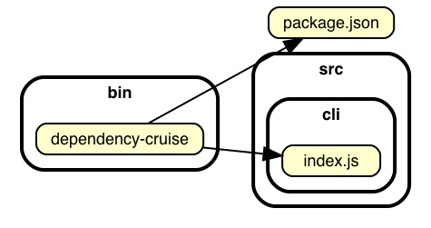
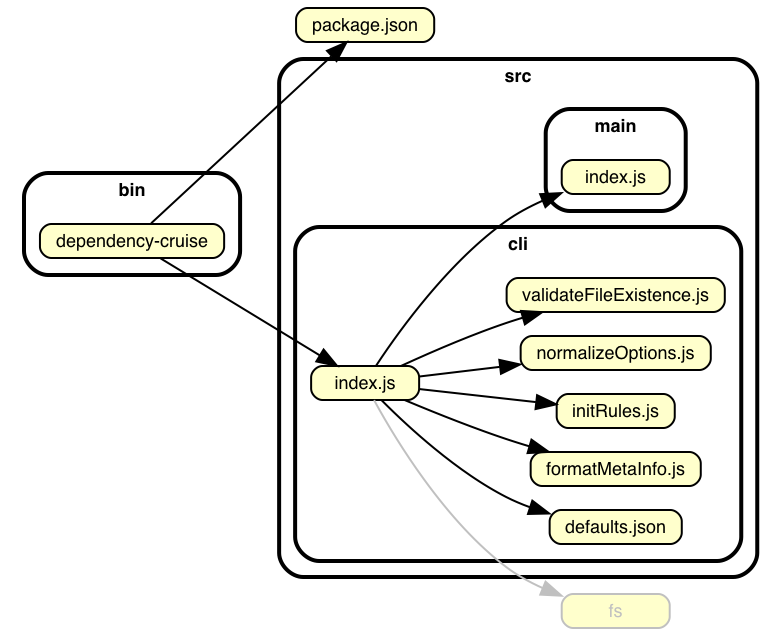
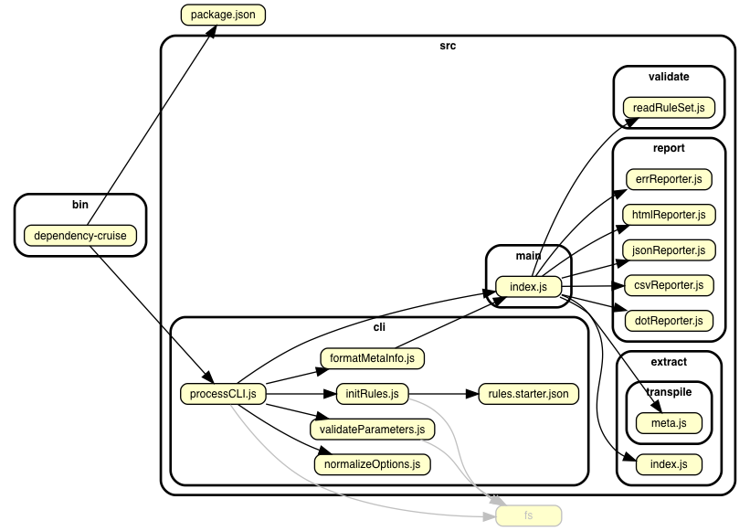
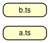

# dependency-cruiser command line interface

Running with no parameters gets you help:
```
Usage: dependency-cruise [options] <files-or-directories>


Options:

  -V, --version                 output the version number
  -i, --info                    shows what languages and extensions
                                dependency-cruiser supports
  -v, --validate [file]         validate with rules in [file]
                                (default: .dependency-cruiser.json)
  -f, --output-to <file>        file to write output to; - for stdout
                                (default: -)
  -X, --do-not-follow <regex>   a regular expression for modules to include,
                                but not follow further
  -x, --exclude <regex>         a regular expression for excluding modules
  -d, --max-depth <n>           the maximum depth to cruise; 0 <= n <= 99
                                (default: 0, which means 'infinite depth')
  -M, --module-systems <items>  list of module systems (default: amd,cjs,es6)
  -T, --output-type <type>      output type - html|dot|err|json
                                (default: err)
  -P, --prefix <prefix>         prefix to use for links in the svg reporter
  --preserve-symlinks           leave symlinks unchanged (off by default)
  --ts-pre-compilation-deps     detect dependencies that only exist before
                                typescript-to-javascript compilation
                                (off by default)
  --init                        write a .dependency-cruiser.json with basic
                                validations to the current folder.
  -h, --help                    output usage information
```

### `--output-type`: specify the output format

#### err
For use in build scripts, in combination with `--validate` e.g.

```sh
dependency-cruise --validate my-depcruise-rules.json src
```

This will:
- ... print nothing and exit with code 0 if dependency-cruiser didn't
  find any violations of the rules in .dependency-cruiser.json.
- ... print the violating dependencies if there is any. Moreover it
  will exit with exit code _number of violations found_ in the same fasion
  linters and test tools do.

See the _dependency-cruise_ target in the [Makefile](https://github.com/sverweij/dependency-cruiser/blob/master/Makefile#L95)
for a real world example.

#### dot
Supplying `dot` as output type will make dependency-cruiser write
a GraphViz dot format directed graph. Typical use is in concert
with _GraphViz dot_:

```shell
dependency-cruise -x "^node_modules" -T dot src | dot -T svg > dependencygraph.svg
```

#### html
Write it to html with a dependency matrix instead:
```shell
dependency-cruise -T html -f dependencies.html src
```

#### csv
If you supply `csv` it will write the dependency matrix to a comma
separated file - so you can import it into a spreadsheet program
and analyze from there.

### `--do-not-follow`: don't cruise modules adhering to this pattern any further
If you _do_ want to see certain modules in your reports, but are not interested
in these modules' dependencies, you'd pass the regular expression for those
modules to the `--do-not-follow` (short: `-X`) option. A typical pattern you'd
use with this is "node_modules":

```sh
dependency-cruise -X "^node_modules" -T html -f deps-with-unfollowed-node_modules.html src
```

### `--exclude`: exclude modules from being cruised
If you don't want to see certain modules in your report (or not have them
validated), you can exclude them by passing a regular expression to the
`--exclude` (short: `-x`) option. E.g. to exclude `node_modules` from being
scanned altogether:

```sh
dependency-cruise -x "node_modules" -T html -f deps-without-node_modules.html src
```

Because it's regular expressions, you can do more interesting stuff here as well. To exclude
all modules with a file path starting with coverage, test or node_modules, you could do this:

```sh
dependency-cruise -x "^(coverage|test|node_modules)" -T html -f deps-without-stuffs.html src
```

### `--max-depth`
Only cruise the specified depth, counting from the specified root-module(s). This
command is mostly useful in combination with visualisation output like _dot_ to
keep the generated output to a manageable size.

Although totally up to you I advise you to not use this with the `err` reporter;
you'll probably miss validating a dependency or two.

This will cruise the dependencies of each file directly in the src folder, up
to a depth of 1:
```sh
dependency-cruise --max-depth 1 -T dot bin/dependency-cruise | dot -T png > dependency-cruiser-max-depth-1.png
```



With `--max-depth 2` it'll look like this:



And with `--max-depth 3` like this:





### `--validate`
Validates against a list of rules in a rules file. This defaults to a file
called `.dependency-cruiser.json`, but you can specify your own rules file.

```shell
dependency-cruise -x node_modules --validate my.rules.json
```

> _Tip_: usually you don't need to specify the rules file. However if run 
> `depcruise --validate src`, _src_ will be interpreted as the rules file.
> which is probably is not whant you want. To prevent this place `--`
> after the last option, like so:
> ```
> dependency-cruise --validate -- src
> ```


The file specifies a bunch of regular expressions pairs your dependencies
should adhere to.

A simple validation configuration that forbids modules in `src` to use stuff
in the `test` folder and allows everything else:

```json
{
    "forbidden": [{
        "from": {"path": "^src"},
        "to": {"path": "^test"}
    }]
}
```

You can optionally specify a name and an error severity ('error',  'warn' (the
default) and 'info') with them that will appear in some reporters:

```json
{
    "forbidden": [{
        "name": "no-src-to-test",
        "severity": "error",
        "from": {"path": "^src"},
        "to": {"path": "^test"}
    }]
}
```

For more information about writing rules see the [tutorial](rules-tutorial.md) and the
[rules-reference](rules-reference.md). For an easy set up use ...


### `--init`
This creates a `.dependency-cruiser.json` with some useful rules in it to the
current folder and exits. use with `--validate`

These are the rules in that .dependency-cruiser.json:

Rule | Description
---|---
`not-to-test` | Don't allow dependencies from outside the test folder to test
`not-to-spec` | Don't allow dependencies to (typescript/ javascript/ coffeescript) spec files
`no-deprecated-core` | Warn about dependencies on deprecated core modules.
`not-to-unresolvable` | Don't allow dependencies on modules dependency-cruiser can't resolve to files on disk (which probably means they don't exist)
`not-to-dev-dep` | Don't allow dependencies from src/app/lib to a development only package
`no-non-package-json` | Don't allow dependencies to packages not in package.json (except from within node_modules)
`optional-deps-used` | Inform about the use of dependencies labeled as 'optional' (so you can ensure their imports a are sufficiently managed)
`peer-deps-used` | Warn about the use of a peer dependency (peer dependencies are deprecated with the advent of npm 3 - and probably gone with version 4).
`no-duplicate-dep-types` | Warn if a dependency occurs in your package.json more than once (technically: has more than one dependency type)


### `--prefix` prefixing links
If you want the links in the svg output to have a prefix (say,
`https://github.com/you/yourrepo/tree/master/`) so when you click them you'll
open the link on github instead of the local file - pass that after the
`--prefix` option.

```sh
depcruise --prefix https://github.com/sverweij/dependency-cruiser/tree/develop/ -T dot -x node_modules src | dot -T svg > dependencies.svg
```

### `--info` showing what alt-js are supported

Which alt-js languages dependency-cruiser supports depends on the availability
it has to them. To see how dependency-cruiser perceives its environment use
`depcruise --info` (any arguments are ignored). A typical output will look
like this:

```
Supported:

  If you need a supported, but not enabled transpiler ('✖' below) just install
  it in the same folder dependency-cruiser is installed. E.g. 'npm i livescript'
  will enable livescript support if it's installed in your project folder.

Transpilers:

  ✔ javascript (>es1)
  ✔ coffee-script (>=1.0.0 <2.0.0)
  ✖ livescript (>=1.0.0 <2.0.0)
  ✔ typescript (>=2.0.0 <3.0.0)

Extensions:

  ✔ .js
  ✔ .ts
  ✔ .d.ts
  ✖ .ls
  ✔ .coffee
  ✔ .litcoffee
  ✔ .coffee.md
```

### `--module-systems`
Here you can pass a list of module systems dependency-cruiser should use
to detect dependencies. It defaults to `amd, cjs, es6`.

### `--ts-pre-compilation-deps` (typescript only)
By default dependency-cruiser does not take dependencies between typescript
modules that don't exist after compilation to javascript. Pass this command
line switch to do take them into account.

#### Pre-compilation dependencies example: only importing a type
As the javascript doesn't really know about types, dependencies on
types only exist before, but not after compile time.

`a.ts` exports an interface ...
```typescript
import { B } from './b';
export interface A {
  foo: string;
}
const b = new B();
```
... and `b.ts` uses that interface:
```typescript
import { A } from './a';
export class B {};
const a: A = {foo: "foo"};
```

After compilation `b.js` looks like this:
```javascript
// import omitted as it only contained a reference to a type
export class B { };
const a = { foo: "foo" }; // no type refer
```

Normally, without `--ts-pre-compilation-deps` the output will
look like this:


_With_ `--ts-pre-compilation-deps` the dependency graph _does_ include the
dependency-on-a-type-only from `b.ts` to `a.ts`:


#### Pre-compilation dependencies example: import without use 

Similarly, if you import something, but don't use it, the dependency
only exists before compilation. Take for example thse two 
typescript modules:

`a.ts`:
```typescript
import { B } from './b';
export class A {
}
```

`b.ts`:
```typescript
export class B {
}
```

As `a.ts` uses none of the imports from b are used, the typescript
compiler will omit them when compiling and yield this for `a.js`:
```javascript
// no imports here anymore...
export class A {
}
```
Hence, without `--ts-pre-compilation-deps` dependency-cruiser's
output will look like this:



... and with `--ts-pre-compilation-deps` like this:


### `--preserve-symlinks`
Whether to leave symlinks as is or resolve them to their realpath. This option defaults
to `false` (which is also nodejs' default behavior since release 6).

### arguments
You can pass a bunch of files, directories and 'glob' patterns. 
dependency-cruiser will 
- resolve the glob patterns (if any) to files and directories
- scan directories (if any) for files with supported extensions
- add the passed files to that
... and start the cruise with the files thus found.

#### Cruising multiple files and directories in one go
Just pass them as arguments. This, e.g. will cruise every file in the folders
src, test and lib (recursively) + the file called index.ts in the root.

```sh
depcruise --output-type dot src test lib index.ts
```

#### passing globs as parameters
dependency-cruiser uses [node-glob](https://github.com/isaacs/node-glob) to
make sure globs work the same accross platforms. It cannot prevent the
environment from expanding globs before it can process it, however.

As each environment interprets globs slightly differently, a pattern
like `packages/**/src/**/*.js` will yield different results.

To make sure glob expansion works _exactly_ the same accross
platforms slap some quotes around them, so the it's not the environment
(/ shell) expanding the glob, but dependency-cruiser itself:

```sh
depcruise "packages/**/src/**/*.js"
```

## Daphne's dependencies - a gentle introduction
**[Daphne's
dependencies](sample-output.md)**
sport a visual overview of all the output formats. It also shows how Daphne and
her colleagues use them in their workflow.
