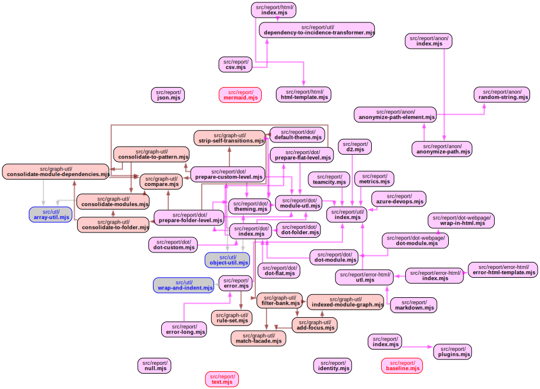
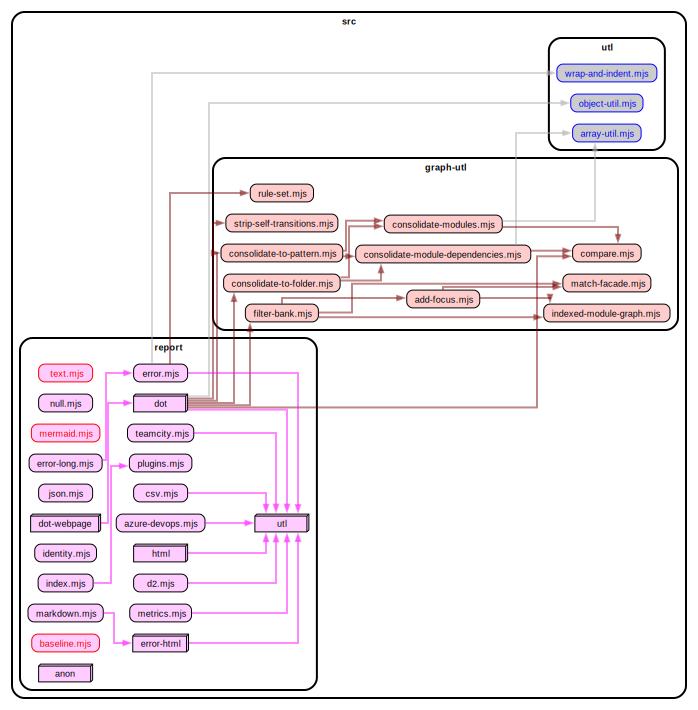
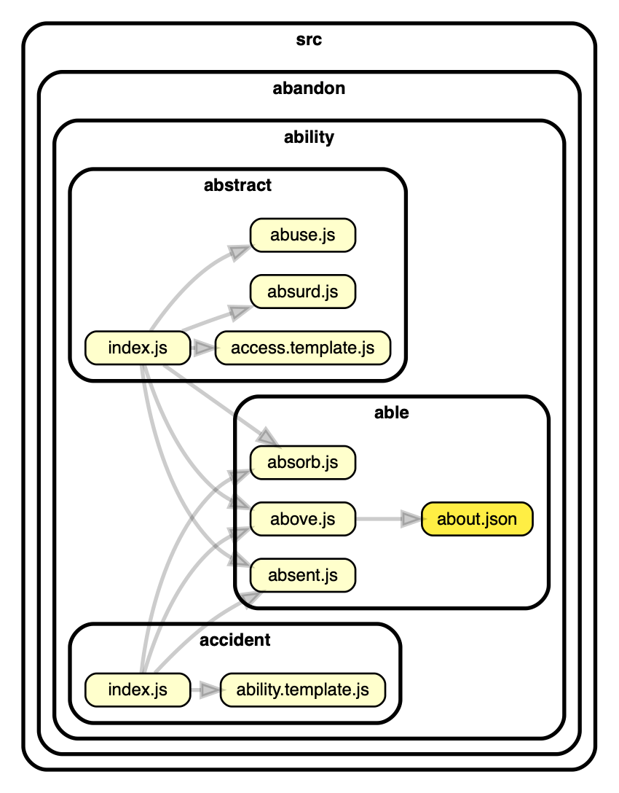
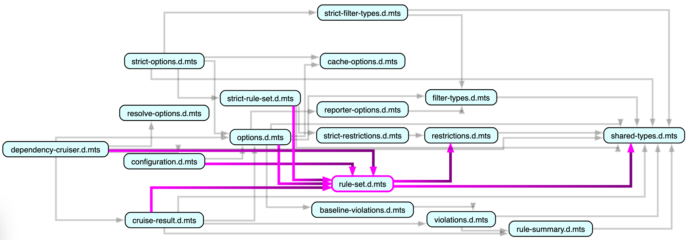

# dependency-cruiser command line interface

The command line interface is a straightforward affair - you pass it a bunch of
files, and dependency-cruiser will start cruising them:

```sh
depcruise [options] <files-or-directories>
```

Below you'll find a list of command line options you can use, divided into ones that
are only available as options on the command line and into those also
available in dependency-cruiser configurations.

## Contents

### Command line only options

1. [arguments - files and/ or directories](#arguments---files-and-or-directories)
1. [`--output-type`: specify the output format](#--output-type-specify-the-output-format)
1. [`--config`/ `--validate`: use a configuration with rules and/or options](#--config---validate)
1. [`--no-config`: do not use a configuration file](#--no-config)
1. [`--init`](#--init)
1. [`--metrics`: calculate stability metrics](#--metrics)
1. [`--no-metrics`: do not calculate stability metrics](#--no-metrics)
1. [`--info`: show what alt-js are supported](#--info-showing-what-alt-js-are-supported)
1. [`--ignore-known`: ignore known violations](#--ignore-known-ignore-known-violations)
1. [`--no-ignore-known`: don't ignore known violations](#--no-ignore-known)
1. [`--help`/ no parameters: get help](#--help--no-parameters)

### Options also available in dependency-cruiser configurations

1. [`--do-not-follow`: don't cruise modules adhering to this pattern any further](#--do-not-follow-dont-cruise-modules-adhering-to-this-pattern-any-further)
1. [`--include-only`: only include modules satisfying a pattern](#--include-only-only-include-modules-satisfying-a-pattern)
1. [`--focus`: show modules and their neighbours](#--focus-show-modules-and-their-neighbours)
1. [`--focus-depth`: influence how many layers of neighbors --focus shows](#--focus-depth-influence-how-many-layers-of-neighbors---focus-shows)
1. [`--reaches`: show modules and their transitive dependents](#--reaches-show-modules-and-their-transitive-dependents)
1. [`--highlight`: highlight modules](#--highlight-highlight-modules)
1. [`--collapse`: summarize to folder depth or pattern](#--collapse-summarize-to-folder-depth-or-pattern)
1. [`--exclude`: exclude dependencies from being cruised](#--exclude-exclude-dependencies-from-being-cruised)
1. [`--max-depth`](#--max-depth)
1. [`--progress`: get feedback on what dependency-cruiser is doing while it's running](#--progress-get-feedback-on-what-dependency-cruiser-is-doing-while-its-running)
1. [`--no-progress`: don't show feedback on what dependency-cruiser is doing](#--no-progress-dont-show-feedback-on-what-dependency-cruiser-is-doing)
1. [`--prefix` prefixing links](#--prefix-prefixing-links)
1. [`--module-systems`](#--module-systems)
1. [`--ts-pre-compilation-deps` (typescript only)](#--ts-pre-compilation-deps-typescript-only)
1. [`--ts-config`: use a typescript configuration file ('project')](#--ts-config-use-a-typescript-configuration-file-project)
1. [`--webpack-config`: use (the resolution options of) a webpack configuration`](#--webpack-config-use-the-resolution-options-of-a-webpack-configuration)
1. [`--preserve-symlinks`](#--preserve-symlinks)
1. [`--cache`: use a cache to speed up cruising (experimental)](#--cache-use-a-cache-to-speed-up-cruising-experimental)
1. [`--cache-strategy`: influence how the cache functionality detects changes (experimental)](#--cache-strategy-influence-how-the-cache-functionality-detects-changes-experimental)
1. [`--no-cache`: switch off caching](#--no-cache-switch-off-caching)

### Standalone formatting of dependency graphs: [depcruise-fmt](#depcruise-fmt)

### Baseline dependencies: [depcruise-baseline](#depcruise-baseline)

### Make GraphViz output more interactive: [depcruise-wrap-stream-in-html](#depcruise-wrap-stream-in-html)

## Command line only options

### arguments - files and/ or directories

You can pass a bunch of files, directories and 'glob' patterns.
dependency-cruiser will

- resolve the glob patterns (if any) to files and directories
- scan directories (if any) for files with supported extensions
- add the passed files to that
  ... and start the cruise with the files thus found.

#### Cruising multiple files and directories in one go

Just pass them as arguments. This, e.g. will cruise every file in the folders
src, test and lib (recursively) + the file called index.ts in the root.

```sh
depcruise --output-type dot src test lib index.ts
```

#### passing globs as parameters

dependency-cruiser uses [node-glob](https://github.com/isaacs/node-glob) to
make sure globs work the same across platforms. It cannot prevent the
environment from expanding globs before it can process it, however.

As each environment interprets globs slightly differently, a pattern
like `packages/**/src/**/*.js` will yield different results.

To make sure glob expansion works _exactly_ the same across
platforms slap some quotes around them, so it's not the environment
(/ shell) expanding the glob, but dependency-cruiser itself:

```sh
depcruise "packages/**/src/**/*.js"
```

### `--output-type`: specify the output format

#### err

For use in build scripts, in combination with `--config`. It's also
the default reporter. Sample use:

```sh
dependency-cruise --config my-depcruise-rules.json src
```

This will:

- ... print nothing and exit with code 0 if dependency-cruiser didn't
  find any violations of the rules in the configuration file (e.g.
  .dependency-cruiser.js or .dependency-cruiser.json).
- ... print the violating dependencies if there is any. Moreover it
  will exit with exit code _number of violations with severity `error` found_
  in the same fashion linters and test tools do.

See the _depcruise_ target in the [package.json](https://github.com/sverweij/dependency-cruiser/blob/develop/package.json#L55)
for a real world example.

#### err-long

Similar to `err`, but in addition for each violation it emits the _comment_
that went with the violated rule, so it's easier to put the rule into context
(and if the comment contains that information: why the rule is there, and
how to fix it). If you use dependency-cruiser in a lint-staged like setup, this
might be a useful format,

```sh
dependency-cruise --output-type err-long --config my-depcruise-rules.json src
```

#### dot

Supplying `dot` as output type will make dependency-cruiser write
a GraphViz dot format directed graph. Typical use is in concert
with _GraphViz dot_ (`-T` is the short form of `--output-type`:)

```shell
dependency-cruise -x "^node_modules" -T dot src | dot -T svg > dependencygraph.svg
```

You can customise the look of these graphs. See the
[theming](./options-reference.md#theme-dot-ddot-and-archi-reporters) and
[summarising](./options-reference.md#summarising-collapsepattern-dot-and-archi-reporters)
sections in the options reference for details. You can also use
[`depcruise-wrap-stream-in-html`](#depcruise-wrap-stream-in-html) to
make the graphs more interactive.

When dependency-cruiser calculcated instability metrics (command line option
[`--metrics`](#--metrics)), these will show up in the modules so it's easy to
verify whether the _stable dependency principle_ holds.

#### ddot - summarise on folder level

> This reporter is _experimental_. It's likely to stay, but the way you configure
> it or how its output looks might change without major version bumping.

The `ddot` reporter is a variant on the `dot` output. It summarises modules on
folder level. You can customise it with [themes](./options-reference.md#theme-dot-ddot-and-archi-reporters)
and [filters](./options-reference.md#filtering-dot-ddot-and-archi-reporters)
just like you can the dot reporter output.

#### archi/ cdot

> This reporter is _experimental_. It's likely to stay, but the way you configure
> it or how its output looks might change without major version bumping.

The archi is a variant on the `dot` output. The archi reporter
can summarise (or 'collapse') dependencies to folders of your own choosing.
Great if you want to have a high level overview of your app's dependencies.

By default it collapses to one folder below folders named _node_modules_, _packages_,
_src_, _lib_ and _test_, but you can pass your own patterns as well in the
`options.reporterOptions.archi` section of your dependency-cruiser configuration.

See the [summarising section in the options reference](./options-reference.md#summarising-collapsepattern-dot-and-archi-reporters)
for details.

<details>
<summary>Sample output</summary>


</details>

#### flat/ fdot

> Just like the archi/ ddot reporter, this one is _experimental_.

Also a variant on the `dot` output. Where all other graphical reporters group
modules into the folders they reside in, this shows all modules on the same
level. It is still possible to apply a theme, though.

<details>
<summary>Sample output</summary>

This flat graph of the report folder in dependency cruiser and all things it direct


As a comparison, this is the default dot report for the same folder(s)


</details>

This too is a reporter that shows the modules' instability metrics when they
have been calculated ([--metrics](#--metrics) command line switch).

#### mermaid

Generates a graph in mermaid format - which can be convenient as e.g. GitHub and
GitLab support this out of the box in their on-line rendering of markdown.

Both due to limitations in the mermaid format and to the relative newness of this
reporter the graph cannot be (made as) feature rich as those produced by the
`dot` reporters.

<details>
<summary>Sample output</summary>


</details>

#### err-html

Generates a stand-alone html report with:

- a summary with files & dependencies cruised and the number of errors and warnings found
- all rules, ordered by the number of violations (un-violated ones are hidden by default)
- a list of all dependency and module violations, ordered by severity, rule name, from module, to module.

```shell
dependency-cruise --validate --output-type err-html -f dependency-report.html src test configs
```


#### markdown

> This reporter is _experimental_. It's currently as configurable as it is
> to test out how it works in various contexts a.o. GitHub actions action summary's
> and possibly in a custom action (to show output in a PR, for instance)
>
> At the moment of writing (2022-06-09) it doesn't support links or show
> a complete list of all run validations like e.g. the `err-html` reporter does.

Approximately the same content as the `err-html` reporter, but instead in markdown
format. The markdown reporter is fairly configurable - see the
[markdown](./options-reference.md#markdown) section in the options reference
for details.

#### html

Write it to html with a dependency matrix instead:

```shell
dependency-cruise -T html -f dependencies.html src
```

#### csv

If you supply `csv` it will write the dependency matrix to a comma
separated file - so you can import it into a spreadsheet program
and analyse from there.

#### teamcity

Write the output in [TeamCity service message format](https://www.jetbrains.com/help/teamcity/build-script-interaction-with-teamcity.html).

E.g. to cruise src (using the .dependency-cruiser config) and emit TeamCity messages to stdout:

```shell
dependency-cruise -v -T teamcity  -- src
```

<details>
<summary>Sample output</summary>

```
##teamcity[inspectionType id='not-to-dev-dep' name='not-to-dev-dep' description='Don|'t allow dependencies from src/app/lib to a development only package' category='dependency-cruiser' flowId='8970869134' timestamp='2019-06-02T10:37:56.812']
##teamcity[inspectionType id='no-orphans' name='no-orphans' description='Modules without any incoming or outgoing dependencies are might indicate unused code.' category='dependency-cruiser' flowId='8970869134' timestamp='2019-06-02T10:37:56.812']
##teamcity[inspectionType id='not-to-unresolvable' name='not-to-unresolvable' description='' category='dependency-cruiser' flowId='8970869134' timestamp='2019-06-02T10:37:56.812']
##teamcity[inspection typeId='not-to-dev-dep' message='src/asneeze.js -> node_modules/eslint/lib/api.js' file='src/asneeze.js' SEVERITY='ERROR' flowId='8970869134' timestamp='2019-06-02T10:37:56.812']
##teamcity[inspection typeId='not-to-unresolvable' message='src/index.js -> ./medontexist.json' file='src/index.js' SEVERITY='ERROR' flowId='8970869134' timestamp='2019-06-02T10:37:56.812']
##teamcity[inspection typeId='not-to-dev-dep' message='src/index.js -> node_modules/dependency-cruiser/src/main/index.js' file='src/index.js' SEVERITY='ERROR' flowId='8970869134' timestamp='2019-06-02T10:37:56.812']
##teamcity[inspection typeId='not-to-dev-dep' message='src/index.js -> node_modules/eslint/lib/api.js' file='src/index.js' SEVERITY='ERROR' flowId='8970869134' timestamp='2019-06-02T10:37:56.812']
##teamcity[inspection typeId='no-orphans' message='src/orphan.js -> src/orphan.js' file='src/orphan.js' SEVERITY='ERROR' flowId='8970869134' timestamp='2019-06-02T10:37:56.812']
```

</details>

Just like the `err` reporter the TeamCity reporter has an empty output when there's
no violations - and a non-zero exit code when there's errors.

#### text

This reporter makes a straight, flat dump of all dependencies found in a cruise.
Useful for grepping.

```sh
dependency-cruise -T text --include-only src/report src/report
```

<details>
<summary>output</summary>

```
src/report/anon/anonymize-path-element.js → src/report/anon/random-string.js
src/report/anon/anonymize-path.js → src/report/anon/anonymize-path-element.js
src/report/anon/index.js → src/report/anon/anonymize-path.js
src/report/csv/index.js → src/report/utl/dependency-to-incidence-transformer.js
src/report/dot/index.js → src/report/dot/dot.template.js
src/report/dot/index.js → src/report/dot/module-utl.js
src/report/dot/index.js → src/report/dot/prepare-custom-level.js
src/report/dot/index.js → src/report/dot/prepare-folder-level.js
src/report/dot/index.js → src/report/dot/theming.js
src/report/dot/module-utl.js → src/report/dot/theming.js
src/report/dot/theming.js → src/report/dot/default-theme.js
src/report/dot/prepare-custom-level.js → src/report/utl/consolidate-to-pattern.js
src/report/dot/prepare-custom-level.js → src/report/dot/module-utl.js
src/report/utl/consolidate-to-pattern.js → src/report/utl/consolidate-module-dependencies.js
src/report/utl/consolidate-to-pattern.js → src/report/utl/consolidate-modules.js
src/report/utl/consolidate-module-dependencies.js → src/report/utl/compare-rules.js
src/report/utl/consolidate-modules.js → src/report/utl/compare-rules.js
src/report/dot/prepare-folder-level.js → src/report/utl/consolidate-to-folder.js
src/report/dot/prepare-folder-level.js → src/report/dot/module-utl.js
src/report/utl/consolidate-to-folder.js → src/report/utl/consolidate-module-dependencies.js
src/report/utl/consolidate-to-folder.js → src/report/utl/consolidate-modules.js
src/report/error-html/index.js → src/report/error-html/error-html.template.js
src/report/error-html/index.js → src/report/error-html/utl.js
src/report/html/index.js → src/report/utl/dependency-to-incidence-transformer.js
src/report/html/index.js → src/report/html/html.template.js
src/report/index.js → src/report/anon/index.js
src/report/index.js → src/report/csv/index.js
src/report/index.js → src/report/dot/index.js
src/report/index.js → src/report/error.js
src/report/index.js → src/report/error-html/index.js
src/report/index.js → src/report/html/index.js
src/report/index.js → src/report/identity.js
src/report/index.js → src/report/json.js
src/report/index.js → src/report/teamcity.js
src/report/index.js → src/report/text.js
```

</details>

... or to find everything connected to the `meta` module, in combination with
`grep`:

```sh
dependency-cruise -v -T text src | grep transpile/meta.js
```

<details>
<summary>output</summary>

```
src/main/resolve-options/normalize.js → src/extract/transpile/meta.js
src/extract/transpile/meta.js → package.json
src/extract/transpile/meta.js → src/extract/transpile/coffeescript-wrap.js
src/extract/transpile/meta.js → src/extract/transpile/javascript-wrap.js
src/extract/transpile/meta.js → src/extract/transpile/livescript-wrap.js
src/extract/transpile/meta.js → src/extract/transpile/typescript-wrap.js
src/extract/transpile/meta.js → src/extract/transpile/vue-template-wrap.js
src/main/index.js → src/extract/transpile/meta.js
src/extract/transpile/index.js → src/extract/transpile/meta.js
src/extract/gather-initial-sources.js → src/extract/transpile/meta.js
```

</details>

#### json

This emits the internal representation of a cruise as json. It's the input format for
[depcruise-fmt](#depcruise-fmt), and is useful for debugging.

See [output-format](output-format.md) for more information

#### anon - obfuscated json

The same as json - but with all paths obfuscated. This enables you to share the result
of a cruise for troubleshooting purposes without showing what the source code is
about.

To save an anonymized dependency graph to `anonymized-result.json` do this:

```sh
depcruise --validate --output-type anon --output-to anonymized-result.json bin src
```

e.g. to save an anonymized graph into and svg:

```sh
depcruise --validate --output-type anon bin src | depcruise-fmt --output-type dot - | dot -T svg > anonymized_graph.svg
```

<details>
<summary>Sample output</summary>

Here's a part of dependency-cruiser's own dependency graph both original
and obfuscated (after converting it to a graph via depcruise-fmt and dot -
so it's easier to compare than the two json's):

##### Original


##### Obfuscated



</details>

<details>
<summary>How does the obfuscation work?</summary>

- It uses the list of words you pass in `options.reporterOptions.anon.wordlist`
  to replace non-common path elements
  with (`src/search/dragonfly-algorithm.js` -> `src/animal/announce.js`,
  `src/search/dragonfly-algorithm.spec.js` -> `src/animal/announce.spec.js`).
- (You can use any array of strings here - a good one is Sindre Sorhus'
  [mnemonic-words](https://www.npmjs.com/package/mnemonic-words), which
  you can simply require into the option if you're using JavaScript as
  the config file format):
  ```javascript
  ...
  options: {
    reporterOptions:
      anon: {
        wordlist: require('mnemonic-words')
      }
  }
  ...
  ```
- It will retain name similarities (like the `announce.js`/ `announce.spec.js` above).
- When there's more path elements in your dependency graph than in the corpus
  the algorithm falls back to random strings that have the same length and pattern
  as the original one (`secretService-record.ts` -> `fnwarqVboiuvq-pugnmh.ts`).
- The algorithm considers some patterns to be 'common'. It leaves those
  alone to retain some readability. 'Common' patterns include `src`, `test`,
  `node_modules`, `.`, `index` etc. You can find the full regexp in
  [anonymize-path.js](../src/report/anon/anonymize-path.js#3).
- The algorithm obfuscates _within_ node_modules is obfuscated as well, so
  it won't become apparent from the dependency graph which ones your app
  uses either.

</details>

#### baseline - generate known violations

Generates a list of all current violations you can use as input for the
[`--ignore-known`](#--ignore-known-ignore-known-violations) option.

#### metrics - generate a report with stability metrics for each folder

Shows for each module and each folder:

| metric             | abbreviation | description                                                                                                               |
| ------------------ | ------------ | ------------------------------------------------------------------------------------------------------------------------- |
| number of modules  | N            |                                                                                                                           |
| Afferent couplings | Ca           | The number of modules outside this folder that depend on this folder ("coming in")                                        |
| Efferent couplings | Ce           | The number of modules this folder depends on _outside_ the current folder ("going out")                                   |
| Instability        | I            | Ce / (Ca + Ce) a number between 0 and 1 that indicates how 'stable' the folder with 0: wholy stable; and 1 wholy unstable |

While the term 'instability' has a negative connotation it's also unavoidable
in any meaningful system. It's the basis of Martin's variable component stability
principle: 'the instability of a folder should be larger than the folders it
depends on'.

Only present when dependency-cruiser was asked to calculate it.

<details>
<summary>Typical output</summary>

```
name                                                      N    Ca    Ce  I
----------------------------------------------------- ----- ----- -----  -----
bin                                                       4     0    12  1
src/validate                                              7     0     4  1
bin/depcruise-baseline.js                                 1     0     4  1
bin/depcruise-fmt.js                                      1     0     4  1
bin/dependency-cruise.js                                  1     0     4  1
src/validate/index.js                                     1     0     4  1
src/extract                                              40     3    86  0.97
src/extract/get-dependencies.js                           1     1    14  0.93
src                                                      64     9   115  0.93
src/extract/resolve/index.js                              1     1    11  0.92
src/main                                                 10     3    25  0.89
src/main/resolve-options                                  1     1     7  0.88
src/extract/clear-caches.js                               1     1     7  0.88
src/main/resolve-options/normalize.js                     1     1     7  0.88
src/extract/transpile                                    10     4    27  0.87
src/extract/resolve                                      10     5    30  0.86
src/extract/transpile/vue-template-wrap.js                1     1     6  0.86
src/extract/gather-initial-sources.js                     1     1     6  0.86
src/extract/resolve/resolve-cjs.js                        1     1     5  0.83
src/extract/index.js                                      1     1     4  0.8
src/extract/parse/to-javascript-ast.js                    1     2     8  0.8
src/extract/transpile/coffeescript-wrap.js                1     1     4  0.8
src/extract/transpile/svelte-wrap.js                      1     1     4  0.8
src/extract/transpile/typescript-wrap.js                  1     1     4  0.8
src/extract/resolve/determine-dependency-types.js         1     1     4  0.8
src/main/options/normalize.js                             1     1     4  0.8
src/main/rule-set/validate.js                             1     1     4  0.8
src/validate/match-dependency-rule.js                     1     1     4  0.8
src/validate/match-module-rule.js                         1     1     4  0.8
src/cli/index.js                                          1     2     7  0.78
src/cli/normalize-cli-options.js                          1     2     7  0.78
src/main/index.js                                         1     3    10  0.77
src/cli                                                   6     6    18  0.75
src/extract/resolve/get-manifest                          2     2     6  0.75
src/main/rule-set                                         2     2     6  0.75
src/extract/transpile/babel-wrap.js                       1     1     3  0.75
src/extract/transpile/livescript-wrap.js                  1     1     3  0.75
src/extract/resolve/get-manifest/merge-manifests.js       1     1     3  0.75
src/extract/ast-extractors/extract-amd-deps.js            1     1     3  0.75
src/extract/ast-extractors/extract-es6-deps.js            1     1     3  0.75
src/extract/ast-extractors/swc-dependency-visitor.js      1     1     3  0.75
src/extract/ast-extractors/extract-typescript-deps.js     1     1     3  0.75
src/cli/format-meta-info.js                               1     1     3  0.75
src/cli/format.js                                         1     1     3  0.75
src/extract/transpile/meta.js                             1     4    10  0.71
src/extract/parse/to-typescript-ast.js                    1     2     5  0.71
src/extract/resolve/resolve-amd.js                        1     2     5  0.71
src/extract/parse                                         3     7    17  0.71
src/extract/ast-extractors                                7     5    11  0.69
src/main/options                                          3     3     6  0.67
src/extract/resolve/external-module-helpers.js            1     3     6  0.67
src/extract/resolve/get-manifest/index.js                 1     2     4  0.67
src/extract/resolve/resolve-helpers.js                    1     1     2  0.67
src/main/report-wrap.js                                   1     1     2  0.67
src/main/rule-set/normalize.js                            1     1     2  0.67
src/validate/violates-required-rule.js                    1     1     2  0.67
src/main/utl                                              1     2     3  0.6
src/main/utl/normalize-re-properties.js                   1     2     3  0.6
src/main/options/validate.js                              1     2     3  0.6
src/extract/parse/to-swc-ast.js                           1     3     4  0.57
src/main/files-and-dirs                                   1     1     1  0.5
src/extract/transpile/index.js                            1     1     1  0.5
src/extract/transpile/svelte-preprocess.js                1     1     1  0.5
src/extract/resolve/resolve.js                            1     3     3  0.5
src/extract/ast-extractors/extract-cjs-deps.js            1     2     2  0.5
src/extract/ast-extractors/extract-swc-deps.js            1     1     1  0.5
src/extract/utl/detect-pre-compilation-ness.js            1     1     1  0.5
src/main/files-and-dirs/normalize.js                      1     1     1  0.5
src/cli/validate-node-environment.js                      1     3     2  0.4
src/extract/utl/get-extension.js                          1     2     1  0.33
src/validate/is-module-only-rule.js                       1     2     1  0.33
src/extract/resolve/module-classifiers.js                 1     5     2  0.29
src/extract/ast-extractors/estree-helpers.js              1     3     1  0.25
src/extract/utl                                           6    10     2  0.17
src/extract/utl/path-to-posix.js                          1     5     1  0.17
src/meta.js                                               1    15     0  0
src/extract/transpile/javascript-wrap.js                  1     1     0  0
src/extract/utl/strip-query-parameters.js                 1     1     0  0
src/extract/utl/compare.js                                1     1     0  0
src/extract/utl/extract-module-attributes.js              1     1     0  0
src/main/options/defaults.js                              1     1     0  0
src/cli/defaults.js                                       1     1     0  0
bin/wrap-stream-in-html.js                                1     0     0  0
src/validate/matchers.js                                  1     3     0  0
src/validate/utl.js                                       1     3     0  0
```

</details>

### `--config`/ `--validate`

Validates against a list of rules in a configuration file. This defaults to a file
called `.dependency-cruiser.js` (/ `.dependency-cruiser.cjs`/
`.dependency-cruiser.json`), but you can specify your own rules file, which can
be in json format or a valid node module returning a rules object literal.

```shell
dependency-cruise -x node_modules --config my.rules.json src spec
```

> _Caveat_: up to version 12, you needed to specify the `--config` command line
> option in order for a config file to be used at all. As of version 13 picking
> up a config file is the default, so you don't need to specify `--config` anymore
> _unless_ you want to have an alternate name or location for it.
> If you want to run _without_ a configuration file use --no-config

> _Tip_: usually you don't need to specify the rules file after --config. However
> if you run `depcruise --config src`, _src_ will be interpreted as the rules file.
> Which is probably is not what you want. To prevent this, place `--`
> after the last option, like so:
>
> ```
> dependency-cruise --config -- src
> ```

The configuration specifies a bunch of regular expressions pairs your dependencies
should adhere tom as well as configuration options that tweak what is cruised and
how.

A simple validation configuration that forbids modules in `src` to use stuff
in the `test` folder and allows everything else:

```json
{
  "forbidden": [
    {
      "from": { "path": "^src" },
      "to": { "path": "^test" }
    }
  ]
}
```

You can optionally specify a name and an error severity ('error', 'warn' (the
default) and 'info') with them that will appear in some reporters:

```json
{
  "forbidden": [
    {
      "name": "no-src-to-test",
      "severity": "error",
      "from": { "path": "^src" },
      "to": { "path": "^test" }
    }
  ]
}
```

For more information about writing rules see the [tutorial](rules-tutorial.md) and the
[rules-reference](rules-reference.md). For options check out the
[options reference](options-reference.md).

For an easy set up of both use [--init](#--init)

#### null - no output, just an exit code

This dummy 'reporter' will print _nothing_, not even when there are errors. It
will exit with the exit code _number of violations with severity `error` found_,
though. This reporter primarily exists to help in the development of
dependency-cruiser.

### `--no-config`

Use this if you don't want to use a configuration file. Also overrides earlier
specified --config (or --validate) options.

> If you actually use this, I'm interested in your use case. Please drop an
> [issue on GitHub](https://github.com/sverweij/dependency-cruiser/issues/new?assignees=&labels=&template=use-without-config.md&title=I+use+dependency-cruiser+without+a+configuration+file.+This+is+why:) or contact me on mastodon
> ([@mcmeadow@mstdn.social](https://mstdn.social/@mcmeadow)) or twitter
> ([@mcmeadow](https://twitter.com/mcmeadow)).

### `--init`

This asks some questions and - depending on the answers - creates a dependency-cruiser
configuration with some useful rules to the current folder and exits.

The configuration file is larded with documentation to make it easy to tweak.

Use `--config` to have dependency-cruiser take the configuration file into account.

<details>
<summary>Some of the rules that will be in the configuration (either directly or from a
preset):</summary>

| Rule                     | Description                                                                                                      |
| ------------------------ | ---------------------------------------------------------------------------------------------------------------- |
| `no-circular`            | flags all circular dependencies                                                                                  |
| `no-orphans`             | flags orphan modules (except typescript `.d.ts` files)                                                           |
| `no-deprecated-core`     | flags dependencies on deprecated node 'core' modules                                                             |
| `no-deprecated-npm`      | flags dependencies on deprecated npm modules                                                                     |
| `no-non-package-json`    | flags (npm) dependencies that don't occur in package.json                                                        |
| `not-to-unresolvable`    | flags dependencies that can't be resolved                                                                        |
| `no-duplicate-dep-types` | flags dependencies that occur more than once in package.json                                                     |
| `not-to-test`            | Don't allow dependencies from outside test folders to test folders                                               |
| `not-to-spec`            | Don't allow dependencies to (typescript/ JavaScript/ CoffeeScript) spec files                                    |
| `not-to-dev-dep`         | Don't allow dependencies from src/app/lib to a development only package                                          |
| `optional-deps-used`     | Inform about the use of 'optional' dependencies (so you can ensure their imports a are sufficiently managed)     |
| `peer-deps-used`         | Warn about the use of a peer dependency (they might be OK for you, but it's not typical you have them).          |
| `no-duplicate-dep-types` | Warn if a dependency occurs in your package.json more than once (technically: has more than one dependency type) |

</details>

### `--metrics`

Makes dependency-cruiser calculate stability metrics (number of dependents,
number of dependencies and 'instability' (`# dependencies/ (# dependencies + # dependents)`))
for all folders. These metrics are adapted from _Agile software development:
principles, patterns, and practices_ by Robert C Martin (ISBN 0-13-597444-5).

Currently this output is only reflected in the `json` and the
`metrics` reporter. Some other reporters will follow suit later.

- These metrics substitute 'components' and 'classes' from that Martin's book
  with 'folders' and 'modules'; the closest relatives, that work for the most
  programming styles in JavaScript (and its derivative languages).
- For output-type `metrics` this command line switch is implied, so there's no
  need to specify it there.
- Not on by default as it's relatively resource intensive (especially when
  dependency-cruiser doesn't already derives dependents of folders.)

### `--no-metrics`

Do not calculate metrics. You can use this to override an earlier set `--metrics`
command line option or `metrics` option in a .dependency-cruiser.js configuration
file.

### `--info` showing what alt-js are supported

Which alt-js languages dependency-cruiser supports depends on the availability
it has to them. To see how dependency-cruiser perceives its environment use
`depcruise --info` (any arguments are ignored).

<details>
<summary>Typical output</summary>

```
Supported:

  If you need a supported, but not enabled transpiler ('✖' below), just install
  it in the same folder dependency-cruiser is installed. E.g. 'npm i livescript'
  will enable livescript support if it's installed in your project folder.

Transpilers:

  ✔ javascript (>es1)
  ✔ coffee-script (>=1.0.0 <2.0.0)
  ✔ coffeescript (>=1.0.0 <3.0.0)
  ✖ livescript (>=1.0.0 <2.0.0)
  ✔ typescript (>=2.0.0 <4.0.0)

Extensions:

  ✔ .js
  ✔ .mjs
  ✔ .jsx
  ✔ .vue
  ✔ .ts
  ✔ .tsx
  ✔ .d.ts
  ✖ .ls
  ✔ .coffee
  ✔ .litcoffee
  ✔ .coffee.md
  ✔ .csx
  ✔ .cjsx
```

</details>

### `--ignore-known`: ignore known violations

> This feature was recently (september 2021) introduced. It is useful, well
> tested, stable and it will stay. However, the file format and the ergonomics of
> the command(s) to deal with known violations might still shift a bit _without_
> dependency-cruiser getting a major version bump.
>
> The `err`, `err-long` and `err-html` reporters have been adapted to reflect
> the results of this feature well. Other reporters to which it is relevant (e.g.
> all of the `dot` family, `html`, `teamcity`) will follow in releases after
> dependency-cruiser v10.3.0.

With this option engaged dependency-cruiser will ignore known violations as saved
in the file you pass it as a parameter. If you don't pass a filename dependency-cruiser
will assume the known violations to live in a file called `.dependency-cruiser-known-violations.json`.

You can generate a known violations file with the `baseline` reporter e.g. like so:

```sh
dependency-cruiser src --config --output-type baseline --output-to .dependency-cruiser-known-violations.json
```

... or with the [`depcruise-baseline`](#depcruise-baseline) command which simplifies this a bit:

```sh
# will assume a .dependency-cruiser.{js,cjs,json} to exist and will write
# the baseline output to .dependency-cruiser-known-violations.json
depcruise-baseline src
```

#### How dependency-cruiser ignores known violations

For all violations dependency-cruiser finds in the known violations file it will
lower the severity to `ignore`. It depends on the reporter how these show up. E.g.
the `err`/ `err-long` reporters will hide all ignored violations, but add a
warning if there's violations ignored:

```
✔ no dependency violations found (454 modules, 1078 dependencies cruised)
⚠ 20 known violations ignored. Run with --no-ignore-known to see them.
```

#### When is this useful?

When you first deploy dependency-cruiser in a large code base chances are it will
detect quite some violations - even when it only uses the default set of rules
that comes with `--init`. It will not always possible to fix all the violations
right away. This means that any run of dependency-cruiser will show violations
you already decided to fix later - possibly burying any new violations (which
you probably want to avoid).

With this option you can avoid that.

### `--no-ignore-known`

Don't ignore known violations. Use this if you want to override an `--ignore-known`
option set earlier on the command line.

### `--help` / no parameters

Running with no parameters or with `--help` gets you help. It doesn't show all
options documented here in order to keep it inviting to use. The ones left out
are:

- the _implied_ ones (e.g. `--config` implies the existence of
  a `--no-config` option).
- ones that have an _alias_ to prevent a breaking change
  (`--validate` is an alias for `--config`).
- ones that have been superseded by better options but were left in for
  backwards compatibility. E.g. `--max-depth` has been superseded by the
  `--focus`/ `--focus-depth` and `--collapse` which are both more powerful
  and mor to the point for most use cases.
- those that better live in the configuration file, but are still cli
  options for backwards compatibility (e.g. `--ts-config`, `--webpack-config`,
  `--ts-pre-compilation-deps`, `--module-systems`, `--preserve-symlinks`)

## Options also available in dependency-cruiser configurations

Some of the `options` in dependency-cruiser configurations are also available as
command line options. They _override_ what's in the configuration, so they're great
if you need to quickly experiment with an option, or when you want to use one
configuration for multiple purposes.

The first four options below will be of use when you want to tame the size of
the visual representation of a big dependency graph. For the rest of the options
you're typically best off setting in a configuration file (generate one with
`depcruise --init`).

### `--do-not-follow`: don't cruise modules adhering to this pattern any further

If you _do_ want to see certain modules in your reports, but are not interested
in these modules' dependencies, you'd pass the regular expression for those
modules to the `--do-not-follow` (short: `-X`) option. A typical pattern you'd
use with this is "node_modules" (but be sure to check out the possibilities you
have with the [`doNotFollow` option](#./options-reference.md#donotfollow-dont-cruise-modules-any-further))

```sh
dependency-cruise -X "^node_modules" -T html -f deps-with-unfollowed-node_modules.html src
```

Details and more ways to limit dependency-cruiser from following things: check out
the [doNotFollow](./options-reference.md#donotfollow-dont-cruise-modules-any-further)
option in the options reference.

### `--include-only`: only include modules satisfying a pattern

E.g. to only take modules into account that are in the `src` tree (and exclude all
node_modules, core modules and modules otherwise outside it):

```sh
dependency-cruise --include-only "^src" -T dot src | dot -T svg > internal-dependency-graph.svg
```

See [includeOnly](./options-reference.md#includeonly-only-include-modules-satisfying-a-pattern)
in the options reference for more details.

### `--focus`: show modules and their neighbours

You can use this e.g. to inspect one module or folder and see what the direct
dependencies are and which modules are direct dependents.

Takes a regular expression in the same fashion `--include-only`, `--exclude` and
`--do-not-follow` do.

```sh
dependency-cruise src --include-only "^src" --focus "^src/main" -T dot | dot -T svg > focus-on-main-dir-graph.svg
```

See [focus](./options-reference.md#focus-show-modules-matching-a-pattern---with-their-neighbours)
in the options reference for more details.

### `--focus-depth`: influence how many layers of neighbors --focus shows

If you want to increase the number of layers of neighbors (transitive dependencies
& dependents) the focus option shows as context, you can specify that with this
command line switch. A value of 1 (which is also the default) means _direct neighbours
only_. 2 also shows the neighbour's neighbours, etc. The value 0 means 'infinite'.

```sh
dependency-cruise src --include-only "^src" --focus "^src/main" --focus-depth 0 -T dot |\
  dot -T svg > focus-on-main-dir-graph.svg
```

See [focus depth](./options-reference.md#adding-depth) in the options reference
for more details

### `--reaches`: show modules and their transitive dependents

If you want to e.g. analyze what modules will directly or indirectly be affected
by a change you make in one or modules you can use this option.

Just like the filter options above, takes a regular expression:

```sh
dependency-cruise src --include-only "^src/report" --reaches "^src/report/utl/index.js" -T dot | dot -T svg > reaches-example.svg
```

See [reaches](./options-reference.md#reaches-show-modules-matching-a-pattern---with-everything-that-can-reach-them)
in the options reference for more details.

### `--highlight`: highlight modules

This option takes a regular expression and reporters that recognize the
highlight option[^1] will highlight the modules that match that regular
expression.

[^1]: Currently only _dot_ (and its variants) and _mermaid_.

```sh
dependency-cruise src --include-only "^src/report" --highlight "^src/report/utl/index.js" -T dot | dot -T svg > highlight-example.svg
```

This can be useful when you want to display what modules have changed since
the last commit[^2]. Especially when the number of modules of your project is
limited this can be more effective than using the `--reaches` option for the
same.

[^2]:
    This uses [watskeburt](https://github.com/sverweij/watskeburt) which by default
    generates a regular expression that includes all modules changed since the last
    commit. Here we pass the `main` branch to it so we can see all modules that
    make up the diff between that branch and wherever we are currently in the
    git history.

```sh
dependency-cruise src --highlight "$(watskeburt main)" -T dot | dot -T svg > highlight-diff-example.svg
```

<details>
<summary>Example output</summary>

With --highlight it shows the whole code base (suitable when your codebase is not
that big). Command used:

```
npx depcruise src types --include-only '^(src|types)' --highlight "$(watskeburt main)" --config --output-type dot | dot -T svg > with-highlight.svg
```


With --reaches it shows only part of the code base (suitable when your codebase
is large). Command used:

```
npx depcruise src types --include-only '^(src|types)' --highlight "$(watskeburt main)" --config --output-type dot | dot -T svg > with-highlight.svg
```


</details>

See [highlight](./options-reference.md#highlight-highlight-modules) in the options
reference for more details, like how to adjust the attributes used for highlighting
in the dot-like reporters.

### `--collapse`: summarize to folder depth or pattern

If you feel the need for reporting on a higher level (e.g. on packages in a
mono repo, or the main folders in `src`) you can use the `--collapse` option. It
takes either a single digit or a regular expression.

#### --collapse: single digit

The most typical use for collapsing is to limit the folder depth. It is possible
to do this with regular expressions (see below, and in the
[options reference](./options-reference.md#reporteroptions)). As this case occurs
a lot you can pass

```sh
depcruise src --include-only ^src --collapse 2 -T dot | dot -T svg > collapsed.svg
```

> Under water dependency-cruiser translates the single digit into a regular
> expression again. For `2` e.g. it generates `/node_modules/[^/]+|^[^/]+\/[^/]+\//`

### --collapse: regular expression

If you need more flexibility, you can also pass a regular expression to --collapse.
E.g. to only collapse stuff under `node_modules` and `lib` (but not under e.g.
`test` and `src`) you can pass this:

```sh
depcruise src --do-not-follow node_modules --collapse "^(node_modules|lib)/[^/]+" -T dot | dot -T svg > collapsed.svg
```

`--collapse` works the same as the [dot/ archi specific collapsePattern option](#summarising-collapsepattern-dot-and-archi-reporters),
except it works for all reports instead of for only the dot and archi reporters.
This means you can not only use it to make graphical output look better, but also
to show simple textual output of relations between high level components e.g.

```sh
depcruise packages --include-only ^packages --collapse "^packages/[^/]+" -T text
```

### `--exclude`: exclude dependencies from being cruised

If you don't want to see certain modules in your report (or not have them
validated), you can exclude them by passing a regular expression to the
`--exclude` (short: `-x`) option. Two examples:

```sh
dependency-cruise -x "node_modules" -T html -f deps-without-node_modules.html src
```

```sh
dependency-cruise -x "^(coverage|test|node_modules)" -T html -f deps-without-stuffs.html src
```

See the [exclude](./options-reference.md#exclude-exclude-dependencies-from-being-cruised) option
in the options reference for details.

### `--max-depth`

Only cruise the specified depth, counting from the specified root-module(s). This
command was mostly useful in combination with visualisation output like _dot_ to
keep the generated output to a manageable size.

You probably don't want to use these as today better options exist that serve the
same goal and give better looking and more accurate results. E.g.:

- use the [`--collapse`](#--collapse-summarize-to-folder-depth-or-pattern) option
- use a [collapsePattern](./options-reference#summarising-collapsepattern-dot-and-archi-reporters)
  in conjunction with your dot reporter to hide details you don't want to see
  right now
- use filters like --include-only and --focus to only show a relevant part of your graph
- use the `archi` reporter that produces a high level dependency-graph based on
  heuristics.

```sh
dependency-cruise --max-depth 2 -T dot src/main/index.ts | dot -T svg > depth-limited-dependency-graph.svg
```

See [maxDepth](./options-reference.md#maxdepth)

> This will only be effective when you pass one file as an argument.

### `--progress`: get feedback on what dependency-cruiser is doing while it's running

If the number of files dependency-cruiser needs to analyse is large, it can be
busy for awhile. To get an impression of what dependency-cruiser is doing you
can pass the `--progress` option.

#### cli-feedback (the default when you pass --progress without an option)

Gives a one-line summary of what dependency-cruiser is currently doing
(e.g. parsing input, reading files, analyzing them, making a report about them).
When dependency-cruiser is done it erases that feedback again so it doesn't
clutter your logs. It also writes to stderr, so you can still safely redirect
without the progress messages ending up in your output.

<details>
<summary>Typical output</summary>

```
▶ reading files ...
```

</details>

#### performance-log

Writes a detailed overview of the time and memory each step in dependency-cruiser's
processing takes to stderr. The main purpose is to get a quick high-level overview
of what dependency-cruiser is spending its time (and memory) on, so the results
stay in view when dependency-cruiser is done.

<details>
<summary>Typical output</summary>

```
 elapsed real          user        system         ∆ rss   ∆ heapTotal    ∆ heapUsed    ∆ external after step...
------------- ------------- ------------- ------------- ------------- ------------- ------------- -------------
        785ms         813ms          98ms    +132,384kB     +85,020kB     +62,483kB      +2,280kB start of node process
         12ms          11ms           1ms      +1,148kB        +256kB        +785kB           0kB parsing options
         79ms          18ms           5ms      +2,492kB        +548kB      +1,731kB        +541kB cache: check freshness with metadata
        187ms         345ms          11ms     +18,620kB      +7,024kB      +9,037kB      -1,430kB parsing rule set
          0ms           2ms           0ms          +8kB           0kB         +28kB           0kB determining how to resolve
          0ms           1ms           0ms         +24kB           0kB          +9kB           0kB reading files
         23ms          32ms           7ms        +724kB      +1,280kB     -12,023kB           0kB reading files: gathering initial sources
      1,260ms       2,040ms         112ms     +50,152kB     +48,640kB     +51,344kB        +413kB reading files: visiting dependencies
          0ms           0ms           0ms          +8kB           0kB          +3kB           0kB analyzing
         13ms          33ms           0ms         +28kB           0kB      +6,083kB           0kB analyzing: cycles
         27ms          59ms           2ms      +3,012kB      +2,816kB      +1,842kB        -157kB analyzing: dependents
          1ms           1ms           0ms          +8kB           0kB         +46kB           0kB analyzing: orphans
        292ms         384ms           8ms      +2,176kB      +2,048kB        +668kB           0kB analyzing: reachables
          0ms           0ms           0ms         +12kB           0kB          +3kB           0kB analyzing: module metrics
          0ms           0ms           0ms           0kB           0kB          +3kB           0kB analyzing: add focus (if any)
         80ms         157ms           3ms        +560kB        +768kB      -3,119kB           0kB analyzing: validations
          5ms          13ms           0ms         +56kB        +256kB        +960kB           0kB analyzing: comparing against known errors
          6ms           7ms           1ms      +1,704kB      +1,088kB      +2,314kB        +541kB cache: save
          5ms           5ms           0ms         +40kB           0kB        +596kB           0kB reporting
          0ms           0ms           0ms           0kB           0kB          +5kB           0kB really done
------------- ------------- ------------- ------------- ------------- ------------- ------------- -------------
      2,775ms       3,920ms         248ms    +213,156kB    +149,744kB    +122,798kB      +2,188kB
```

Number formatting takes place with the `Intl` API, so in your locale the numbers
and units might look slightly different.

</details>

#### none (the default when you don't pass --progress )

Make sure dependency-cruiser doesn't print any feedback. Useful if you want to
override the progress option configured in a configuration file (currently
an undocumented feature that is subject to change).

### `--no-progress`: don't show feedback on what dependency-cruiser is doing

The equivalent of `--progress none`.

As showing no progress is dependency-cruiser's default the only use for this
option is to override a `progress` setting from a configuration file or a
`--progress` command line option set earlier on the command line.

### `--prefix` prefixing links

In the dot output prefix links to the source files with a string - useful to link to
e.g. an on line repository.

```sh
dependency-cruise --prefix "https://github.com/you/yourrepo/tree/master/" -T dot src | dot -T svg > dependency-graph-with-links-to-gh.svg
```

See [prefix](./options-reference.md#prefix-prefix-links-in-reports) in the options
reference for details.

### `--module-systems`

Here you can pass a list of module systems dependency-cruiser should use
to detect dependencies. It defaults to `amd, cjs, es6`.

See [moduleSystems](./options-reference.md#modulesystems) in the options reference.

### `--ts-pre-compilation-deps` (typescript only)

By default dependency-cruiser does not take dependencies between typescript
modules that don't exist after compilation to JavaScript. Pass this command
line switch to do take them into account.

For details see [tsPreCompilationDeps](./options-reference.md#tsprecompilationdeps) in the
options reference.

### `--ts-config`: use a typescript configuration file ('project')

If you use typescript and want dependency-cruiser to take the `baseDir`'s and/ or `paths`
in your tsconfig.json into account- can pass it with this option.

Although it's possible to pass it as a command line option, you typically
want to do this in a configuration file - see
[tsConfig](./options-reference.md#tsconfig-use-a-typescript-configuration-file-project)
section in the options reference for details.

> If you happen to use a [`jsconfig.json`](https://code.visualstudio.com/docs/languages/jsconfig)
> you can pass that as well - the syntax for tsconfig.json and jsconfig.json
> is identical for all practical purposes.

### `--webpack-config`: use (the resolution options of) a webpack configuration

With a webpack config you can drastically alter how module names resolve to
files on disk, a.o. with aliases. If you want dependency-cruiser to take that
into account (you probably do), you can pass the webpack config here.

However, just like with tsconfigs, you probably want to put this in a configuration
file - see the [webpackConfig](./options-reference.md#webpackconfig-use-the-resolution-options-of-a-webpack-configuration)
section in the options reference.

### `--preserve-symlinks`

Whether to leave symlinks as is or resolve them to their realpath. This option defaults
to `false` (which is also nodejs' default behavior since release 6).

You'll typically want to set this in the configuration file with the [preserveSymlinks](./options-reference.md#preservesymlinks)
option.

### `--cache`: use a cache to speed up cruising (experimental)

> :warning: the cache feature is _experimental_. It _is_ significantly faster
> and it _is_ tested, but the interface & format might be changing without
> dependency-cruiser getting a major bump.

> Available from version 11.14.0.

With `--cache` you instruct dependency-cruiser to use a cache. When you don't
specify a location it uses `node_modules/.cache/dependency-cruiser` as the
folder for the cache.

Dependency-cruiser will use the cache as long as it's not invalidated, which
happens when

- changes to files that would be part of a cruise have happened.
  This includes modifications of files already included in the earlier cruise,
  new files, file deletions and file renaming. By default dependency-cruiser
  uses `git` to do this (see `--cache-strategy` below for other options).
- The parameters/ options of the cruises are still "compatible".
  The rule of thumb is that if the _existing_ cache has a broader scope than
  the _new_ one, the cruises are compatible and the new cruise can use the
  cache. Currently dependency-cruiser takes a simplified approach to this:
  - if the arguments are not equal the cache is not valid anymore
  - if the cache was created as the result of a filter (e.g. _includeOnly_,
    _reaches_ or _collapse_) the new cruise can be served from the cache when
    the filters are exactly the same.
  - if the cache was created without a filter, but the new cruise includes one,
    the new cruise _can_ be served from the cache.

### `--cache-strategy`: influence how the cache functionality detects changes (experimental)

> :warning: this is part of the _experimental_ cache feature. Especially the
> 'content' cache strategy is quite new. The feature _is_ tested and works, but
> interface & format might change without dependency-cruiser getting a major
> bump.

> Available from version 12.5.0

With this option you can tell dependency-cruiser how it should detect whether
files have changed. The default (`metadata`) use git for this - it is the fastest
and most reliable of the two. The other one (`content`) is there in case you
don't have git available or are working on a shallow clone of your repository
(which might be the only practical way on a continuous integration server). The
`content` strategy looks at the content of the files.

When you don't pass --cache-strategy (and don't specify a `strategy` in the
`cache` option in you .dependency-cruiser.js) the strategy defaults to `metadata`.

### `--no-cache`: switch off caching

This overrides any `--cache`, `--cache-strategy` options set earlier on the
command line as well as the [`cache`](./options-reference.md#cache)
configuration option.

## depcruise-fmt

`depcruise-fmt` is a separate command line program, that takes the (json)
output of a dependency-cruise and runs one of the reporters over it. This
could be useful if you want to display the results of the same cruise in
different ways, without having to run the cruise repeatedly. Especially on
bigger code bases this can save time. Cruising all code can sometimes take
more than a minute, while formatting usually takes well below a second.

For instance, to report any violations to console, create a distributable
report _and_ generate a dependency graph. With just the `depcruise` command
this would look like

```sh
depcruise -v -T err-long src
depcruise -v -T err-html src -f violation-report.html
depcruise -v -T dot src | dot -T svg > dependency-graph.svg
```

With depcruise-fmt there's just one cruise and three quick depcruise-fmt commands

```sh
depcruise -v -T json src -f cruise_result.json
depcruise-fmt -T err-long cruise_result.json
depcruise-fmt -T err-html -f violation-report.html cruise_result.json
depcruise-fmt -T dot cruise_result.json | dot -T svg > dependency-graph.svg
```

### filters

You can also use the filters `--focus`, `--include-only` and `--exclude` to peruse
parts of the dependency-graph. This could be useful for chopping up humongous
graphs efficiently, or to quickly find the uses of a module:

```sh
depcruise -v -T json src -f cruise_result.json
depcruise-fmt -T dot --focus "^src/main" cruise_result.json | dot -T svg > main.svg
depcruise-fmt -T dot --focus "^src/juggle" cruise_result.json | dot -T svg > juggle.svg
depcruise-fmt -T dot --include-only "^src/the-law" cruise_result.json | dot -T svg > the-law.svg

## or to find dependencies going into or departing from the spelunk-me module
## and emitting them to stdout:
depcruise-fmt -T text --focus "^src/main/spelunk-me\\.ts$" cruise_result.json
```

### highlight

The `--highlight` option is also available in case you want to just highlight
modules without filtering them. See the [--highlight](#highlight-highlight-modules)
documentation of the regular depcruise command for more information.

### collapse/ summarize

Summarize or collapse to either a folder depth or (if you're feeling fancy) a regular
expression. It works the same as the regular depcruise command's [`--collapse`](#--collapse-summarize-to-folder-depth-or-pattern) option.

### prefix

To enable different prefixes on the same depcruise run, you can uses the `--prefix`
option to set (or override) the prefix used in e.g. the `err-html` and the
`dot`-like reporters. It works the same as depcruise's
[option of the same name](https://github.com/sverweij/dependency-cruiser/blob/develop/doc/cli.md#--prefix-prefixing-links)

See [prefix](./options-reference.md#prefix-prefix-links-in-reports) in the options
reference for details.

### getting non-zero exit codes

If you want to see non-zero exit codes when there's error level dependency
violations, you can use the `--exit-code` (short: `-e`). This only works for
the output types that support non-zero exit codes (_err_, _err-long_ and
_TeamCity_). Example for the default output type (_err_):

```sh
depcruise-fmt -e cruise_result.json
```

### What --help will tell you

```
Usage: depcruise-fmt [options] <dependency-cruiser-json>

Format dependency-cruiser output json.
Details: https://github.com/sverweij/dependency-cruiser

Options:
  -f, --output-to <file>      file to write output to; - for stdout (default:
                              "-")
  -T, --output-type <type>    output type; e.g. err, err-html, dot, ddot, archi,
                              flat, baseline or json (default: "err")
  -I, --include-only <regex>  only include modules matching the regex
  -F, --focus <regex>         only include modules matching the regex + their
                              direct neighbours
  -x, --exclude <regex>       exclude all modules matching the regex
  -S, --collapse <regex>      collapse the modules to the regex pattern E.g.
                              ^packages/[^/]+/ collapses to modules/ folders
                              directly under your packages folder. Or pass a
                              single digit (e.g. 2) to collapse to a folder
                              depth.
  -e, --exit-code             exit with a non-zero exit code when the input
                              json contains error level dependency violations.
                              Works for err, err-long and teamcity output types
  -V, --version               output the version number
  -h, --help                  display help for command
```

### depcruise-baseline

To create a baseline of known violations. You can use the resulting file to tell
regular dependency-cruiser you want to ignore them for now and to only focus
on new ones.

> Shortcut for `depcruise -c -T baseline -f .dependency-cruiser-known-violations.json`
> which might be a bit of an elaborate incantation for generating a list
> of known violations.

If your sources & test live in `src`, `test` and you use the default filenames
for the dependency-cruiser configuration and known violations (recommended)
then...

```
depcruise-baseline src test
```

... will generate the baseline of known violations to .dependency-cruiser-known-violations.json.

The two command line options exist in case you want these files to live in
different spots; `--config` to specify where the config file lives, `--output-to`
to write to an alternative output location.

## depcruise-wrap-stream-in-html

With `depcruise-wrap-stream-in-html` you can wrap the graphical output of
GraphViz dot into html that is geared to make the graph easier to use. It adds a.o.:

- highlighting dependencies on hover
- the ability to 'pin' that highlight with a left mouse click ("on context menu").
  Can be cleared with a left mouse click on something not a module or dependency
  or by pressing the _Escape_ key.



Typical use:

```sh
depcruise -v -T dot src | dot -T svg | depcruise-wrap-stream-in-html > dependency-graph.html
```

This works for all dot-based reporters, including `archi` and `ddot`

Some examples:

- [Dependency-cruiser's own dependency graph](https://sverweij.github.io/dependency-cruiser/dependency-cruiser-dependency-graph.html)
- [yarn v2's high level dependency graph](https://sverweij.github.io/dependency-cruiser/assets/berry-high-level-dependencies.html)
  (`archi` reporter)
- [state-machine-cat's dependency graph](https://state-machine-cat.js.org/dependency-cruiser-graph.html)

## Daphne's dependencies - a gentle introduction

**[Daphne's dependencies](sample-output.md)**
sport a visual overview of all the output formats. It also shows how Daphne and
her colleagues use them in their workflow.
