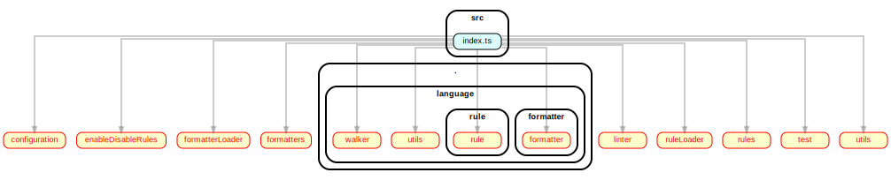
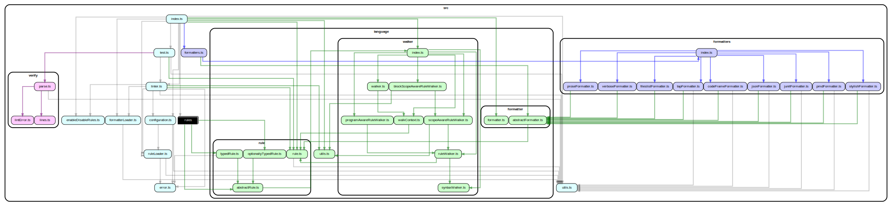

# FAQ

- [Troubleshooting](#troubleshooting)
- [Features](#features)
- [Expanding dependency-cruiser](#expanding-dependency-cruiser)
- [Road map](#roadmap)
- [Contact](#contact)

## Troubleshooting

### Q: TypeScript, CoffeeScript, LiveScript or Vue Single File Component (SFC) dependencies don't show up. How can I fix that?

**A**: Install the compiler you use in the same spot dependency-cruiser is installed (or vv).

For some types of TypeScript dependencies you need to flip a switch,
which is what the next question is about.

<details>
<summary>Background</summary>

Dependency-cruiser doesn't come shipped with the necessary transpilers to
handle these languages. Instead, it uses what is already available in the
environment (see [below](#q-does-this-mean-dependency-cruiser-installs-transpilers-for-all-these-languages)).
You can check if the transpilers are available to dependency-cruiser by
running `depcruise --info`.

When it turns out they aren't yet:

- if you're running dependency-cruiser as a local (development-)
  dependency (**recommended!**), install the necessary transpilers there.
- if you're running dependency-cruiser as a global install, install
  the necessary transpilers globally as well.
- if you're running dependency-cruiser with npx you can pass the necessary
  compiler(s) with the `-p` option. E.g. to get a list of all incoming and
  outgoing dependencies of a TypeScript file you could use this:
  ```
  npx -p typescript@4.3.5 -p dependency-cruiser@latest depcruise src -T text --focus src/main/index.ts
  ```

</details>

### Q: Some TypeScript dependencies I'd expect don't show up. What gives?

**A**: Put `"tsPreCompilationDeps" : true` in the `options` section of your
dependency-cruiser configuration (`.dependency-cruiser.json` or
`.dependency-cruiser.js`) or use `--ts-pre-compilation-deps` on the
command line.

See [--ts-pre-compilation-deps](./cli.md#--ts-pre-compilation-deps-TypeScript-only)
for documentation and examples.

<details>
<summary>background ...</summary>

By default, dependency-cruiser only takes post-compilation dependencies into
account; dependencies between TypeScript modules that exist after compilation
to JavaScript. Two types of dependencies do not fall into this category

- imports that aren't used (yet)
- imports of types only

If you _do_ want to see these dependencies, do one of these:

- if you have a dependency-cruiser configuration file, put `"tsPreCompilationDeps" : true`
  in the `options` section.
- pass `--ts-pre-compilation-deps` as a command line option

</details>

### Q: Some TypeScript dependencies _still_ don't show up (`/// triple slash directives`)

**_A_**: You're using a version <9.0.0. From version 9.0.0 on triple slash
directives are recognized without the need for additional configuration. Easiest
is to upgrade to version 9.0.0 or higher.

<details>
<summary>background</summary>

In older versions you needed to add the "tsd" (_triple slash directive_)
module system to the `moduleSystems` array in your dependency-cruiser
configuration - or pass it on the command line (with `--module-systems cjs,ejs,tsd`).

</details>

### Q: It looks like dependency-cruiser only detects the first of level dependencies - what is going on (TypeScript)?



**_A_**: The most likely cause is that dependency-cruiser can't find the TypeScript
compiler at the same spot you installed it in - see [Q: TypeScript dependencies don't show up. How can I fix that?](#q-typescript-coffeescript-livescript-or-vue-single-file-component-sfc-dependencies-dont-show-up-how-can-i-fix-that)
for a solution.

<details>
<summary>Background</summary>

The graph above is the result of a command like `depcruise src/index.ts -T dot | dot -T svg > deps.svg`.
As dependency-cruiser got _src/index.ts_ as an explicit argument, it'll scan it.
When no TypeScript compiler is available it'll fall back to the JavaScript one.
As TypeScript looks a lot like JavaScript, it will still find all direct dependencies.
However, when it tries to resolve those dependencies (e.g. _configuration_ in the
example above) it's going to check for extensions it can handle - which will
typically be ".js", ".json", etc. - but not ".ts". As it cannot find the modules
it marks them as unresolvable. This is also why the graph shows them with red
lines and text.

Once dependency-cruiser _does_ have a TypeScript compiler available, it will find
a lot more dependencies with the same command:



</details>

### Q: The graph dependency-cruiser generates is humongous, and I can't follow the lines very well what can I do?

**A**: Usually you don't need to see _all_ modules and dependencies that make up
your app at the same time - showing your monorepo with 5000 modules and 20000
dependencies in one picture will not give you much information. There's a few
strategies and options that can help

It can e.g. be helpful to make separate graphs for
each of the `packages` in your monorepo. That won't solve all readability issues,
though, so dependency-cruiser has a few options to get you sorted.

#### High level dependency graph ('archi' reporter)

If you just want to get an overview of how the main components of your application
are connected, you can aggregate dependencies to a higher level.

<details>
<summary>Background</summary>

```sh
dependency-cruiser --config .dependency-cruiser.js --output-type archi -- src | dot -T svg > high-level-dependency-graph.svg
```

By default the _archi_ reporter aggregates to the level just below `packages` (for
mono repos), `src`, `lib` and a few other often occurring paths. You can tweak this
to your own app's structure with a [collapsePattern](options-reference.md#summarising-collapsepattern-dot-and-archi-reporters)).

An example of how this can look: [dependency-cruiser's high level dependency graph](https://sverweij.github.io/dependency-cruiser/dependency-cruiser-archi-graph.html)
Compare that to [dependency-cruiser's internal module graph](https://sverweij.github.io/dependency-cruiser/dependency-cruiser-dependency-graph.html)
with ~100 modules to appreciate the difference)

</details>

#### Folder level dependency graph ('ddot' reporter)

For a birds-eye view, you can use the `ddot` reporter that summarises dependencies
on a folder level.

<details>
<summary>Background</summary>

```sh
dependency-cruiser --config .dependency-cruiser.js --output-type ddot -- src | dot -T svg > folder-level-dependency-graph.svg
```

See an example of how this can look: [dependency-cruiser's folder level dependency graph](https://sverweij.github.io/dependency-cruiser/dependency-cruiser-dir-graph.html)

</details>

#### Filtering

The `--include-only`, `exclude`, `--do-not-follow`, `--focus` (and for more
extreme measures `--max-depth`) command line options and their configuration
file equivalents provide various ways to reduce the number of modules and
dependencies in the dot output.

<details>
<summary>Background</summary>

E.g. to focus on stuff _within_ src only and not
show any test and mock files, you'd do something like this:

```sh
depcruise --include-only "^src/" --exclude "mocks\\.ts$|\\.spec\\.ts$" --output-type dot | dot -T svg > dependency-graph.svg
```

</details>

#### Bonus: report level filtering

If you want to apply a different filter for your graph as for your validations
(because the detail you need for your graph is lower, for instance) this is
possible as well

<details>
<summary>Background</summary>

There are two options:

1. Create a configuration separate from your validation configuration,
   dedicated to the generation of graphs.
2. In your overall configuration add filters at reporter level. Read more
   about that in [report level filtering](options-reference.md#filtering-dot-ddot-and-archi-reporters),
   which also explains how you can use depcruise-fmt to get a free performance
   level-up. Here's an example that only shows modules in the `src` tree:

```json5
{
  "options": {
    // global filtering: when encountering node_modules record it
    // but don't follow it any further
    "doNotFollow": "node_modules",
    "reporterOptions": {
      "dot": {
        // filtering specific for the dot (graphical) reporter:
        // only show modules in the src tree
        "filters": {
          "includeOnly": { "path": "^src" }
        }
    }
  }
}
```

You can do this with the _includeOnly_, _exclude_ and _focus_ filters

</details>

#### Make dot render orthogonal edges instead of splines

Some of the examples you see in the documentation have orthogonal (right) edges,
instead of splines (curvy lines). Sometimes this will improve legibility
quite a bit.

<details>
<summary>Background</summary>

To achieve that either pass `-Gsplines=ortho` to dot, e.g. in a complete incantation:

```sh
depcruise --config .dependency-cruiser-graph.js --output-type dot -- src | dot -Gsplines=ortho -T svg > dependency-graph-with-orthogonal-edges.svg
```

... or put it permanently in your dependency-cruiser configuration in the dot
reporter options:

```js
module.exports = {
  // ... your rules and/ or the configuration it extends ...
  options: {
    // ... your other options ...
    reporterOptions: {
      dot: {
        theme: {
          graph: {
            splines: "ortho",
          },
        },
      },
    },
  },
};
```

The reason it's not the default for the dot reporter output is GraphViz won't
always be able to render a graph with orthogonal edges, so YMMV.

</details>

### Q: TypeScript dynamic imports show up as "✖" . What's up there?

**A**: You're using a version of dependency-cruiser < 4.17.0. Dynamic imports,
both in TypeScript and JavaScript are supported as of version 4.17.0 -
and ✖'s in the output should be a thing of the past.

<details>
<summary>Background</summary>

Before dependency-cruiser@4.17.0 this instruction was in place:

By default dependency-cruiser uses _ES2015_ as compilation target to figure out
what your TypeScript sources look like. That does not play nice with dynamic
imports. Chances are you already have a `tsconfig.json` with a configuration
that makes your TypeScript compiler happy about compiling dynamic imports.
If so: feed it to dependency-cruiser with the `--ts-config` command line
parameter and dependency-cruiser will attempt to resolve the dynamic imports -
which will work as long as you're not importing variables (or expressions).

</details>

### Q: My package is pure ESM and I get "Must use import to load ES Module" when I run dependency-cruiser. How do I fix that?

**A**: Rename your .dependency-cruiser.js to .dependency-cruiser.cjs

> As of version 10.1.0 the `--init` generator automatically does this for you.

### Q: Should I run dependency-cruiser as a global install, with npx or as as local development dependency?

**A**: It's recommended to install dependency-cruiser as a local (development)
dependency in your project. That way it will automatically use the same
versions of compiler tooling as your project does, which will give the most
reliable results.

### Q: dependency-cruiser complains it cannot resolve a type from an external package. What to do?

**A**: add a `mainFields` attribute to the `options.enhancedResolveOptions` section
in your .dependency-cruiser.js that tells it to _also_ look for the _types_ field
in that external package package.json e.g. like so:

```JavaScript
{
  // rules: [],
  options: {
    enhancedResolveOptions: {
      mainFields: ["main", "types"]
    }
    // other options ...
  }
}
```

Dependency-cruiser uses the defaults of `enhanced-resolve`, which (correctly,
as per node.js specification) looks at `main` and `export` fields in package.json,
in addition to files named `index` (.js, .mjs, .cjs, ...). It can be instructed
to also look at other fields with this `mainFields` attribute, which
dependency-cruiser will 1:1 pass on to it.

## Features

### Q: How do I enable TypeScript, CoffeeScript or LiveScript in dependency-cruiser?

**A**: You don't. They work out of the box, as long as it has the
necessary compilers at its disposal.

### Q: I'm developing in React and use jsx/ tsx/ csx/ cjsx. How do I get that to work?

**A**: jsx and its TypeScript and CoffeeScript variants work
out of the box as well. For jsx there is a little caveat, though.

### Q: I hear there is a little caveat with jsx. What is that?

**A**: In (extremely) rare cases dependency-cruiser could find that a jsx depends
on something it doesn't depend upon in reality.

<details>
<summary>Background</summary>

Under the hood dependency-cruiser currently uses `acorn` and `acorn-jsx`
which (for at least some time) have been the official jsx transpilers and are
still used by other tools (source: acorn-jsx github page). Some constructs in
jsx it does not support however. In the lion's share of the cases you will not
notice, and acorn will still pick out the correct dependencies (more nor
less than are in the source code) because it will fall back on the acorn-loose
parser, which will pick up the pieces. _except_, that is when you happen to use
_import_, _export_ or _require_ in jsx fragments in one special flavor of jsx

Sample of jsx the default parser doesn't parse

```jsx
import React from "react";

export class ReplicateIssueComponent extends React.Component {
  renderSomethingElse = () => {
    return (
      <>The word import here results is picked up as an import statement.</>
    );
  };

  render = () => (
    <>
      {this.renderSomethingElse()}
      Here import is confused with an import statement as well.
    </>
  );
}
```

In [this comment](https://github.com/sverweij/dependency-cruiser/issues/395#issuecomment-730295987)
on the original issue [@audunsol](https://github.com/audunsol) offers a few
ways to work around the issue you might find helpful when you have similar
jsx.

(As a future feature dependency-cruiser will include ways to handle even these
situations without workarounds).

</details>

### Q: Does this work with Vue as well?

**A**: Yes.

<details>
<summary>Background</summary>

For `.vue` single file components it uses _either_ the `vue-template-compiler`
(Vue2) or `@vue/compiler-sfc` (Vue3).

`vue-template-compiler` should be in your module dependencies already if you are
developing with Vue2 - just make sure you install dependency-cruiser in the same
place.

`@vue/compiler-sfc` is [included by default in Vue 3 projects since version 3.2.13](https://github.com/vuejs/vue-next/tree/master/packages/compiler-sfc#vuecompiler-sfc).
If you are using an older version of Vue 3, you may have to add `@vue/compiler-sfc`
manually.

</details>

### Q: Does this work with Svelte as well?

**A**: Yes.

<details>
<summary>Background</summary>

For `.svelte` single file components it uses the `svelte` (version 3.x)

- which will be in your module dependencies if you're developing with Svelte.
- because of how svelte works, all `.svelte` files depend on `"svelte/internal"`.
  If that turns out to be too noisy, you can configure dependency-cruiser to
  ignore it (either in the config file or with a command-line param)

</details>

### Q: Does this mean dependency-cruiser installs transpilers for all these languages?

**A**: No.

<details>
<summary>Background</summary>

For LiveScript, TypeScript, CoffeeScript, Svelte and Vue Single File Components
dependency-cruiser will use the transpiler already in your project (or,
if you installed dependency-cruiser globally - the transpilers available
globally).

This has a few advantages over bundling the transpilers as dependencies:

- `npm i`-ing dependency-cruiser will be faster.
- Transpilers you don't need won't land on your disk.
- Dependency-cruiser will use the version of the transpiler you are using
  in your project (which might not be the most recent one for valid reasons).

</details>

### Q: Does this work with webpack configs (e.g. `alias` and `modules`)?

**A**: Yes.

<details>
<summary>Background</summary>

You can feed dependency-cruiser a webpack configuration
([`--webpack-config`](./options-reference.md#webpackconfig-use-the-resolution-options-of-a-webpack-configuration)
on the cli or `webpackConfig` in the dependency-cruiser config file
in the [`options`](./rules-reference.md#options) section) and it
will take the `resolve` part in there into account when cruising
your dependencies. This includes any `alias` you might have in there.

Currently dependency-cruiser supports a reasonable subset of webpack
config file formats:

- nodejs parsable JavaScript only (_including_ ESM)
- webpack 4 compatible and up (although earlier ones _might_ work
  there's no guarantee)
- exporting either:
  - an object literal
  - a function (webpack 4 style, taking up to two parameters)
  - an array of the above (where dependency-cruiser takes the
    first element in the array)
- other formats (TypeScript, yaml, LiveScript, ...) will work if the function
  is available that hacks node into understanding it. If you use a format like
  this for your webpack configuration, it's likely this function is already
  available.

</details>

### Q: Can I tweak things to make dependency-cruiser go faster?

**A**: You can, very likely.

<details>
<summary>Background</summary>

At its default settings (with a `.dependency-cruiser.js` scaffolded with `--init`)
favours correctness over speed - erring on the side of cautiousness. Things that
influence performance, loosely in order of impact:

- `moduleSystems` - reducing the number of module systems to the ones
  you actually use (these days likely only `es6` and possibly `cjs`) will
  speed up processing.
- `tsPreCompilationDeps` - with this on `true` dependency-cruiser runs faster
  on typescript sources as with that it directly analyzes the typescript AST
  instead of first transpiling it down to JavaScript.
- `enhancedResolveOptions.extensions` - setting this to only the extensions
  you actually use (e.g. `.ts`) will make resolving faster. By default
  dependency-cruiser initialises this array to support all extensions the
  parsers in your current environment supports (for just tsc or swc this will
  be something like .js, .cjs, .mjs, .ts, .d.ts, jsx, tsx). If removing extensions
  from that array is not an option, ordering it from most to least occurring
  will help as well as the resolver (enhanced-resolve) will try to find
  files in that order and stop once it’s found one.
- older versions of dependency-cruiser initialised the `doNotFollow` to a bunch
  of `dependencyTypes` - it’s faster (and just as accurate - even in _yarn PnP_)
  to _only_ set a `path` for that (typically `node_modules`).
- If your codebase can be compiled successfully with `swc` setting the parser
  to `swc` will help speed up things a bit (although not as dramatically as
  you'd expect).
- By default some rules dependency-cruiser ships with include regular
  expressions that will not be entirely applicable to your code base (do you
  still have files ending in `.coffee`?). It’s probably not going to make a
  big dent, but all little bits help.
- In some rare cases tweaking the cache time enhanced-resolve uses might make
  for a bit better performance (traded against memory use)
  [`enhancedResolveOptions.cachedInputFileSystem.cacheDuration`](options-reference.md#cachedinputfilesystem---cacheduration)

</details>

### Q: Does dependency-cruiser detect [dynamic imports](https://github.com/tc39/proposal-dynamic-import)?

**A**: Yes; in both TypeScript and JavaScript - but only with static string arguments
or template expressions that don't contain placeholders (see the next question).
This should cover most of the use cases for dynamic
imports that use asynchronous module loading (like
[webpack code splitting](https://webpack.js.org/guides/code-splitting/#dynamic-imports)),
though.

### Q: Does dependency-cruiser handle variable or expression requires and imports?

**A**: No.

<details>
<summary>Background</summary>

If you have imports with variables (`require(someVariable)`,
`import(someOtherVariable).then((pMod) => {...})`) or expressions
(`require(funkyBoolean ? 'lodash' : 'underscore'))`
in your code dependency-cruiser won't be able to determine what dependencies
they're about. For now dependency-cruiser focuses on doing static analysis
only and doing that well.

</details>

### Q: Does dependency-cruiser support [webpack inline loaders](https://webpack.js.org/concepts/loaders/#inline)?

**A**: Yes, as of version 9.17.0 it does. No configuration necessary.

### Q: Does dependency-cruiser support [require.js plugin notation](https://requirejs.org/docs/plugins.html)?

**A**: Yes, as of version 9.17.0 it does. No configuration necessary.

### Q: Does it work with my monorepo?

**A**: Absolutely. For every cruised module the closest `package.json` file is
used to determine if a package was declared as dependency.

### Q: Does dependency-cruiser work with Yarn Plug'n'Play?

**A**: Yes.

<details>
<summary>Background</summary>

From version 9.21.3 this works automatically. In earlier versions (from 4.14.0)
you only needed to `yarn-pnp` into _externalModuleResolutionStrategy_ key in
the config (--init took care of that), but that's not necessary anymore.

As of version 13.0.0 dependency-cruiser does not work with the pnp from
yarn 1.x.x anymore. The yarn team has done only life cycle management and security
fixes on that version for several years - but encourages everyone to migrate over
to yarn 3. Our guess is that everyone who is serious about using yarn pnp has
already done so long ago. Moreover the old yarn 1 pnp version was holding us
back from moving on with the nodejs and javascript ecosystem.

</details>

### Q: dependency-cruiser detected a circular dependency. How can I see (one of the) cycles that dependency-cruiser saw?

**A**: Upgrade to version 5.2.0 or higher - from that version on dependency-cruiser
emits the circular path in the _err_, _err-long_, _err-html_ and
_teamcity_ reporters (he _dot_ and _ddot_ reporters already did before).

### Q: I'm using window.require or a require wrapper - how do I make sure dependencies I declared like that are included?

**A**: From version 5.4.0 or higher you can add an _exoticRequireStrings_ key in
your configuration with the wrapper(s) and/ or re-definitions of require:

```json
"exoticRequireStrings": ["window.require", "need", "tryRequire"]
```

### Q: Can I get code completion for .dependency-cruiser.js?

**A**: Yes.

<details>
<summary>Background</summary>

You can get code completion & suggestions in editors that support these things
by typing the module.exports with a comment like so:

```javascript
/** @type {import('dependency-cruiser').IConfiguration} */
module.exports = {
  // ... your rules & options
};
```

> Newer versions of the `--init` generator automatically do this for you.

</details>

## Expanding dependency-cruiser

### Q: How do I add a new output format?

**A**: There's two ways - as a plugin or directly in dependency-cruiser

#### as a plugin

- create a module that exports a function of this signature:
  ```typescript
  (pCruiseResult: ICruiseResult): IReporterOutput;
  ```
- pass the module as an output type, e.g. on the command line:
  - `depcruise src --output-type plugin:my-awesome-plugin`
  - dependency-cruiser should be able to find `my-awesome-plugin`. For
    local modules this typically means you have to provide it the full path
    path e.g. `depcruise src --output-type plugin:$(pwd)/path/to/my-awesome-plugin`
- before executing the plugin dependency-cruiser checks whether the function
  has the correct signature and whether it can handle minimal input.
- plugin support is quite new (2021-02), so details like when
  the plugin gets validated what prefix to use (currently: `plugin:` ) might
  still change in the coming months.

> See the basic [stats-reporter-plugin](../configs/plugins/stats-reporter-plugin.js)
> for an example.

#### directly in dependency-cruiser

For reporters that should come shipped with dependency-cruiser do this:

- In `src/report`:
  - add a module that exports a default function that
    - takes a dependency cruiser output object
      ([json schema](../src/schema/cruise-result.schema.json))
    - returns an object with
      - output: the output you want the cli to emit
      - exitCode: the exit code you want the cli to return when
        the report is done
- In `report/index.js`
  - require that module and
  - add a key to the `TYPE2REPORTER` object with that module as value
- In `bin/dependency-cruise`
  - add it to the documentation of the -T option
- In `test/report` add unit tests that prove your reporter does what it
  intends.

### Q: How do I add support for my favorite alt-js language?

**A**: Ask me nicely or make a PR.

Dependency-cruiser already supports TypeScript, CoffeeScript and LiveScript. If
there's another language (that transpiles to JavaScript) you'd like to see
support for, let me know.

Recipe for PR's to add an alt-js language:

- In `package.json`:
  - add your language (and supported version range) to the `supportedTranspilers`
    object.
  - Add your language's transpiler to `devDependencies` (you'll need that,
    because you are going to write tests that prove the addition works
    correctly later on).
- In `src/transpile`
  - add a `yourLanguageWrap.js` that invokes the transpiler transforming
    your language into JavaScript (preferably ES6 or better, but lower versions
    should work as well). [`typeScriptWrap.js`](../src/extract/transpile/typeScriptWrap.js)
    as an example on how to do this.
  - in [`meta.js`](../src/extract/transpile/meta.js)
    - require `./yourLanguageWrap` and
    - add it to the `extension2wrapper` object with the extensions proper for your
      language.
- In `test/extract/transpile` add unit tests for `yourLanguageWrap`

## Road map

[Here](https://github.com/sverweij/dependency-cruiser/projects/1)

## Contact

If you have an issue, suggestion - don't hesitate to create an
[issue](https://github.com/sverweij/dependency-cruiser/issues/new/choose).

You're welcome to create a pull request - if it's something more complex it's
probably wise to first create an issue or hit [@mcmeadow@mstdn.social](https://mstdn.social/@mcmeadow)
up on Mastodon (or on twitter, while it lasts: [@mcmeadow](https://twitter.com/mcmeadow))

For things that don't fit an issue or pull request you're welcome to
contact these accounts as well (checked at approximately daily intervals).
