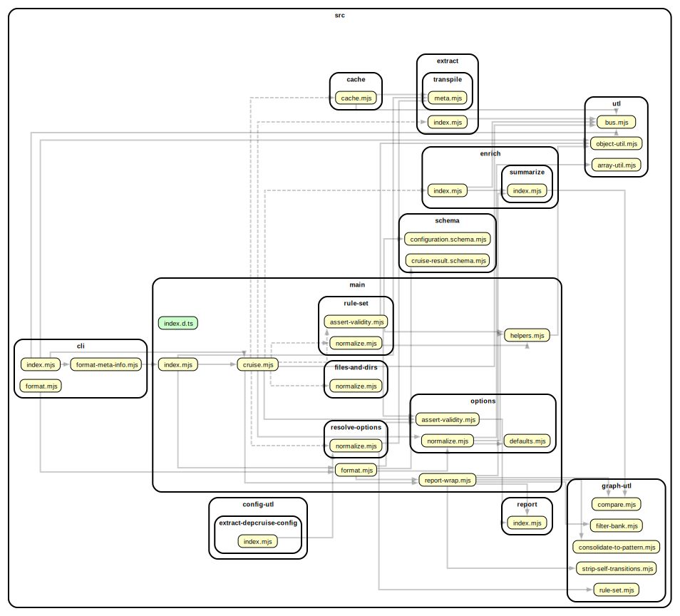
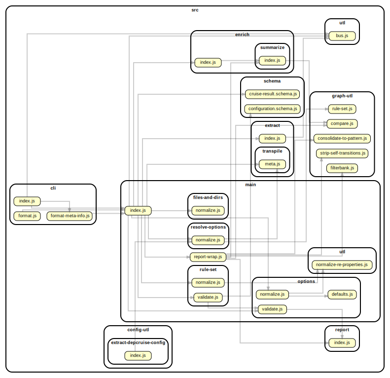
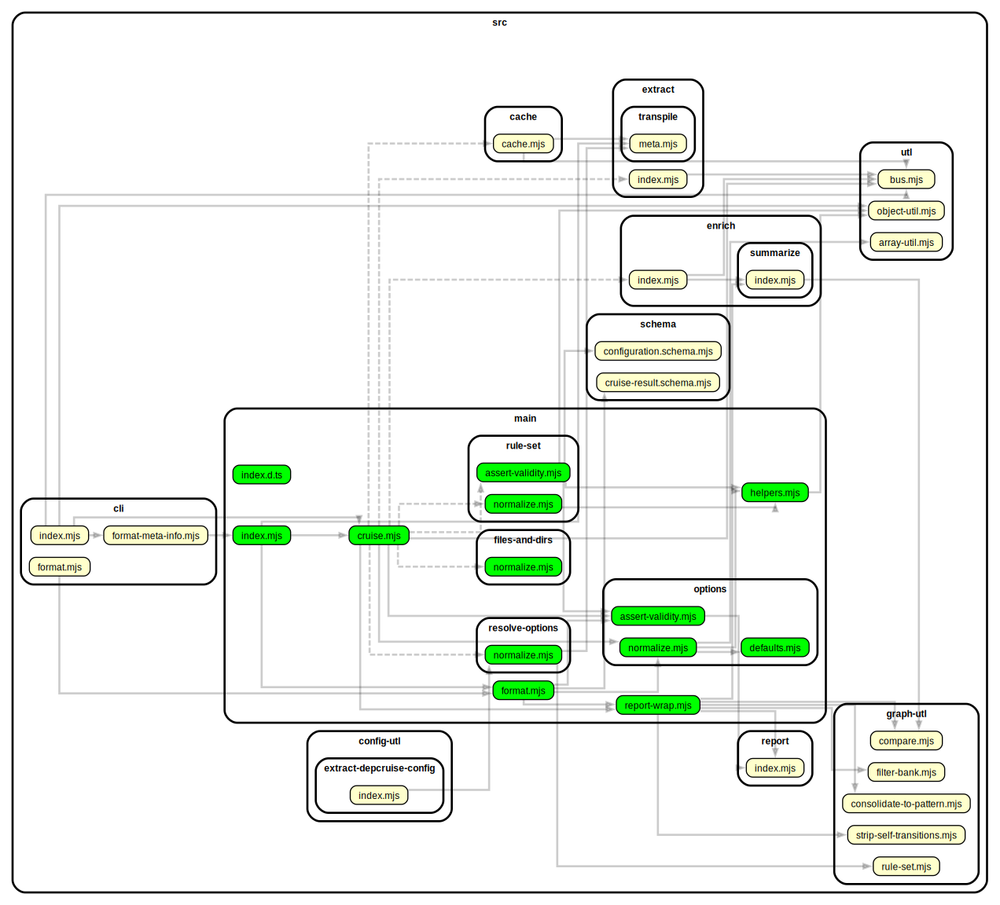
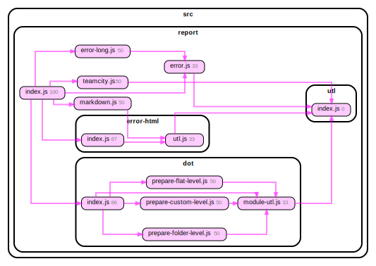
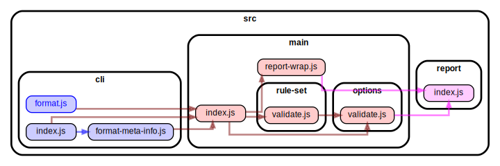
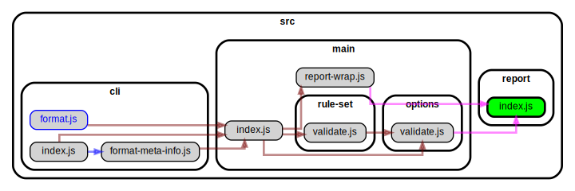
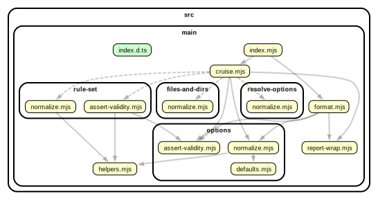
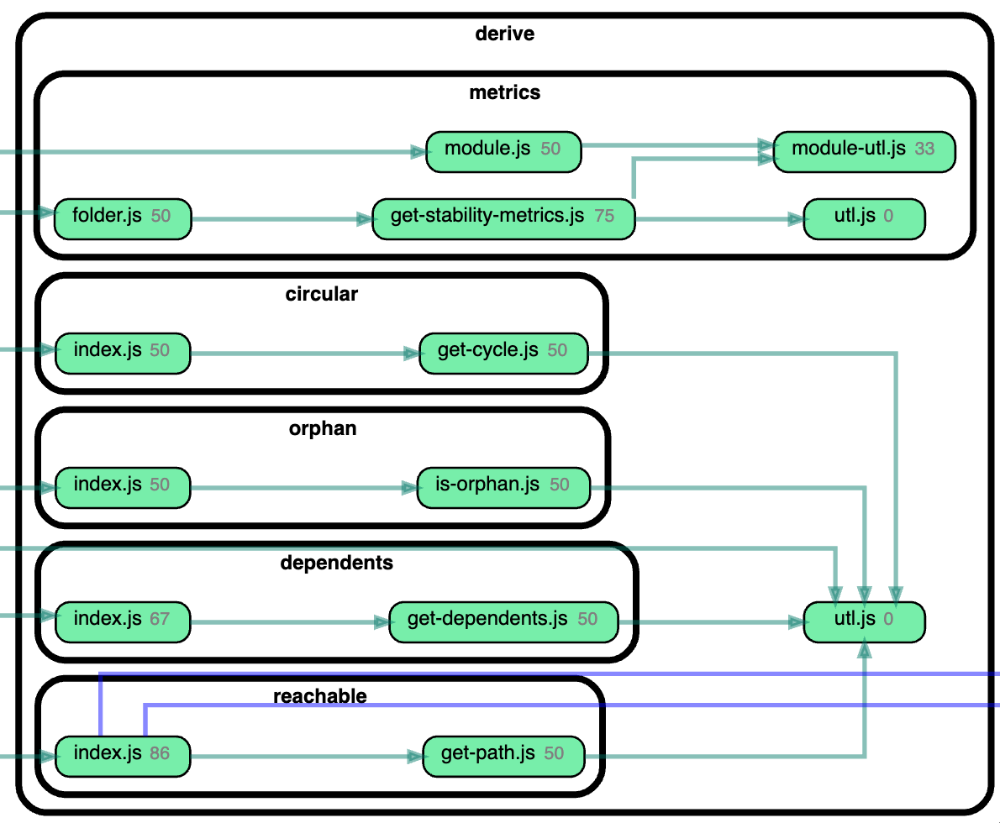
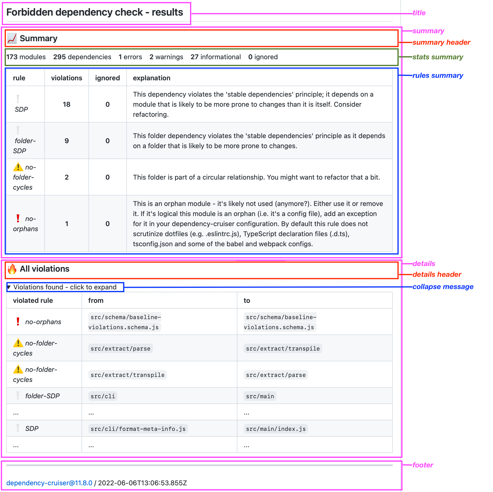

# Dependency cruiser options - reference

- [Filters](#filters)
  - [`doNotFollow`: don't cruise modules any further](#donotfollow-dont-cruise-modules-any-further)
  - [`includeOnly`: only include modules satisfying a pattern](#includeonly-only-include-modules-satisfying-a-pattern)
  - [`focus`: show modules matching a pattern - with their direct neighbours](#focus-show-modules-matching-a-pattern---with-their-neighbours)
  - [`reaches`: show modules matching a pattern - with everything that can reach them](#reaches-show-modules-matching-a-pattern---with-everything-that-can-reach-them)
  - [`highlight`: highlight modules](#highlight-highlight-modules)
  - [`exclude`: exclude dependencies from being cruised](#exclude-exclude-dependencies-from-being-cruised)
  - [`collapse`: summarize to folder depth or pattern](#collapse-summarize-to-folder-depth-or-pattern)
  - [`maxDepth`](#maxdepth)
- [Matching your environment](#matching-your-environment)
  - [`moduleSystems`](#modulesystems)
  - [`tsPreCompilationDeps`](#tsprecompilationdeps)
  - [`tsConfig`: use a TypeScript configuration file ('project')](#tsconfig-use-a-typescript-configuration-file-project)
  - [`babelConfig`: use a babel configuration file](#babelconfig-use-a-babel-configuration-file)
  - [`webpackConfig`: use (the resolution options of) a webpack configuration](#webpackconfig-use-the-resolution-options-of-a-webpack-configuration)
  - [Yarn Plug'n'Play support - `externalModuleResolutionStrategy`](#yarn-plugnplay-support---externalmoduleresolutionstrategy)
  - [`prefix`: prefix links in reports](#prefix-prefix-links-in-reports)
- [`reporterOptions`](#reporteroptions)
  - [theme (`dot`, `ddot` and `archi` reporters)](#theme-dot-ddot-and-archi-reporters)
  - [summarising/ `collapsePattern` (`dot` and `archi` reporters)](#summarising-collapsepattern-dot-and-archi-reporters)
  - [filtering (`dot`, `ddot` and `archi` reporters)](#filtering-dot-ddot-and-archi-reporters)
  - [wordlist - (`anon` reporter)](#wordlist---anon-reporter)
  - [markdown](#markdown)
  - [mermaid](#mermaid)
  - [text](#text)
- [Esoteric options](#esoteric-options)
  - [preserveSymlinks](#preservesymlinks)
  - [mono repo behaviour - combinedDependencies](#mono-repo-behaviour---combinedDependencies)
  - [exotic ways to require modules - exoticRequireStrings](#exotic-ways-to-require-modules---exoticrequirestrings)
  - [extraExtensionsToScan](#extraextensionstoscan)
  - [enhancedResolveOptions](#enhancedresolveoptions)
  - [forceDeriveDependents](#forcederivedependents)
  - [parser](#parser)
  - [cache](#cache)

## Filters

Dependency-cruiser sports some filters that enable you to leave out certain
parts of dependency-trees you're not particularly interested in. They work
from the command line (as --do-not-follow, --include-only, --focus and --exclude
respectively) but you can also specify them in the configuration file.

On the command line you can pass a single regular expression for each of them.
The filters will use that to match against the (resolved) paths of modules
in your dependency tree.

The configuration file gives a little bit more flexibility. Apart from the path
you can specify additional properties, and pass an array of regular expressions
(which in some instances will enhance legibility).

You can pass the path in one of three ways:

As a single regular expression:

```javascript
options: {
  includeOnly: {
    path: "^bin|^src|^test|^packages";
  }
}
```

As an array of regular expressions:

```javascript
options: {
  includeOnly: {
    path: ["^bin", "^src", "^test", "^packages"];
  }
}
```

Or in shorthand:

```javascript
options: {
  includeOnly: ["^bin", "^src", "^test", "^packages"];
}
```

The next sections contain details on what each filter does and what extra
attributes you can pass.

### `doNotFollow`: don't cruise modules any further

> :shell: command line option equivalent: `--do-not-follow` (string values passed to 'path' only)

If you _do_ want to see certain modules in your reports, but are not interested
in these modules' dependencies, you'd pass the regular expression for those
modules to the `doNotFollow` option. A typical pattern you'd
use with this is "node_modules":

```json
    "options": {
      "doNotFollow": {
        "path": "node_modules"
      }
    }
```

#### Specifying dependency types in `doNotFollow`

> It's not possible to use this on the command line

It is possible to specify a regular expression
for files that dependency-cruiser should cruise, but not follow any further.
In the options section you can restrict what gets cruised by specifying
[dependency types](#dependencytypes). So if e.g. you don't want dependency-cruiser
to follow external dependencies, instead of specifying the "node_modules" path:

```json
    "options": {
        "doNotFollow": {
            // "path": "node_modules",
            "dependencyTypes": [
                "npm",
                "npm-dev",
                "npm-optional",
                "npm-peer",
                "npm-bundled"
            ]
        }
    }
```

> #### How `doNotFollow` influences what gets cruised
>
> There's a few steps dependency-cruiser takes when you fire it of:
>
> 1. gather all files specified as an argument, filtering out the stuff in `exclude`
>    and `doNotFollow` and that which is not in `includeOnly`.
> 2. starting from the gathered files: crawl all dependencies it can find. Crawling
>    stops when a module matches `doNotFollow` rule or a modules' dependency matches
>    either `exclude` or does not match `includeOnly`.
> 3. apply any rules over the result & report it.
>
> So in the first step `doNotFollow` behaves itself exactly like `exclude` would.
> Only in the second step it allows files matching its pattern to be visited
> (but not followed any further).
>
> This means dependency-cruise _will_ encounter files matching `doNotFollow`
> but only when they are dependencies of other modules. This a.o. prevents unexpected
> behaviour where specifying node modules as `doNotFollow` pattern would still
> traverse all node_modules when the node_modules were part of the arguments
> e.g. in `depcruise --do-not-follow node_modules --validate -- src test node_modules`
> or, more subtly with `depcruise --don-not-follow node_modules -- validate -- .`.

### `includeOnly`: only include modules satisfying a pattern

> :shell: command line option equivalent: `--include-only`

In the `includeOnly` option you can pass a regular expression of all file paths
dependency-cruiser should include in a cruise. It will discard all files
not matching the `includeOnly` pattern.

This can be handy if you want to make an overview of only your internal application
structure. E.g. to only take modules into account that are in the `src` tree (and
exclude all node_modules, core modules and modules otherwise outside it):

```json
"options": {
  "includeOnly": "^src/"
}
```

If you specify both an includeOnly and an exclude (see below), dependency-cruiser takes
them _both_ into account.

### `focus`: show modules matching a pattern - with their neighbours

> :shell: command line option equivalent: `--focus`

Just like the `includeOnly` option, `focus` takes a regular expressions you want
dependency-cruiser to show in its output. In addition dependency-cruiser will
include all neighbours of those modules. By default these will be direct dependencies
and direct dependents - if you want more, you can use the [`depth`](#adding-depth)
attribute.

This can be useful if you just want to focus on one part of your application and
how it interacts with the outside world.

#### basic use

Add a `focus` attribute in your options section. You will typically want to use
this option in conjunction with one of the other filtering options, like
_doNotFollow_ or _includeOnly_ as that will speed up the rendition quite
a lot.

> _doNotFollow_, _includeOnly_ and _exclude_ can run before dependency-cruiser
> does any static analysis, so dependency-cruiser applies as early on in the
> process as it can so it can prevent having to read files from disk (which is
> expensive).
>
> It can only determine the modules in focus and their neighbours after applying
> static analysis, though, as only then it knows what the relationships
> between the modules are.

Example configuration:

```json
{
  "options": {
    "includeOnly": "^src/",
    "focus": "^src/main/"
  }
}
```

<details>
<summary>sample command line invocation and graphical output</summary>

```sh
depcruise -src c focus.config.json -T dot | dot -T svg > focus.svg
```



</details>

#### adding `depth`

> :shell: command line option equivalent: `--focus-depth`

With the `depth` attribute you can influence whether to include not only direct
neighbours (`depth: 1` - the default), but also _their_ neighbours (`depth: 2`)
etc. Just like with the `maxDepth` option, a depth of 0 is interpreted as _infinite_.

Example configuration:

```json
{
  "options": {
    "includeOnly": "^src/",
    "focus": {
      "path": "^src/main/",
      "depth": 2
    }
  }
}
```

<details>
<summary>sample command line invocation and graphical output</summary>

```sh
depcruise src -c focus-depth-2.config.json -T dot | dot -T svg > focus-depth-2.svg
```



</details>

#### snazzy-up graphics with the 'matchesFocus' attribute

When dependency-cruiser applies focus on modules, it provides each module with
a `matchesFocus` attribute, which is either `true` for modules in focus or
`false` for the neighbours. You can use this attribute e.g. in your
[dot theme](#theming).

<details>
<summary>sample dot theme that uses matchesFocus + graphical output</summary>

```json
{
  "options": {
    "includeOnly": "^src/",
    "focus": "^src/main/",
    "reporterOptions": {
      "dot": {
        "collapsePattern": "^node_modules/(@[^/]+/[^/]+|[^/]+)/",
        "theme": {
          "graph": {
            "splines": "ortho"
          },
          "modules": [
            {
              "criteria": { "matchesFocus": true },
              "attributes": {
                "fillcolor": "lime"
              }
            },
            {
              "criteria": { "matchesFocus": false },
              "attributes": {
                "fillcolor": "lightgray",
                "fontcolor": "gray"
              }
            }
          ]
        }
      }
    }
  }
}
```

When run...

```sh
depcruise src -c snazzy-focus.config.json -T dot | dot -T svg > snazzy-focus.svg
```

...it'll look something like this:



</details>

### `reaches`: show modules matching a pattern - with everything that can reach them

> :shell: command line option equivalent: `--reaches`

Just like the `includeOnly` and `focus` option, `reaches` takes a regular expression
that dependency-cruiser uses to find modules to show in its output. In addition
to what `includeOnly` does, dependency-cruiser will all dependents (direct _and_
indirect) of the modules matched by the regular expression.

This can be useful if you want to make an impact analysis on what would
be affected when you change one or more modules around.

Example configuration that'd filter out everything in src/report that can
directly or indirectly reach the dependency-to-incidence-transformer module:

```json
{
  "options": {
    "includeOnly": "^src/report",
    "reaches": "^src/report/utl/index.js"
  }
}
```

Which will look something like this when output through a `dot` reporter:



#### snazzy-up graphics with the 'matchesReaches' attribute

Just like with the `focus` filter option dependency-cruiser tags the modules that
_directly_ match the regular expression in the filter with `matchesReaches: true`
and all other modules with `matchesReaches: false`. You can use this in the `dot`
like reporter configurations to do some nice highlighting:

```javascript
{
  "options": {
    "includeOnly": "^src/",
    "reaches": "^src/report/index.js",
    "reporterOptions": {
      "dot": {
        "theme": {
          "graph": {
            "splines": "ortho"
          },
          "modules": [
            {
              "criteria": { "matchesReaches": true },
              "attributes": {
                "fillcolor": "lime"
              }
            },
            {
              "criteria": { "matchesReaches": false },
              "attributes": {
                "fillcolor": "lightgray",
                "fontcolor": "gray"
              }
            }
          ]
        }
      }
    }
  }
}
```

Without this theming engaged the graph would look like this:



With the theming it looks like this:



### `highlight`: highlight modules

> :shell: command line option equivalent: `--highlight`

In contrast to all other 'filter' types this doesn't really filter anything. It
will, however, label all modules that match the regular expression `matchesHighlight`
boolean attribute. Reporters can use this to their advantage to apply special
colors or fonts to the modules marked as such. The `mermaid` and `dot` reporters
do this out of the box. The `dot` (and related, like ddot, archi and flat) reporter
allows for some tweaking in the `options.reporterOptions` section of your
.dependency-cruiser.js, the same way you can tweak the modules matched by
the `reaches` or `focus` filters.

An example:

```javascript
{
  "options": {
    "includeOnly": "^src/",
    "reaches": "^src/report/index.js",
    "reporterOptions": {
      "dot": {
        "theme": {
          "graph": {
            "splines": "ortho"
          },
          "modules": [
            {
              "criteria": { "matchesHighlight": true },
              "attributes": {
                "fillcolor": "yellow",
                "penwidth": 2
              }
            },
          ]
        }
      }
    }
  }
}
```

### `exclude`: exclude dependencies from being cruised

> :shell: command line option equivalent: `--exclude` (string values passed to 'path' only)

If you don't want to see certain modules in your report (or not have them
validated), you can exclude them by passing a regular expression to the
`exclude`. E.g. to exclude `node_modules` from being scanned altogether:

```json
"options": {
  "exclude": {
    "path": "node_modules"
  }
}
```

Because it's regular expressions, you can do more interesting stuff here as well. To exclude
all modules with a file path starting with coverage, test or node_modules, you could do this:

```json
"options": {
  "exclude": {
    "path": "^(coverage|test|node_modules)"
  }
}
```

#### Other 'exclude' attributes

It's also possible to exclude dependencies on other properties than the (resolved) paths
at either end of them. To exclude all dependencies that result of an (ECMAScript)
dynamic import from being included in a cruise, you can use the `dynamic` attribute:

```json
"options": {
  "exclude": {
    "dynamic": true
  }
}
```

> Other attributes might come in future releases

### `collapse`: summarize to folder depth or pattern

> :shell: command line option equivalent `--collapse`

As this is an option that is probably typically used from the command line it's
described primarily [over there](cli.md#--collapse-summarize-to-folder-depth-or-pattern).

### `maxDepth`

> :shell: command line option equivalent: `--max-depth`

Only cruise the specified depth, counting from the specified root-module(s). This
command is mostly useful in combination with visualization output like _dot_ to
keep the generated output to a manageable size.

> :bulb: If you use this to get a high level overview of your dependencies, be sure
> to check out the [archi](#archi) reporter. That's more flexible, while still
> taking into account all your rules and dependencies. You can also consider the
> [collapse](#collapse-summarize-to-folder-depth-or-pattern) option for this.

This will cruise the dependencies of each file directly in the src folder, up
to a depth of 1:

```javascript
...
  "maxDepth": 1
...
```


With `"maxDepth": 2` it'll look like this:


And with `"maxDepth": 3` like this:


> :bulb: The `maxDepth` option is there to help with visualising. If your goal is to _validate_
> this option is best left alone as you'll miss a dependency or two otherwise.

## Matching your environment

### `moduleSystems`

> :shell: command line option equivalent: `--module-systems`

Here you can pass a list of module systems dependency-cruiser should use
to detect dependencies. It defaults to `["es6", "cjs", "tsd", "amd"]` The
'module systems' dependency-cruiser supports:

| System | Meaning                                                                                                                                                                        |
| ------ | ------------------------------------------------------------------------------------------------------------------------------------------------------------------------------ |
| `es6`  | modules as defined for ECMAScript 6 in 2015 in [Emma-262](http://www.ecma-international.org/ecma-262/6.0/index.html#sec-modules), with proper `import` and `export` statements |
| `cjs`  | Common js as popularised by [node.js](https://nodejs.org/dist/latest-v18.x/docs/api/modules.html) which uses the `require` function to include other modules                   |
| `tsd`  | [TypeScript 'triple slash directives'](https://www.typescriptlang.org/docs/handbook/triple-slash-directives.html)                                                              |
| `amd`  | [Asynchronous Module Definition](https://github.com/amdjs/amdjs-api/wiki/AMD) as used by a.o. [RequireJS](requirejs.org)                                                       |

## `tsPreCompilationDeps`

> :shell: command line option equivalent: `--ts-pre-compilation-deps`

By default dependency-cruiser does not take dependencies between typescript
modules into account that don't exist after compilation to JavaScript.

Switch this option to `true` if you _do_ want to take them into account
(as a bonus this will make cruising typescript code bases faster).

If you want to define rules on whether dependencies exist only
before compilation or also after (with [`preCompilationOnly`](#precompilationonly))
you can pass the value `"specify"` to this option. Only do this if
you really need it as it will impact cruise speed. You can only use the
`"specify"` value within dependency-cruiser configurations (not from the
command line).

<details>
<summary><b>Pre-compilation dependencies example: only importing a type</b></summary>
As the JavaScript doesn't really know about types, dependencies on
types only exist before, but not after compile time.

`a.ts` exports an interface ...

```typescript
import { B } from "./b";
export interface A {
  foo: string;
}
const b = new B();
```

... and `b.ts` uses that interface:

```typescript
import { A } from "./a";
export class B {}
const a: A = { foo: "foo" };
```

After compilation `b.js` looks like this:

```javascript
// import omitted as it only contained a reference to a type
export class B {}
const a = { foo: "foo" }; // no type refer
```

Normally, without `tsPreCompilationDeps` the output will
look like this:


_With_ `tsPreCompilationDeps` the dependency graph _does_ include the
dependency-on-a-type-only from `b.ts` to `a.ts`:


</details>

<details>
<summary><b>Pre-compilation dependencies example: import without use</b></summary>

Similarly, if you import something, but don't use it, the dependency
only exists before compilation. Take for example these two
typescript modules:

`a.ts`:

```typescript
import { B } from "./b";
export class A {}
```

`b.ts`:

```typescript
export class B {}
```

As `a.ts` uses none of the imports from b, the typescript
compiler will omit them when compiling and yield this for `a.js`:

```javascript
// no imports here anymore...
export class A {}
```

Hence, without `tsPreCompilationDeps` dependency-cruiser's
output will look like this:


... and with `tsPreCompilationDeps` like this:


</details>

### `tsConfig`: use a typescript configuration file ('project')

> :shell: command line option equivalent: --ts-config

If dependency-cruiser encounters typescript, it compiles it to understand what it
is looking at. If you have `compilerOptions` in your `tsconfig.json` you think
it should take into account, you can use this option to make it do that.
You might want to do this e.g. if you have `baseDir`/ `paths` keys in your
`tsconfig`, or are using jsx/ tsx outside of a react context.

Dependency-cruiser understands the `extends` configuration in tsconfig's so
if you have a hierarchy of configs, you just need to pass the relevant one.

Sample

```json
"options": {
  "tsConfig": {
    "fileName": "tsconfig.json"
  }
}
```

You can do it even more minimalistic like so (in which case dependency-cruiser will
assume the fileName to be `tsconfig.json`)

```json
"options": {
  "tsConfig": {}
}
```

#### On the command line

```sh
## use the `tsconfig.json` in the current directory into account when looking
## at typescript sources:
depcruise --ts-config --validate -- src

## use `tsconfig.prod.json for the same purpose:
depcruise --ts-config tsconfig.prod.json --validate -- src
```

#### Usage notes

- :bulb: The configuration file you can pass as an argument to this option is
  relative to the current working directory.
- :bulb: dependency-cruiser currently only looks at the `compilerOptions` key
  in the tsconfig.json and not at other keys (e.g. `files`, `include` and
  `exclude`).
- :bulb: If you happen to use a [`jsconfig.json`](https://code.visualstudio.com/docs/languages/jsconfig)
  you can pass that as well as the syntax of the `compilerOptions` key
  is the same for both.

### `babelConfig`: use a babel configuration file

> :shell: there is no command line equivalent for this at the moment

If you're using [babel](https://babeljs.io) you can tell dependency-cruiser so
by telling it where your babel config lives, like this:

```json
"options": {
  "babelConfig": {
    "fileName": ".babelrc"
  }
}
```

That way dependency-cruiser will use the babel compiler for its transpilation
steps, so if you're using features that are not TC39 stage 4 yet dependency-cruiser
will happily analyze these source files for you.

If you just use a `babel` key in your package.json pass `package.json` as the
babelConfig - dependency-cruiser will sort it out for you.

#### Usage notes

- :bulb: In its current state dependency-cruiser will assume that all JavaScript and
  TypeScript sources it parses need to go through the babel compiler (regardless
  of the extension). This will cover the majority of the use cases for babel,
  but [raise an issue](https://github.com/sverweij/dependency-cruiser/issues/new?template=feature-request.md&title=Feature+request%3A+use+babel+only+for+specific+extensions?)
  if you need this to be configurable.
- :bulb: Dependency-cruiser can process json (/ json5) configurations, either in a
  separate file or as a key in your package.json. It can also process .js , .cjs
  and .mjs configurations, as long as they export a simple javascript object.
  JavaScript configurations that export a function, might get supported in a
  later stage (upon request).
- :bulb: Auto detection in [--init](cli.md#--init) looks at some of the likely suspects
  for babel configs - _package.json_ (only if it contains a _babel_ key),
  _.babelrc_, _.babelrc.json_, _babel.config.json_ and any other file with _babel_
  in the name that ends on _json_ or _json5_. - The feature currently works with
  babel versions >=7.0.0
- :construction: The current implementation of babel support is robust, but can be more
  efficient. It's on the [road map](https://github.com/sverweij/dependency-cruiser/projects/1#card-39192574),
  but as it's not entirely trivial it may take some time. The implementation
  will be feature switched to guarantee stability.

### `webpackConfig`: use (the resolution options of) a webpack configuration

> :shell: command line option equivalent: `--webpack-config`  
> passing `env` and `arguments` is only available in the configuration file's
> options

Dependency-cruiser will pluck the `resolve` key from the webpack configuration
you pass here and will use that information to resolve files on disk.

```json
"options": {
  "webpackConfig": {
    "fileName": "webpack.config.js"
  }
}
```

Or, shorter, to let dependency-cruiser pick the default webpack.config.js all by
itself:

```json
"options": {
  "webpackConfig": {}
}
```

If your webpack configuration exports a function that takes parameters,
you can provide the parameters like so:

```json
"options": {
  "webpackConfig": {
    "fileName": "webpack.config.js",
    "env": { "production": true },
    "arguments": { "mode": "production" }
  }
}
```

#### Usage notes

- :bulb: The configuration file you can pass as an argument to this option is
  relative to the current working directory.
- :bulb: If your webpack config exports an array of configurations,
  dependency-cruiser will only use the resolve options of the first
  configuration in that array.
- :bulb: Configuration files in the node 'native' formats (.json, .js (both commonjs
  and ESM), .cjs, .mjs, .node) will load without configuration.
- :bulb: formats of webpack configurations (TypeScript, yaml, livescript(!),
  json5 etc.) only work when the function is available that hacks nodejs into
  accepting the language type.
  This should already be the case in order for `webpack-cli` to parse the config in
  the first place, so that _should_ hardly be an issue.
- :bulb: For more information check out the the [webpack resolve](https://webpack.js.org/configuration/resolve/)
  documentation.

### Yarn Plug'n'Play support - `externalModuleResolutionStrategy`

> :shell: there is no command line equivalent for this

This options is _deprecated_ as per version 9.21.3; it's not necessary anymore
as detection now happens automatically (_enhanced_resolve_ supports it out of
the box.)

> In versions before 9.21.3 you could set it to use yarn's Plug'n'Play to resolve
> external modules; setting the `externalModuleResolutionStrategy` attribute to
> `yarn-pnp` would get you set for that - the default was `node_modules`

### `prefix`: prefix links in reports

> :shell: command line option equivalent: `--prefix`

If you want the links in the svg output to have a prefix (say,
`https://github.com/you/yourrepo/tree/master/`) so when you click them you'll
open the link on GitHub instead of the local file - pass that in the
`prefix` option, e.g.:

```javascript
...
  prefix: "https://github.com/sverweij/dependency-cruiser/tree/develop/"
...
```

Any URL works, so you can also use it to make sure links always open in your
favorite editor. Here's an example for visual studio code:

```javascript
...
  prefix: `vscode://file/${process.cwd()}/`,
...
```

> :bulb: Make sure the prefix ends on a `/`.

### `baseDir`: specify a directory to cruise from

> :shell: there is no command line equivalent for this at the moment

By default dependency-cruiser will take the current working directory to start
a cruise from. If you want to alter that you can pass it in this attribute.

## reporterOptions

In the `reporterOptions` attribute you can pass things to reporters to influence
their behaviour - for reporters that support this.

### theme (`dot`, `ddot` and `archi` reporters)

Most representational aspects of the 'dot' reporter are customizable:

- On a global level, affecting all rendered modules and dependencies with
  `graph`, `node` and `edge`.
- Conditional - only affecting modules (or dependencies) that meet the criteria
  you specify with `modules` and `dependencies`.
  - You can use any
    [module attribute](https://github.com/sverweij/dependency-cruiser/blob/develop/types/cruise-result.d.ts#L16)
    and any [dependency attribute](https://github.com/sverweij/dependency-cruiser/blob/develop/types/cruise-result.d.ts#L73)
    for dependencies.
  - For attributes you can use anything GraphViz dot can understand as an attribute
    (see their [attributes](https://graphviz.gitlab.io/_pages/doc/info/attrs.html)
    documentation for a complete overview).

The criteria are evaluated top to bottom:

- Criteria higher up get precedence over the ones lower down.
- Criteria in the configuration file take precedence over the default ones.

For an extensive example you can have a look at the default theme dependency-cruiser
ships with - [default-theme.js](../src/report/dot/default-theme.js).

#### theming examples

As a base, take this part of dependency-cruisers code:

<details>
<summary>base.config.js</summary>

```javascript
module.exports = {
  options: {
    includeOnly: "^src/main",
    exclude: "/filesAndDirs/",
  },
};
```

</details>


The default template, with tweaks to get an 'engineering' like look (and all
file names ending on `.json` a cylindrical look with a soft gradient):

<details>
<summary>engineering.config.js</summary>

```javascript
module.exports = {
  extends: "./base.config.js",
  options: {
    reporterOptions: {
      dot: {
        theme: {
          replace: false,
          graph: {
            bgcolor: "dodgerblue",
            color: "white",
            fontcolor: "white",
            fillcolor: "transparent",
            splines: "ortho",
          },
          node: {
            color: "white",
            fillcolor: "#ffffff33",
            fontcolor: "white",
          },
          edge: {
            arrowhead: "vee",
            arrowsize: "0.5",
            penwidth: "1.0",
            color: "white",
            fontcolor: "white",
          },
          modules: [
            {
              criteria: { source: "\\.json$" },
              attributes: {
                shape: "cylinder",
                fillcolor: "#ffffff33:#ffffff88",
              },
            },
            {
              criteria: { coreModule: true },
              attributes: {
                color: "white",
                fillcolor: "#ffffff33",
                fontcolor: "white",
              },
            },
          ],
          dependencies: [
            {
              criteria: { resolved: "\\.json$" },
              attributes: { arrowhead: "obox" },
            },
          ],
        },
      },
    },
  },
};
```

</details>


To shift the dependency graph from a horizontal orientation to a vertical one, set
the global graph attribute `rankdir` to `TD` (top down):

<details>
<summary>vertical.config.js</summary>

```javascript
module.exports = {
  extends: "./base.config.js",
  options: {
    reporterOptions: {
      dot: {
        theme: {
          graph: { rankdir: "TD" },
        },
      },
    },
  },
};
```

</details>



To get output without any attributes and no conditional coloring you can order
the default theme to be replaced by flipping the `replace` attribute to `true`.

<details>
<summary>bare</summary>
<!-- bin/dependency-cruise.mjs -Tdot -v doc/assets/theming/bare.config.js src/main | dot -Tsvg > doc/assets/theming/bare.svg-->

```javascript
module.exports = {
  extends: "./base.config.js",
  options: {
    reporterOptions: {
      dot: {
        theme: {
          replace: true,
        },
      },
    },
  },
};
```

</details>


### summarising/ `collapsePattern` (`dot` and `archi` reporters)

The dot reporter also supports the `collapsePattern` option originally created
for the [archi](#archi) reporter, which summarizes modules matching the pattern
to one node in the output. For the `dot` reporter the default is to not summarize
anything, but you can make it do so anyway. A good candidate is the `node_modules`
folder (provided you want that in your graph)

```javascript
module.exports = {
  options: {
    reporterOptions: {
      dot: {
        // collapse onto folders one step below node_modules:
        collapsePattern: "^(node_modules/[^/]+)",
        // if you additionally collapse to scoped packages (@foo/bar, @foo/baz)
        // instead of just the scope (@foo) you can use this pattern:
        // collapsePattern: "^(node_modules/(@[^/]+/[^/]+|[^/]+))",
      },
    },
  },
};
```

The _collapsePattern_ also accepts an array of regular-expressions-in-a-string
to be consistent with how other regular expressions in the configuration file
are handled.

### archi

The 'customizable dot' (`cdot`) or 'archi' reporter exists to make high level
dependency overviews. Out of the box it recognises structures that summarise
to folders directly under _packages_, _src_, _lib_, and _node_modules_. You can
adapt this behaviour by passing a collapsePattern to the archi reporterOptions
in your dependency-cruiser configurations e.g. like so:

```javascript
module.exports = {
  options: {
    reporterOptions: {
      archi: {
        collapsePattern: "^(src/[^/]+|bin)",
      },
    },
  },
};
```

It also accepts the same `theme` option `dot` does. If you don't specify a theme,
it'll use the one specified for `dot` or the default one if that one isn't
specified either.

With the above collapsePattern and a custom dot scheme, the archi report for
dependency-cruiser looks like this:


> Modules collapsed in this fashion get the special attribute `consolidated`
> so they're easy to distinguish in a.o. themes. The default theme makes them a
> `box3d` shape (as you can see above) but if you want to use other attributes
> you can use the power of the theme mechanism to use your own e.g.
>
> ```javascript
> // ...
> reporterOptions: {
>  archi: {
>    // ...
>    theme: {
>      modules: [
>        {
>          criteria: { collapsed: true },
>          attributes: { shape: "tab" }
>       }
>     ]
>   }
> }
> // ...
>
> ```

### filtering (`dot`, `ddot` and `archi` reporters)

The level of detail you want to see in a visual representation can differ
(quite a bit) from the detail you need for validation. This is the reason
other graphical reporters exist as well, which collapse modules and their
dependencies to either folders ([_ddot_](#ddot)), or to a level you specify
([_archi_](#archi)).

With _filters_ you can prune the dependency tree the _dot_ reporter shows. It
works _on top_ of the cruise-level filters (_includeOnly_, _exclude_, _focus_,
_reaches_ and _doNotFollow_) and only for the reporter you configured it for.

> The filters specified in the _dot_ reporterOptions act as a fall back for
> the _archi_ and _ddot_ reporterOptions. This is because we found that often
> you want the same pruning for all visualizations.

The filters the _reporterOptions.dot.filters_ support are _includeOnly_,
_exclude_, _focus_ and _reaches_.

Example:

```javascript
module.exports = {
  options: {
    // this global doNotFollow option makes sure that dependency-cruiser
    // doesn't crawl any further when it encounters something with node_modules
    // in the name. The encountered module will be in the dependency-tree however
    doNotFollow: "node_modules",
    reporterOptions: {
      dot: {
        filters: {
          // makes sure only things in the src tree end up in the dot
          // report, and not things in node_modules, test or bin
          includeOnly: {
            path: "^src",
          },
        },
      },
    },
  },
};
```

Why would you use this over an extra cruise over the modules? If you have a
lot of modules a cruise can take some time. Running a reporter takes relatively
little time. You can leverage this knowledge by saving the results as json
and then (with [`depcruise-fmt`](cli.md#depcruise-fmt)) run the various
reporters over it. E.g.

```sh
# depcruise reads all specified modules from disk and parses them to infer
# dependencies. For big repos this can take a while
depcruise src bin test -T json -c > results.json

# depcruise-fmt just reads the result of a cruise and emits a report
# on it, so it doesn't need to do the expensive disk access & parse
# step. These three formatting steps together will take a lot less
# than even one cruise:
depcruise-fmt -T dot results.json | dot -T svg > module-graph.svg
depcruise-fmt -T archi results.json | dot -T svg > high-level-graph.svg
depcruise-fmt --exit-code -T err results.json
```

> Note: as of version 9.12.0 depcruise-fmt has [filters](cli.md#depcruise-fmt)
> as command line options that have the same effect, work on all reporters and might
> give you more flexibility.

> ```sh
> depcruise-fmt -T dot results.json --include-only "^packages/search" | dot -T svg > search.svg
> depcruise-fmt -T dot results.json --include-only "^packages/ancillaries" | dot -T svg > ancillaries.svg
> depcruise-fmt -T dot results.json --include-only "^packages/checkout" | dot -T svg > checkout.svg
> ```

### showMetrics - (`dot` and `flat` reporters)

With the showMetrics switch you can influence whether you want to show metrics
in the graph or not (_not_ is also the default).

> Dependency-cruiser doesn't calculate these metrics by default - as likely not
> a lot of folks need them, and it _does_ involve serious numbers of CPU-cycles
> to calculate them - switching the showMetrics option for these reporters to
> true will ensure metrics _are_ calculated.

```javascript
module.exports = {
  options: {
    reporterOptions: {
      dot: {
        showMetrics: true,
      },
    },
  },
};
```

This currently shows the instability metric next to the filename, e.g for the
`dot` reporter like so:



### wordlist - (`anon` reporter)

The anonymous reporter has a `wordlist` option to pass it a list of words to use
to replace path elements with before it starts to generate random names. If you
use the anonymous report a lot it can be beneficial to use a list of words so the
output is repeatable (and easier to read).

```json
{
  "options": {
    "reporterOptions": {
      "anon": {
        "wordlist": [
          "foo",
          "bar",
          "baz",
          "qux",
          "grault",
          "garply",
          "waldo",
          "fred"
        ]
      }
    }
  }
}
```

You're likely to need a _lot_ of words to cover all your path elements if you
want to prevent random names as much as possible. There's word lists in the wild
that work exceptionally well - in the past I have used Sindre Sorhus'
[mnemonic-words](https://www.npmjs.com/package/mnemonic-words) list
for this. If you use JavaScript as the configuration file format you can
simply require it:

```javascript
const mnemonicWords = require('mnemonic-words');

module.exports = {
  // ...
  options: {
    reporterOptions:
      anon: {
        wordlist: mnemonicWords
      }
  }
}
```

### options for the _metrics_ reporter

By default the metrics reporter emits instability metrics for all modules and
folders, ordered by instability (descending). If you want to see less, or
use a different sort order, you can tweak that with the metrics reporterOptions.

- `hideModules`: switch to `true` if you only want to see instability metrics for
  folders. Defaults to `false`.
- `hideFolders`: switch to `true` if you only want to see instability metrics for
  modules. Defaults to `false`.
- `orderBy`: with this you can specify how the metrics reporter orders its output.
  Defaults to `instability`.
  Possible values `name`, `moduleCount`, `afferentCouplings`, `efferentCouplings`,
  `instability`.

```javascript
module.exports = {
  // ...
  options: {
    reporterOptions: {
      metrics: {
        hideModules: true, // hides the modules from the metrics reporter output
        // hideFolders: true, // would hide folders from the metrics reporter output
        orderBy: "name", // possible values: name, moduleCount, afferentCouplings, efferentCouplings, instability
      },
    },
  },
};
```

## markdown

> The markdown reporter is a keeper, but the reporterOptions.markdown interface
> below is _experimental_ and might change without a major version bump.

The `markdown` reporter by default delivers a report approximately as complete as
the `err-html` reporter, including a title, a summary section, a details section
and a footer. It might be you don't need that in your target situation (e.g. in a
[GitHub action job summary](https://github.blog/2022-05-09-supercharging-github-actions-with-job-summaries/)).
This is why it is configurable. The a `markdown` section in the
`options.reporterOptions` section of your dependency-cruiser lets you configure
what parts to leave in or out - and even what titles and headers the report
should show:

```javascript
module.exports = {
  // ...
  options: {
    reporterOptions: {
      markdown: {
        // Whether or not to show a title in the report. Defaults to true.
        showTitle: true,
        // The text to show as a title of the report.
        title: "## dependency-cruiser forbidden dependency check - results",

        // Whether or not to show a summary in the report
        showSummary: true,
        // Whether or not to give the summary a header
        showSummaryHeader: true,
        // The text to show as a header on top of the summary
        summaryHeader: "### Summary",
        // Whether or not to show high level stats in the summary
        showStatsSummary: true,
        // Whether or not to show a list of violated rules in the summary
        showRulesSummary: true,
        // Whether or not to show rules in the list of rules for which all violations are ignored.
        includeIgnoredInSummary

        // Whether or not to show a detailed list of violations
        showDetails: true,
        // Whether or not to show ignored violations in the detailed list.
        includeIgnoredInDetails: true,
        // Whether or not to give the detailed list of violations a header
        showDetailsHeader: true,
        // The text to show as a header on top of the detailed list of violations
        detailsHeader: "### All violations",
        // Whether or not to collapse the list of violations in a <details> block
        // especially practical when the list of violations is still large.
        collapseDetails: true,
        // The text to in the <summary> section of the <details> block
        collapsedMessage: "Violations found - click to expand",
        // The text to show when no violations were found
        noViolationsMessage: "No violations found",

        // Whether or not to show a footer (with version & run date) at the bottom of the report
        showFooter: true,
      },
    },
  },
};
```

<details><summary>Example output</summary>



</details>

## mermaid

By default the `mermaid` reporter delivers "compressed" results - This means that
the rendered appearance remains the same, but the node is hashed and shortened.
The default value for mermaid.js limits the amount of text that mermaid.js will
render to 50000 characters.

However, it is also possible to output readable results without compression:

```javascript
module.exports = {
  // ...
  options: {
    reporterOptions: {
      mermaid: {
        // Whether or not to compresses the output text. Defaults to true.
        minify: false,
      },
    },
  },
};
```

## text

When you emit a text report you might want to see more clearly which modules you
'focussed' with the `focus` option and which are callers/ called. In order to do
so you can pass an option that highlights focused modules (currently by
<u>underlining</u> the focused modules).

```javascript
module.exports = {
  // ...
  options: {
    reporterOptions: {
      text: {
        // Whether or not to highlight modules that are focused with the focus
        // option. Defaults to false.
        highlightFocused: true,
      },
    },
  },
};
```

## Esoteric options

### preserveSymlinks

> command line option equivalent: `--preserve-symlinks`

Whether to leave symlinks as is or resolve them to their realpath. This option
defaults to `false` - which is also nodejs' default behaviour since release 6.

### mono repo behaviour - combinedDependencies

If `combinedDependencies` is on `false` (the default) dependency-cruiser will
search for a `package.json` closest up from the source file it investigates.
This is the behaviour you expect in a regular repo and in mono repos with
independent packages. When in doubt keep this switch out of your config or
set it to `false`.

<details>
<summary>Example</summary>

- monodash/
  - package.json
  - packages/
    - begindash/
      - **package.json** <- _only look in this one_
      - src/
        - index.ts

With `combinedDependencies` on `true` dependency-cruiser will merge dependencies
from `package.json`s from closest up from the source file until the place you
started the cruise (typically the root of your monorepo). It 'll give
precedence to the dependencies declared in the package.json closest to
the file it investigates:

- monodash/
- **package.json** _<- look in this one as well; merge it into the one down the tree_
- packages/
  - begindash/
  - **package.json** _<- look in this one_
  - src/
  - index.ts
    </details>

### exotic ways to require modules - exoticRequireStrings

In some situations you might not be able to use the `require` function
directly or at all. E.g. when you're not sure a module is present and
want to have a fallback ([semver-try-require](https://github.com/sverweij/semnver-try-require)).
Or because require in your environment is used for something else and
you needed to redefine require (`const want = require; const whoa = want('whoadash')`).
Or because you're in AMD and you named the require parameter something
else because of a company wide standard to do so.

In each of these cases you can still infer dependencies with the exoticRequireStrings
option by adding an exoticRequireStrings array to the options in your
dependency cruiser config.

E.g.:

```json
"options": {
  "exoticRequireStrings": ["want", "tryRequire", "window.require"]
}
```

### extraExtensionsToScan

The first step dependency-cruiser takes is to scan files and folders matching
the arguments you passed it for files it can parse - typically TypeScript or
JavaScript sources. Only in a next step it considers other file types, like
when you include a picture from a `.jsx`. This approach means dependency-cruiser
only finds these file types when they're reachable from parsable file types.

If you want to run orphan or reachability rules against these file types, however
you might want include them in the first scan already. To do so you can pass
their extensions in an `extraExtensionsToScan` array, like so:

```json
"options": {
  "extraExtensionsToScan": [".json", ".jpg", ".webp", ".png"]
}
```

> dependency-cruiser will take special care not to even _read_ these files as
> it can't parse them anyway, and skipping them saves (sometimes a lot) of
> time. This also means that if you put an extension in the extra extensions
> to scan dependency-cruiser _could_ have had parsed it won't.

### enhancedResolveOptions

Under the hood dependency-cruiser uses webpack's
[enhanced-resolve](https://github.com/webpack/enhanced-resolve).
to resolve dependencies to disk. You can influence how dependency-cruiser uses
it directly by passing resolver options in a
[webpack config](#webpackconfig-use-the-resolution-options-of-a-webpack-configuration)
for most things. If you do need to influence how dependency-cruiser does
its resolution, but don't (want to) have a webpack config, you can use the
`enhancedResolveOptions` section to set them.

#### `exportsFields`

List of strings to consider as 'exports' fields in package.json. Use ['exports']
when you use packages that use such a field and your environment supports it
(e.g. node ^12.19 || >=14.7 or recent versions of webpack).

If you have an `exportsFields` attribute in your webpack config, that one will
have precedence over the one specified here.

#### `conditionNames`

List of conditions to check for in the exports field. e.g. use `['imports']` if
you're only interested in exposed es6 modules, `['require']` for commonjs, or all
conditions at once `(['import', 'require', 'node', 'default']`) if anything goes
for you. Only works when the 'exportsFields' array is non-empty.

If you have an `conditionNames` attribute in your webpack config, that one will
have precedence over the one specified here.

#### `extensions`

List of extensions to scan for when resolving. Typically you want to leave this
alone as dependency-cruiser figures out what extensions to scan based on

1. what is available in your environment
2. in the order your environment (nodejs, typescript) applies the resolution itself.

However, if you want it to scan less you can specify so with the extensions
attribute. E.g. when you're 100% sure you _only_ have typescript & json and
nothing else you can pass `['.ts', '.json']` - which can lead to performance gains
on systems with slow i/o (like ms-windows), especially when your tsconfig
contains paths/ aliases.

#### `mainFields`

A list of main fields in manifests (package.json-s). Typically you'd want to keep
leave this this on its default (`['main']`) , but if you e.g. use external packages
that only expose types, and you still want references to these types to be resolved
you could expand this to `['main', 'types']`.

#### `mainFiles`

> Likely you will not need to use this

A list of files to consider 'main' files, defaults to ['index']. Only set this
when you have really special needs that that warrant it.

#### cachedInputFileSystem - `cacheDuration`

> Likely you will not need to use this

We want to have a slightly tighter control over the way enhanced-resolve
accesses the file system as with the wrong settings a lot can go wrong. There's
one thing you might still want the ability to change though, in a limited number of
circumstances and that is the time enhanced resolve's files systems retains
resolutions in memory.

With `cacheDuration` you can tweak the number of milliseconds
[enhanced-resolve](https://github.com/webpack/enhanced-resolve)'s cached
file system should use for cache duration. Typically you won't have to touch
this - the default works well for repos up to 5000 modules/ 20000 dependencies,
and likely for numbers above as well. If you experience memory problems on a
(humongous) repository you can use the cacheDuration attribute to tame
enhanced-resolve's memory usage by lowering the cache duration trading off against
some (for values over 1000ms) or significant (for values below 500ms) performance.
Dependency-cruiser currently uses 4000ms, and in the past has used 1000ms - both
with good results.

E.g. to set the cache duration to 1337ms, you can use this:

```javascript
{
  // ...
 "options": {
    // ...
    "enhancedResolveOptions": {
      "cachedInputFileSystem": {
        "cacheDuration": 1337
      }
    }
    // ...
  }
}
```

The cache duration is limited from 0ms (~ don't use a cache) to 1800000ms (0.5h).

The cacheDuration used here overrides any that might be set in webpack configs.

### `forceDeriveDependents`

Dependency-cruiser will automatically determine whether it needs to derive dependents.
However, if you want to force them to be derived, you can switch this variable
to `true`.

### `parser`

With this _EXPERIMENTAL_ feature you can specify which parser you want to use
as the primary parser: the `acorn` one, which handles all things javascript
(commonjs, es-modules, jsx), or one of two parser that can in addition parse
typescript; microsoft's `tsc` or the faster and smaller (but slightly less
feature rich) `swc`.

`swc` and `tsc` only work when the compilers (respectively `@core/swc` and
`typescript`) are installed in the same spot as dependency-cruiser is. They're
not bundled with dependency-cruiser.

### `cache`

> :shell: command line option equivalent: --cache

> Available from version 11.14.0.

> :warning: the cache feature is _experimental_. It _is_ significantly faster
> and it _is_ tested, but the interface & format might be changing without
> dependency-cruiser getting a major bump.

Indicates if you want to use caching, and if so enables you to tweak how it
operates.

The long form:

```javascript
{
  // ...
 "options": {
    cache: {
      // folder where dependency-cruiser will put its cache files
      folder: "node_modules/.cache/dependency-cruiser",
      // cache strategy to use - either 'metadata' (which uses git in the
      // background) or 'content' (which will look at file content (hashes),
      // is slower than 'metadata' and is a bleeding edge feature as of
      // version 12.5.0)
      strategy: "metadata"
    }
    // ...
  }
}
```

It's also possible to shorten this either by providing an empty object or `true`
(= 'do use caching, but use the default settings'): `cache: {}` or `cache: true`.

For backwards compatibility you can give it a string as well - dependency-cruiser
will interpret that as the cache folder.

```javascript
{
  // ...
 "options": {
    // cache dependency-cruiser results to a custom location
    cache: "some-folder/where-you-want-to-store/cache"
    // ...
  }
}
```

If you don't want to use caching you cah leave the cache option out altogether or
use `cache: false`.

As with most settings the command line option of the same name takes
precedence of whichever is specified here.

See [`--cache`: use a cache to speed up cruising (experimental)](cli.md#--cache-use-a-cache-to-speed-up-cruising-experimental)
in the command line documentation for more details on how the caching function
currently operates.
