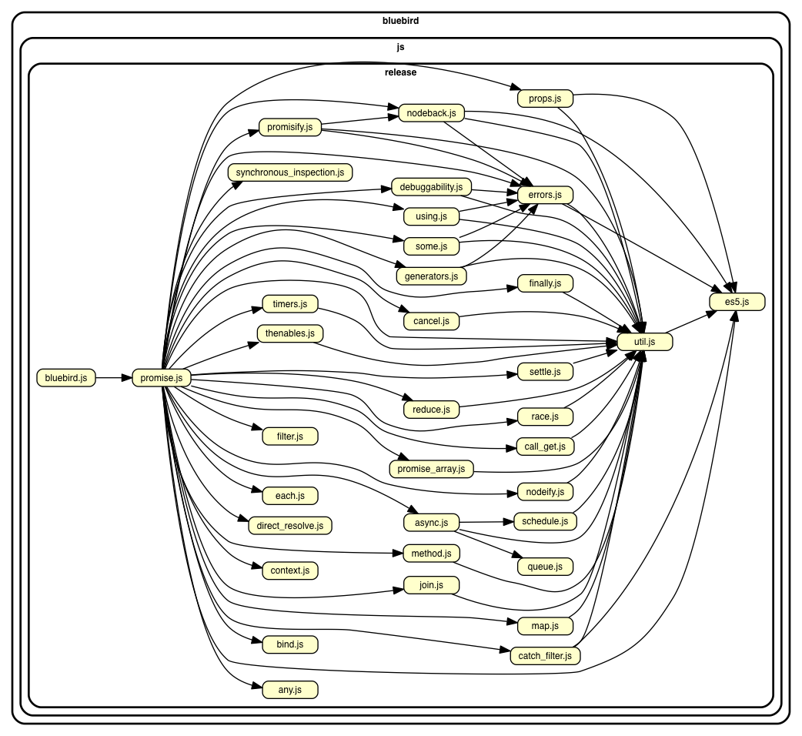
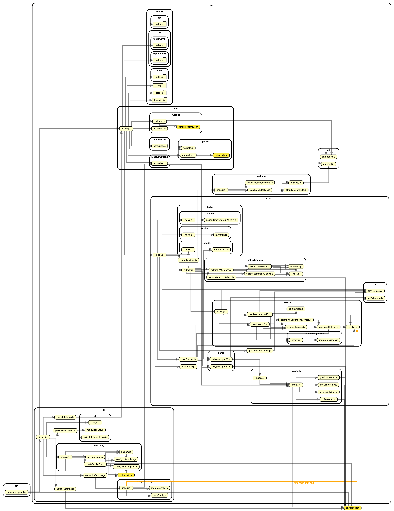
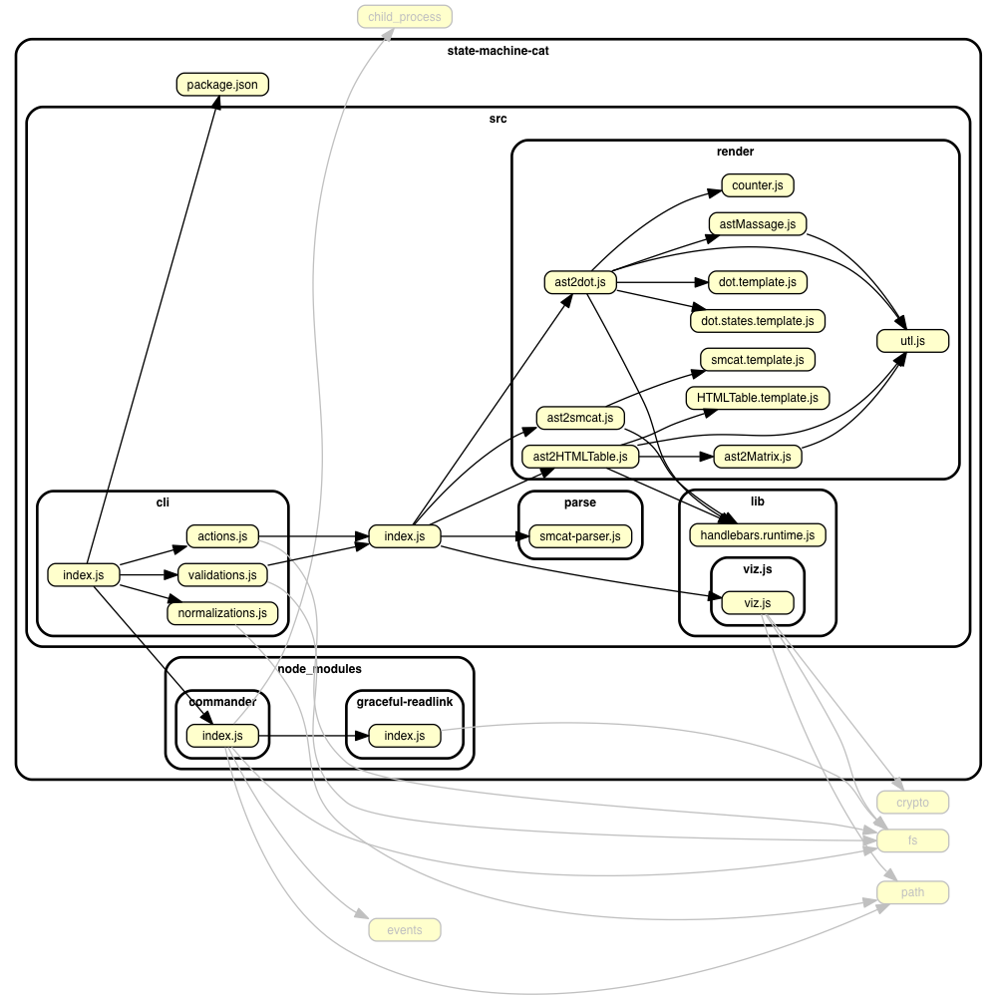
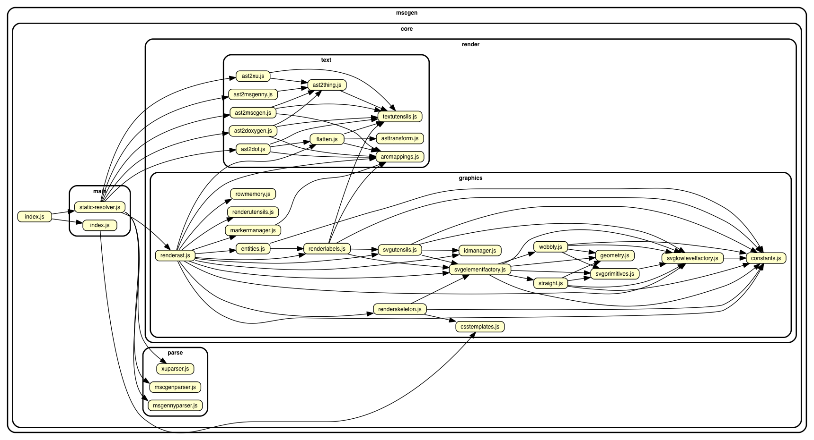

# Real world projects. Dependency cruised.

## Some popular projects on npm

### Commander
[tj/commander.js](https://github.com/tj/commander.js) - For command line parsing - and cooking command line interfaces.


### Chalk
[chalk/chalk](https://github.com/chalk/chalk) -
For coloring strings in the terminal. A typical _Sorhus style_ micro module that uses other micro modules to accomplish its goals.


### Bluebird
[petkaantonov/bluebird](https://github.com/petkaantonov/bluebird) - promise library



### Safe-regex
[substack/safe-regex](https://github.com/substack/safe-regex) - for sanity checking regular expressions against exponential time errors. For everyone who enables users to input regular expressions in.


### Resolve
[substack/node-resolve](https://github.com/substack/node-resolve) - resolves (node) module names to files on disk.


### Yargs
[yargs/yargs](https://github.com/yargs/yargs) - Another library to parse command line options/ cook command line interfaces.


## Typescript
It is possible to use dependency-cruiser to infer dependencies of typescript
projects.

We got the picture of tslint below by changing to the tslint/src folder and
running this:
```sh
dependency-cruise -T dot -x node_modules index.ts  | dot -T png > tslint-without-node_modules.png
```

(Yep, that's all - no separate transpilation steps necessary ...)

### tslint
[palantir/tslint](https://github.com/palantir/tslint) - linter for typescript.


## CoffeeScript
In the same vein dependency-cruiser directly supports CoffeeScript.

In the `src` folder of the coffeescript repo run this:
```sh
depcruise -x node_modules -T dot . | dot -T png > coffee-script-coffee-without-node_modules.png
```

### coffeescript
[jashkenas/coffeescript](https://github.com/jashkenas/coffeescript) - the
coffeescript transpiler:


(You see one module flagged as _unresolvable_ - this is the parser code
that the coffeescript build script generates jison into the folder with
transpiled javascript.)


## My own projects
### dependency cruiser
Dependency cruiser used on itself. node_modules left out to keep it concise.



### state machine cat
[sverweij/state-machine-cat](https://github.com/sverweij/state-machine-cat) - an interpreter for writing nice state diagrams.



### mscgen.js
[mscgenjs/mscgenjs-core](https://github.com/mscgenjs/mscgenjs-core) - an interpreter library for turning text (in MscGen or two other DSLs) into sequence charts.


