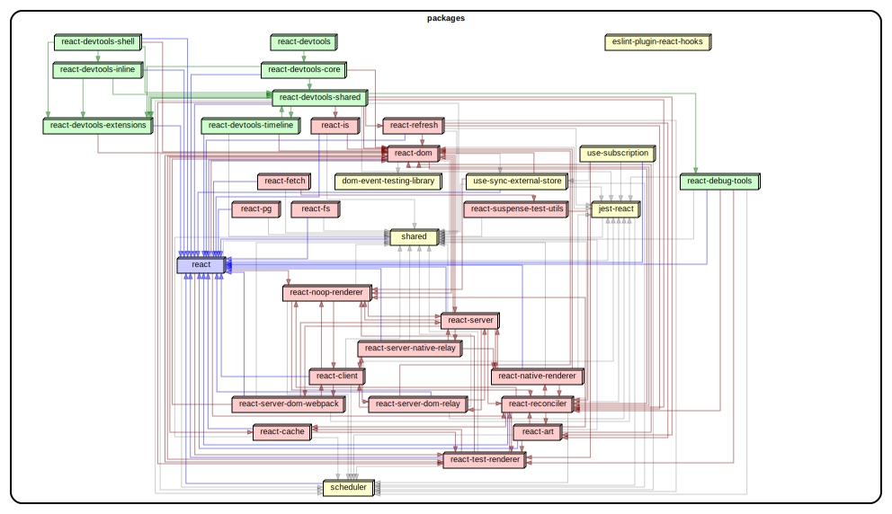
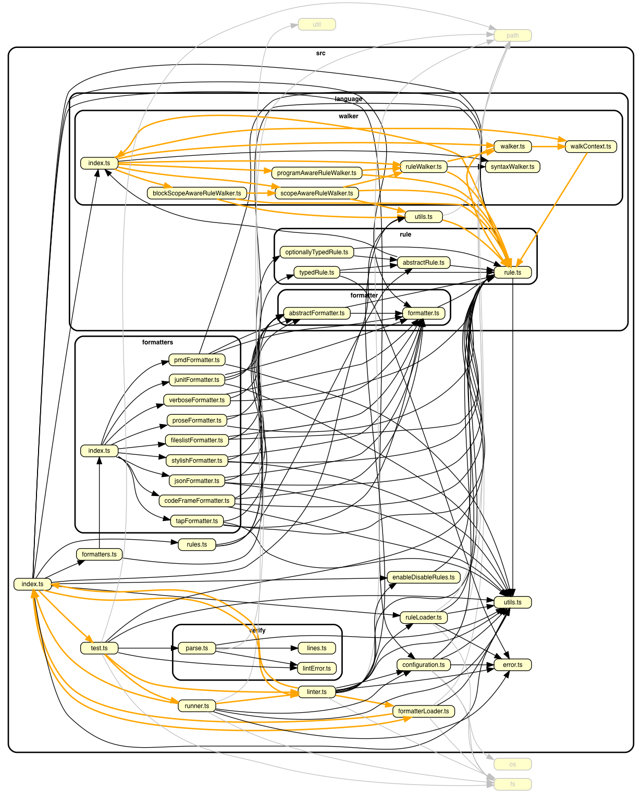
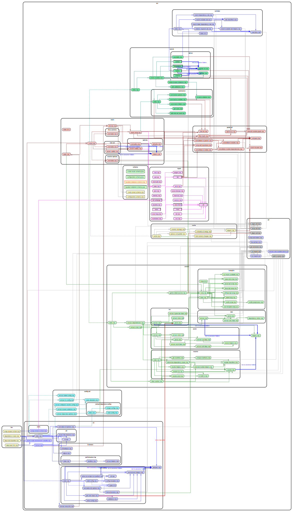

# Real world projects. Dependency cruised.

## Some popular projects on npm

### Commander

[tj/commander.js](https://github.com/tj/commander.js) - For command line parsing - and cooking command line interfaces.


### Chalk

[chalk/chalk](https://github.com/chalk/chalk) -
For colouring strings in the terminal. A typical _Sorhus style_ micro module that uses other micro modules to accomplish its goals.


### Yarn 2 ('berry')

[yarnpkg/berry](https://github.com/yarnpkg/berry) - package manager.

When your app becomes big, dependency graphs on module level will become
impractical. Dependency-cruiser can consolidate modules (+ their dependencies)
and colour them. Consolidation works out of the box for many repositories,
but can be [configured](./rules-reference.md#archi) to your [own liking](./rules-reference.md#reporteroptions).

Here's the resulting get high level dependency graph for berry:

[](https://sverweij.github.io/dependency-cruiser/assets/berry-high-level-dependencies.html)


<details>
<summary>howto</summary>

To get the above graph we used [berry-dependency-cruiser-config.js](real-world-samples/berry-dependency-cruiser-config.js). To generate it yourself do this in the root of the berry repo:

- `yarn` (with yarn v2 :-)) 
- `yarn add -D dependency-cruiser`
- copy `berry-dependency-cruiser-config.js` to the root of the repo
- add this script to package.json (so don't use the globally installed depcruise
  or even the locally installed one - yarn's pnp resolution won't work otherwise:)
  ```
  "depcruise:archi": "depcruise --config berry-dependency-cruiser-config.js --output-type archi packages | dot -T svg > berry-high-level-dependencies.svg",
  ```
- run `yarn depcruise:archi`
</details>


### react

[facebook/react](https://github.com/facebook/react) - "a JavaScript library for building user interfaces".

Also high level:

[](https://sverweij.github.io/dependency-cruiser/assets/react-high-level-dependencies.html)

<details>
<summary>howto</summary>

To get the above graph we used [react-dependency-cruiser-config.js](real-world-samples/react-dependency-cruiser-config.js). To generate it yourself do this in the root of the react repo:

- `yarn` 
- Either use the globally installed dependency cruiser or `yarn add -D dependency-cruiser`
- copy `react-dependency-cruiser-config.js` to the root of the repo
- run this:
  ```
  depcruise --config react-dependency-cruiser-config.js -T archi packages/*/{*.js,src} | dot -T svg | tee react-high-level-dependencies.svg | depcruise-wrap-stream-in-html > react-high-level-dependencies.html
  ```
</details>

### Safe-regex

[substack/safe-regex](https://github.com/substack/safe-regex) - for sanity checking regular expressions against exponential time errors. For everyone who enables users to input regular expressions in.


### Resolve

[substack/node-resolve](https://github.com/substack/node-resolve) - resolves (node) module names to files on disk.


### Yargs

[yargs/yargs](https://github.com/yargs/yargs) - Another library to parse command line options/ cook command line interfaces.


## TypeScript

It is possible to use dependency-cruiser to infer dependencies of typescript
projects.

We got the picture of tslint by running this in its source folder:

```sh
dependency-cruise -T dot -x node_modules -v -- src/index.ts  | dot -T png > tslint-without-node_modules.png
```

(Yep, that's all - no separate transpilation steps necessary ...)

### tslint

[palantir/tslint](https://github.com/palantir/tslint) - linter for typescript.

The orange lines are warnings for circular dependencies, which occur around two of
tslint's 'barrel' `index.ts` modules:



## CoffeeScript

In the same vein dependency-cruiser directly supports CoffeeScript.

In the `src` folder of the CoffeeScript repo run this:

```sh
depcruise -x node_modules -T dot . | dot -T png > coffee-script-coffee-without-node_modules.png
```

### CoffeeScript

[jashkenas/coffeescript](https://github.com/jashkenas/coffeescript) - the
CoffeeScript transpiler:


(You see one module flagged as _unresolvable_ - this is the parser code
that the CoffeeScript build script generates jison into the folder with
transpiled JavaScript.)

## My own projects

### dependency cruiser

Dependency cruiser used on itself, focusing on internal dependencies only, on three
levels of abstraction - high level, folder and modules. A small
[custom theme](rules-reference.md#dot) in its [configuration](../.dependency-cruiser.json#L196)
colours the various main parts (extract, validate, report) and the dependencies to
them. Click for slightly more interactive versions.

#### high level overview ('archi')

[](https://sverweij.github.io/dependency-cruiser/dependency-cruiser-archi-graph.html)

#### folder level overview ('ddot')

[](https://sverweij.github.io/dependency-cruiser/dependency-cruiser-dir-graph.html)

#### detailed overview ('dot')

[](https://sverweij.github.io/dependency-cruiser/dependency-cruiser-dependency-graph.html)

### state machine cat

[sverweij/state-machine-cat](https://github.com/sverweij/state-machine-cat) - an
interpreter for writing nice state diagrams. Click for a slightly
more interactive version.

[](https://state-machine-cat.js.org/dependency-cruiser-graph.html)

### mscgen.js

[mscgenjs/mscgenjs-core](https://github.com/mscgenjs/mscgenjs-core) - an
interpreter library for turning text (in MscGen or two other DSLs) into sequence
charts. Click for a slightly more interactive version.

[](https://mscgenjs.github.io/mscgenjs-core/dependencygraph.html)
