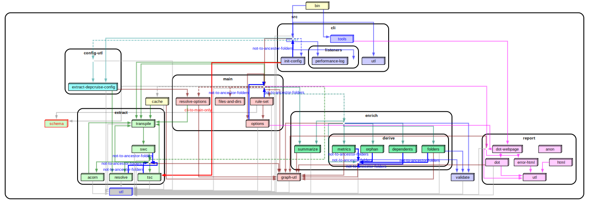

# Real world projects. Dependency cruised.

## Some popular projects on npm

### Commander

[tj/commander.js](https://github.com/tj/commander.js) - For command line parsing - and cooking command line interfaces.


### Chalk

[chalk/chalk](https://github.com/chalk/chalk) -
For colouring strings in the terminal. A typical _Sorhus style_ micro module that uses other micro modules to accomplish its goals.


### Yarn 2 ('berry')

[yarnpkg/berry](https://github.com/yarnpkg/berry) - package manager.

When your app becomes big, dependency graphs on module level will become
impractical. Dependency-cruiser can consolidate modules (+ their dependencies)
and colour them. Consolidation works out of the box for many repositories,
but can be [configured](./options-reference.md#summarising-collapsepattern-dot-and-archi-reporters)
to your [own liking](./options-reference.md#reporteroptions).

Here's the resulting get high level dependency graph for berry:

[](https://sverweij.github.io/dependency-cruiser/assets/berry-high-level-dependencies.html)

<details>
<summary>howto</summary>

To get the above graph we used [berry-dependency-cruiser-config.js](real-world-samples/berry-dependency-cruiser-config.js). To generate it yourself do this in the root of the berry repo:

- `yarn` (with yarn v2 :-))
- `yarn add -D dependency-cruiser`
- `rm -f berry-dependency-cruiser-config.js`
- `wget https://raw.githubusercontent.com/sverweij/dependency-cruiser/develop/doc/real-world-samples/berry-dependency-cruiser-config.js`
- add these two lines to the `scripts` section of the package.json (so don't
  use the globally installed depcruise or even the locally installed one -
  yarn's pnp resolution won't work otherwise:)
  ```
  "dc": "depcruise --version && depcruise --config berry-dependency-cruiser-config.js --output-type err packages",
  "depcruise:archi": "depcruise --version && depcruise --config berry-dependency-cruiser-config.js --output-type archi packages | dot -T svg | tee berry-high-level-dependencies.svg | depcruise-wrap-stream-in-html > berry-high-level-dependencies.html",
  ```
- run `yarn depcruise:archi`
</details>

### react

[facebook/react](https://github.com/facebook/react) - "a JavaScript library for building user interfaces".

Also high level:

[](https://sverweij.github.io/dependency-cruiser/assets/react-high-level-dependencies.html)

<details>
<summary>howto</summary>

To get the above graph we used [react-dependency-cruiser-config.js](real-world-samples/react-dependency-cruiser-config.js). To generate it yourself do this in the root of the react repo:

- prepare

```sh
git clone git@github.com:facebook/react.git
cd react
yarn
yarn add -D -W dependency-cruiser
rm -f react-dependency-cruiser-config.js
wget https://raw.githubusercontent.com/sverweij/dependency-cruiser/develop/doc/real-world-samples/react-dependency-cruiser-config.js
```

- Add these run-scripts to the package.json:

  ```
    "dc": "depcruise --version && depcruise --ignore-known --config react-dependency-cruiser-config.js -T err packages/*/{*.js,src}",
    "depcruise:baseline": "depcruise --version && depcruise-baseline packages/*/{*.js,src} --config react-dependency-cruiser-config.js",
    "depcruise:archi": "depcruise --ignore-known --config react-dependency-cruiser-config.js -T archi packages/*/{*.js,src} | dot -T svg | tee react-high-level-dependencies.svg | depcruise-wrap-stream-in-html > react-high-level-dependencies.html
  ```

- `yarn depcruise:baseline`
- `yarn depcruise:archi`

</details>

### Safe-regex

[substack/safe-regex](https://github.com/substack/safe-regex) - for sanity checking regular expressions against exponential time errors. For everyone who enables users to input regular expressions in.


### Resolve

[substack/node-resolve](https://github.com/substack/node-resolve) - resolves (node) module names to files on disk.


### Yargs

[yargs/yargs](https://github.com/yargs/yargs) - Another library to parse command line options/ cook command line interfaces.


## TypeScript

It is possible to use dependency-cruiser to infer dependencies of typescript
projects.

We got the picture of tslint by running this in its source folder:

```sh
dependency-cruise -T dot -x node_modules -v -- src/index.ts  | dot -T png > tslint-without-node_modules.png
```

(Yep, that's all - no separate transpilation steps necessary ...)

### tslint

[palantir/tslint](https://github.com/palantir/tslint) - linter for typescript.

The orange lines are warnings for circular dependencies, which occur around two of
tslint's 'barrel' `index.ts` modules:


## CoffeeScript

In the same vein dependency-cruiser directly supports CoffeeScript.

In the `src` folder of the CoffeeScript repo run this:

```sh
depcruise -x node_modules -T dot . | dot -T png > coffee-script-coffee-without-node_modules.png
```

### CoffeeScript

[jashkenas/coffeescript](https://github.com/jashkenas/coffeescript) - the
CoffeeScript transpiler:


(You see one module flagged as _unresolvable_ - this is the parser code
that the CoffeeScript build script generates jison into the folder with
transpiled JavaScript.)

## My own projects

### dependency cruiser

Dependency cruiser used on itself, focusing on internal dependencies only, on three
levels of abstraction - high level, folder and modules. A small
[custom theme](options-reference.md#theme-dot-ddot-and-archi-reporters) in its [configuration](../.dependency-cruiser.json#L243)
colours the various main parts (extract, validate, report) and the dependencies to
them. Click for slightly more interactive versions.

#### high level overview ('archi')

[](https://sverweij.github.io/dependency-cruiser/dependency-cruiser-archi-graph.html)

<details>
<summary>howto</summary>

To generate this yourself do this in the root of the dependency-cruiser repo:

```
node ./bin/dependency-cruise.mjs bin src --config --output-type archi | \
  # format the output with dot. For this specific graph top-down (TD)
  # orientation works best
  dot -T svg -Grankdir=TD | \
  # save the svg
  tee doc/real-world-samples/dependency-cruiser-archi-graph.svg | \
  # process the svg into an interactive html graph
  node bin/wrap-stream-in-html.mjs > docs/dependency-cruiser-archi-graph.html
```

> the only repository in the world you can't use the commands `depcruise`,
> `depcruise-fmt` or `depcruise-wrap-stream-in-html` is dependency-cruiser's own -
> instead we run the JavaScript files from `bin` directly.
> If you adapt the script for your own use replace
> `node ./bin/dependency-cruise.mjs` with `depcruise`,
> `node ./bin/wrap-stream-in-html.mjs` with `depcruise-wrap-stream-in-html`.

</details>

#### folder level overview ('ddot')

[](https://sverweij.github.io/dependency-cruiser/dependency-cruiser-dir-graph.html)

<details>
<summary>howto</summary>

To generate this yourself do this in the root of the dependency-cruiser repo:

```
node ./bin/dependency-cruise.js bin src --config --output-type ddot | \
  # format the output with dot. For this specific graph top-down (TD)
  # orientation works best
  dot -T svg -Grankdir=TD | \
  # save the svg
  tee doc/real-world-samples/dependency-cruiser-dir-graph.svg | \
  # process the svg into an interactive html graph
  node bin/wrap-stream-in-html.js > docs/dependency-cruiser-dir-graph.html
```

> the only repository in the world you can't use the commands `depcruise`,
> `depcruise-fmt` or `depcruise-wrap-stream-in-html` is dependency-cruiser's own -
> instead we run the JavaScript files from `bin` directly.
> If you adapt the script for your own use replace
> `node ./bin/dependency-cruise.js` with `depcruise`,
> `node ./bin/wrap-stream-in-html.js` with `depcruise-wrap-stream-in-html`.

</details>

#### detailed overview ('dot')

[](https://sverweij.github.io/dependency-cruiser/dependency-cruiser-dependency-graph.html)

<details>
<summary>how to</summary>

To generate this yourself do this in the root of the dependency-cruiser repo:

```
# The --prefix will make sure that any links in the report open in vscode
# You can alternatively configure this in your .dependency-cruiser.js
node ./bin/dependency-cruise.js bin src --prefix vscode://file/$(pwd)/ --config --output-type dot | \
  # format the output with dot
  dot -T svg |\
  # process the svg into an interactive html graph
  node ./bin/wrap-stream-in-html.js |\
  # The browser command opens the graph-in-html just produced in your
  # default browser
  browser
```

> the only repository in the world you can't use the commands `depcruise`,
> `depcruise-fmt` or `depcruise-wrap-stream-in-html` is dependency-cruiser's own.
> Instead we run the JavaScript files from `bin` directly. Alternatively, in the
> dependency-cruiser repo you can run a script from package.json to get this
> result as well: `depcruise:graph:view` - which also opens the graph.
> If you adapt the script for your own use replace
> `node ./bin/dependency-cruise.js` with `depcruise`,
> `node ./bin/wrap-stream-in-html.js` with `depcruise-wrap-stream-in-html`.

</details>

### state machine cat

[sverweij/state-machine-cat](https://github.com/sverweij/state-machine-cat) - an
interpreter for writing nice state diagrams. Click for a slightly
more interactive version. As you can see this graph does not group modules
from same folders into clusters. Instead it uses only colors for 'grouping'
and notes the folder name in the nodes. It's what the ['flat'](https://github.com/sverweij/dependency-cruiser/blob/develop/doc/cli.md#flat-fdot) graph reporter
does for you. See the _how to_ foldout below to see how to reproduce it.

(For this too: click for a slightly more interactive version)

[](https://state-machine-cat.js.org/dependency-cruiser-graph-flat-dot.html)

<details>
<summary>how to</summary>

```sh
git clone git@github.com:sverweij/state-machine-cat.git
cd state-machine-cat
npm install
npx depcruise src bin/smcat --progress \
    --config config/dependency-cruiser-graph.js \
    --output-type flat \
  | dot -Tsvg \
  | tee docs/dependency-cruiser-graph-flat-dot.svg \
  | npx depcruise-wrap-stream-in-html \
  > docs/dependency-cruiser-graph-flat-dot.html
```

</details>

### mscgen.js

[mscgenjs/mscgenjs-core](https://github.com/mscgenjs/mscgenjs-core) - an
interpreter library for turning text (in MscGen or two other DSLs) into sequence
charts. Click for a slightly more interactive version.

[](https://mscgenjs.github.io/mscgenjs-core/dependencygraph.html)
