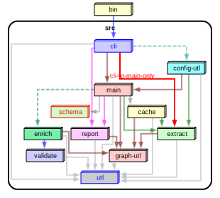

# Dependency cruiser rules - reference

## Introduction

- This is a small reference guide to the elements you can use to write rules
  for dependency-cruiser. If you want a step-by-step introduction check the
  [rules _tutorial_](./rules-tutorial.md).
- There is a [json schema](../src/schema/configuration.schema.json)
  that describes the output format. Dependency-cruiser
  checks rule sets against it.
- Some examples:
  - dependency-cruiser's [own configuration](../.dependency-cruiser.json)
  - the configuration [State Machine cat](https://state-machine-cat.js.org) uses
    [for validation](https://github.com/sverweij/state-machine-cat/blob/develop/config/dependency-cruiser.js)
    and the one it uses [for generating a visual graph](https://github.com/sverweij/state-machine-cat/blob/develop/config/dependency-cruiser-graph.js).
  - [mscgen.js](https://mscgen.js.org)'s [.dependency-cruiser.js](https://github.com/mscgenjs/mscgenjs-core/blob/develop/.dependency-cruiser.js)
- Tip: run `depcruise --init` to create a .dependency-cruiser.js with
  some rules that make sense in most projects.

## Contents

1. [The structure of a dependency-cruiser configuration](#the-structure-of-a-dependency-cruiser-configuration)
   - [`forbidden`](#forbidden)
   - [`allowed`](#allowed)
   - [`allowedSeverity`](#allowedSeverity)
   - [`required`](#required)
   - [`extends`](#extends)
   - [`options`](#options)
2. [The structure of an individual rule](#the-structure-of-an-individual-rule)
3. [Conditions](#conditions)
   - [`path`](#path)
   - [`pathNot`](#pathnot)
   - [path specials](#path-specials)
   - [`orphan`](#orphans)
   - [`reachable`](#reachable---detecting-dead-wood-and-transient-dependencies)
   - [`couldNotResolve`](#couldnotresolve)
   - [`circular`](#circular)
   - [`license` and `licenseNot`](#license-and-licensenot)
   - [`dependencyTypes`](#dependencytypes)
   - [`dynamic`](#dynamic)
   - [`moreThanOneDependencyType`](#more-than-one-dependencytype-per-dependency-morethanonedependencytype)
   - [`exoticRequire` and `exoticRequireNot`](#exoticallyrequired-exoticrequire-and-exoticrequirenot)
   - [`preCompilationOnly`](#precompilationonly)
4. [The `options`](#the-options)
   - [`doNotFollow`: don't cruise modules any further](#donotfollow-dont-cruise-modules-any-further)
   - [`includeOnly`: only include modules satisfying a pattern](#includeonly-only-include-modules-satisfying-a-pattern)
   - [`focus`: show modules matching a pattern - with their direct neighbours](#focus-show-modules-matching-a-pattern---with-their-direct-neighbours)
   - [`exclude`: exclude dependencies from being cruised](#exclude-exclude-dependencies-from-being-cruised)
   - [`maxDepth`](#maxdepth)
   - [`prefix`: prefix links in reports](#prefix-prefix-links-in-reports)
   - [`moduleSystems`](#modulesystems)
   - [`tsPreCompilationDeps`](#tsprecompilationdeps)
   - [`tsConfig`: use a TypeScript configuration file ('project')](#tsconfig-use-a-typescript-configuration-file-project)
   - [`babelConfig`: use a babel configuration file](#babelconfig-use-a-babel-configuration-file)
   - [Yarn Plug'n'Play support - `externalModuleResolutionStrategy`](#yarn-plugnplay-support---externalmoduleresolutionstrategy)
   - [`webackConfig`: use (the resolution options of) a webpack configuration](#webpackconfig-use-the-resolution-options-of-a-webpack-configuration)
   - [`reporterOptions`](#reporteroptions)
   - [Some more esoteric options](#some-more-esoteric-options)
5. [Configurations in JavaScript](#configurations-in-javascript)

## The structure of a dependency cruiser configuration

The typical dependency-cruiser config is json file (although you can use JavaScript -
see [below](#configurations-in-javascript))). The three most important sections
are `forbidden`, `allowed`, `required` and `options`, so a skeleton config could
look something like this:

```json
{
  "forbidden": [],
  "allowed": [],
  "required": [],
  "options": {}
}
```

The following paragraphs explain these three and the other sections.

### `forbidden`

A list of rules that describe dependencies that are not allowed.
dependency-cruiser will emit a separate error (warning/ informational) message
for each violated rule.

### `allowed`

A list of rules that describe dependencies that are _allowed_. dependency-cruiser
will emit a 'not-in-allowed' message for each dependency that does not
satisfy at least one of them. The severity of the message is _warn_ by
default, but you can override it with `allowedSeverity`

### `allowedSeverity`

The severity to use in reports when a dependency is not in the `allowed`
list of rules. It takes the same values as other `severity` fields and
also defaults to `warn`.

### `required`

A list of rules that describe what dependencies modules _must_ have, like 'every
controller _must depend on_ the base controller'.

'Required' rules have slightly different semantics from the `forbidden` and
`allowed` types. There's a mandatory `module` attribute that specifies which
modules the rule applies to and the `to` describes what dependencies that module
should exactly have.

```javascript
{
  required: [
    {
      name: "controllers-inherit-from-base",
      comment:
        "Each controller should inherit from the framework's base controller",
      module: {
        // every module that matches the pattern specified in path & pathNot ...
        path: "-controller\\.js$",
        pathNot: "framework/base-controller\\.js$",
      },
      to: {
        // ... must depend at least once on the framework's base controller
        path: "^src/framework/base-controller\\.js$",
      },
    },
  ];
}
```

### `extends`

This takes one or more file path to other dependency-cruiser-configs. When
dependency-cruiser reads your config, it takes the contents of the
`extends` and merges them with the contents of your config.

#### File resolution

dependency-cruiser resolves the `extends` relative to the file name with the
same algorithm node uses, which means a.o.

- names starting with `./` are local
- you can use external node_modules to reference rule sets (e.g. `dependency-cruiser/configs/recommended`)
- there's no need to specify the extension for JavaScript files, but for json it's mandatory.

#### How rules are merged

- `allowed` rules  
  Dependency-cruiser concatenates `allowed` rules from the extends, and de-duplicates
  them.
- `forbidden` rules  
  For `forbidden` rules it uses the same approach, except when the rules
  have a name, in which case the rule with the same name in the current file
  gets merged into the one from extends, where attributes from the current file
  win.
  This allows you to override only one attribute, e.g. the severity
- `allowedSeverity`  
  If there's an `allowedSeverity` in the current file, it wins. If neither file
  has an `allowedSeverity` dependency-cruiser uses _warn_ as a default
- `options`  
  `options` get the Object.assign treatment - where the option in the current
  file wins.
- If there's more than one path in extends, they get merged into the current file
  one by one, running through the array left to right.

#### Examples

To use a local base config:

```json
{
  "extends": "./configs/dependency-cruiser-base.json"
}
```

To use a base config from an npm package:

```json
{
  "extends": "@ourcompany/dependency-cruiser-configs/frontend-rules-base.json"
}
```

```js
module.exports = {
  extends: "dependency-cruiser/configs/recommended",
  forbidden: [
    {
      // because we still use a deprecated core module, still let
      // the no-deprecated-core rule from recommended fire,
      // but at least temporarily don't let it break our build
      // by setting the severity to "warn" here
      name: "no-deprecated-core",
      severity: "warn",
      // no need to specify the from and to, because they're already
      // defined in 'recommended'
    },
  ],
};
```

### `options`

Options that influence what is cruised, and how it is cruised. See
[The options](#the-options) below for an exhaustive list.

## The structure of an individual rule

A rule consists at least of a `from` and a `to` attribute that contain one or
more conditions that trigger the rule, so a minimal rule will look like this:

```json
{
  "from": {},
  "to": {}
}
```

A rule within the 'allowed' section can also have a `comment` attribute
which you can use to describe the rule.

Rules within the 'forbidden' section can have a `name` and a `severity`.

```json
{
  "name": "kebab-cased-name",
  "comment": "(optional) description of the rule",
  "severity": "warn",
  "from": {},
  "to": {}
}
```

### `from` and `to`

Conditions an end of a dependency should match to be caught by this
rule. Leave it empty if you want any module to be matched.

The [conditions](#conditions) section below describes them all.

### `comment`

You can use this field to document why the rule is there. It's not
used in any rule logic.

### `name`

> (only available in the `forbidden` section )

A short name for the rule - will appear in reporters to enable
customers to quickly identify a violated rule. Try to keep them
short, eslint style. E.g. 'not-to-core' for a rule forbidding
dependencies on core modules, or 'not-to-unresolvable' for one
that prevents dependencies on modules that probably don't exist.

If you do not provide a name, dependency-cruiser will default it
to `unnamed`.

### `severity`

> (only available in the `forbidden` section )

How severe a violation of a rule is. The 'error' severity will make
some reporters (at least the `err` one) return a non-zero exit
code, so if you want e.g. a build to stop when there's a rule
violated: use that.

The other values you can use are `info`, `warn` and `ignore`. If you
leave it out dependency-cruiser will assume it to be `warn`.

With the severity set to `ignore` dependency-cruiser will not check
the rule at all. This can be useful if you want to temporarily
disable a rule or disable a rule you inherited from a rule set you
extended.

## Conditions

### `path`

A regular expression an end of a dependency should match to be caught by this
rule.

In `from`, this is the path from the current working directory (typically your
project root) to the file containing a dependency. In `to`, this is the path from
the current working directory to the file the dependency resolves to.

When path is in a `to` part of a rule it accepts the regular expression
'group matching' special variables `$0`, `$1`, `$2`, ... as well. See
'group matching' below for an explanation & example.

### `pathNot`

A regular expression an end of a dependency should NOT match to be caught by
this rule.

When pathNot is in a `to` part of a rule it accepts the regular expression
'group matching' special variables `$0`, `$1`, `$2`, ... just like the path
attribute. See 'group matching' below for an explanation & example.

### path specials

#### regular expressions - not globs

I chose _regular expressions_ for matching paths over the more traditional
_glob_ because they're more expressive - which makes it easier to specify
rules. Some common patterns

| glob           | regular expression | this expresses:                                                                                       |
| -------------- | ------------------ | ----------------------------------------------------------------------------------------------------- |
| `*.js`         | `[^/]+\.js$`       | files in the current folder with the extension _.js_                                                  |
| `src/**/*`     | `^src`             | all files in the _src_ folder                                                                         |
| _not possible_ | `^src/([^/]+)/.+`  | everything in the src tree - remember the matched folder name directly under src for later reference. |

#### forward slashes

To make sure rules you specify run on all platforms, dependency-cruiser
internally represents paths with forward slashes as path separators
(`src/alez/houpe`).

#### 'group matching'

Sometimes you'll want to use a part of the path the 'from' part of your rule
matched and use it in the 'to' part. E.g. when you want to prevent stuff in
the same folder to be matched.

To achieve this you'll need to do two things:

- In the `from` of your rule:  
  Make sure the part of the `path` you want to be matched is between brackets.
  Like so: `"^src/([^/]+)/.+"`
- In the `to` part of your rule:  
  You can reference the part matched between brackets by using `$1` in `path`
  and `pathNot` rules. Like so: `"pathNot": "^src/$1/.+".`
- It is possible to use more than one group per rule as well. E.g. this
  expression `"^src/([^/]+)/[^\.]\.(.+)$"` has two groups; one
  for the folder directly under src, and one for the extension. The first is
  available in the `to` part of your rule with `$1`, the second with `$2`.
- The special variable `$0` contains the _whole_ matched string. I haven't
  seen a practical use for it in the context of dependency-cruiser, but
  I'll be glad to be surprised.

#### 'group matching' - an example: matching peer folders

Say you have the following folder structure

```
src
└── business-components
    ├── search
    ├── upsell
    ├── check-out
    ├── view-trip
    └── check-in
```

Business components should be completely independent of each other. So typically
you'd specify a rule like this to prevent accidents in the "forbidden" section:

```json
{
  "name": "no-inter-ubc",
  "comment": "Don't allow relations between code in business components",
  "severity": "error",
  "from": { "path": "^src/business-components/([^/]+)/.+" },
  "to": {
    "path": "^src/business-components/([^/]+)/.+"
  }
}
```

This will correctly flag relations from one folder to another, but also
relations _within_ folders. It's possible to get around that by specifying it
for each folder explicitly, leaving the current 'from' folder from the to
list e.g.  
_from: search, to: upsell|check-out|view-trip|check-in,_  
_from: upsell, to: search|check-out|view-trip|check-in,_  
 _..._

That'll be heavy maintenance though; especially when your
business components breed like a litter of rabbits. In stead, you can use
group matching:

```json
{
  "name": "no-inter-ubc",
  "comment": "Don't allow relations between business components",
  "severity": "error",
  "from": { "path": "^src/business-components/([^/]+)/.+" },
  "to": {
    "path": "^src/business-components/([^/]+)/.+",
    "pathNot": "^src/business-components/$1/.+"
  }
}
```

... which makes sure dependency-cruiser does not match stuff in the from folder
currently being matched.

#### Using an array of regular expressions

When your regular expressions grow bigger, you might want to express them
as an array of regular expressions instead of just one regular expression to
improve legibility.

<details>
<summary>example ...</summary>

```javascript
{
  from: {
    path: "(^src/report/)"
  },
  to: {
    pathNot: "$1|^node_modules|^(path|package.json)$|^src/utl"
  }
}
```

```javascript
{
  from: {
    path: "(^src/report/)"
  },
  to: {
      pathNot: [
        "$1",
        "^node_modules",
        "^(path|package.json)$",
        "^src/utl"
      ]
  }
}
```


</details>

### orphans

A Boolean indicating whether or not to match modules that have no incoming
or outgoing dependencies. Orphans might need special attention because
they're unused leftovers from a refactoring. Or the start of some feature
that never got finished but which was merged anyway. Leaving the `orphan`
attribute out means you don't care about orphans in your code.

Detecting orphans will have an impact on performance. You will probably
only notice it when you have a larger code base (thousands of modules
in your dependency graph), but it is something to
keep in mind.

To detect orphan guys you can add e.g. this snippet to your
.dependency-cruiser.json's `forbidden` section:

```json
{
  "name": "no-orphans",
  "severity": "warn",
  "from": { "orphan": true },
  "to": {}
}
```

#### Usage notes

- dependency-cruiser will typically not find orphans when you give it
  only one module to start with. Any module it finds, it finds by
  following its dependencies, so each module will have at least one
  dependency incoming or outgoing. Specify one or more folder, several
  files or a glob. E.g.
  ```
  depcruise -v -- src lib test
  ```
  will find orphans if they exist,
  whereas
  ```sh
  depcruise -v -- src/index.ts
  ```
  probably won't (unless index.ts is an orphan itself).
- by definition orphan modules have no dependencies. So when `orphan` is
  part of a rule, the `to` part won't make sense. This is why
  dependency-cruiser will ignore the `to` part of these rules.
- For similar reasons `orphan` is not allowed in the `to` part of rules.

### `reachable` - detecting dead wood and transient dependencies

`reachable` is a Boolean indicating whether or not modules matching the `to` part
of the rule are _reachable_ (either directly or via other modules) from modules
matching the `from` part of the rule. This can be useful for two use cases:

- [detect dead wood](#detect-dead-wood-with-reachable)
- [prevent modules from being reached via via](#prevent-modules-from-being-reached-via-via-with-reachable)

#### detect dead wood with `reachable`

For instance, in this dependency-graph several modules are not reachable from
the root `index.js`. If `index.js` is the only (legal) entry to this package,
those unreachable modules are likely candidates for removal:


Here's a rule snippet that will detect these for you:

```javascript
{
    "forbidden": [
        {
            "name": "no-unreachable-from-root",
            "severity": "error",
            "from": {
                "path": "src/index\\.js$"
            },
            "to": {
                "path": "src",

                /*
                  spec files shouldn't be reachable from regular code anyway, so you
                  might typically want to exclude these from reachability rules.
                  The same goes for typescript definition files:
                 */
                "pathNot": "\\.spec\\.(js|ts)$|\\.d\\.ts$"

                /*
                  for each file matching path and pathNot, check if it's reachable from the
                  modules matching the criteria mentioned in "from"
                 */
                "reachable": false
            }
        }
    ]
}

```

With this rule enabled, the unreachable rules jump out immediately. Both in the output of the `err` reporter

```sh
  error no-unreachable-from-root: src/other-stuff/index.js
  error no-unreachable-from-root: src/other-stuff/untouched-one.js
  error no-unreachable-from-root: src/other-stuff/untouched-two.js
  error no-unreachable-from-root: src/relevant/to-untouched.js

✖ 4 dependency violations (4 errors, 0 warnings). 8 modules cruised.
```

... and in the output of the `dot` one:


#### Prevent modules from being reached via via with `reachable`

You can use the same `reachable` attribute to find transient dependencies (fancy
way to say _via via_). Let's say you have a bunch of JavaScript files that define
static schemas. It's OK if they import stuff, but they should _never_ touch
database implementation code (which happens to live in `src/lib/database`).

With a rule like this in the `forbidden` section you can make sure that never
happens:

```json
{
  "name": "implementation-not-reachable-from-info-ts",
  "comment": "Don't allow importing database implementation files for schema declaration files",
  "severity": "error",
  "from": {
    "path": "\\.schema\\.ts$",
  },
  "to": {
    "path": "^src/libs/database/",
    "reachable": true,
  },
};
```

#### Usage notes

- You can set up multiple rules with a `reachable` attribute in the `to` section. If you do so,
  make sure you give a `name` to each rule. It's not only the only way dependency-cruiser can keep
  reachable rules apart - it will be for you as well :-).
- Different from other rules, rules with a `reachable` attribute can only have
  - `path` and `pathNot` in the `from` part of the rule
  - `path` and `pathNot` alongside the `reachable` in the `to` part of the rule  
    (these limitations might get lifted somewhere in the future)

### `couldNotResolve`

Whether or not to match modules dependency-cruiser could not resolve (and
probably aren't on disk). For this one too: leave out if you don't care either
way.

To get an error for each unresolvable dependency, put this in your "forbidden"
section:

```json
{
  "name": "not-to-unresolvable",
  "severity": "error",
  "from": {},
  "to": { "couldNotResolve": true }
}
```

### `circular`

A Boolean indicating whether or not to match module dependencies that end up
where you started (a.k.a. circular dependencies). Leaving this out => you don't
care either way.

For example, adding this rule to the "forbidden" section in your
.dependency-cruiser.json will issue a warning for each dependency that ends
up at itself.

```json
{
  "name": "no-circular",
  "severity": "warn",
  "from": { "pathNot": "^(node_modules)" },
  "to": { "circular": true }
}
```

### `license` and `licenseNot`

You can flag dependent modules that have licenses that are e.g. not
compatible with your own license or with the policies within your company with
`license` and `licenseNot`. Both take a regular expression that matches
against the license string that goes with the dependency.

E.g. to forbid GPL and APL licenses (which require you to publish your source
code - which will not always be what you want):

```json
{
  "name": "no-gpl-apl-licenses",
  "severity": "error",
  "from": {},
  "to": { "license": "GPL|APL" }
}
```

This raise an error when you use a dependency that has a string with GPL or
APL in the "license" attribute of its package.json (e.g.
[SPDX](https://spdx.org) compatible expressions like `GPL-3.0`, `APL-1.0` and
`MIT OR GPL-3.0` but also on non SPDX compatible)

To only allow licenses from an approved list (e.g. a greenlist provided by your
legal department):

```json
{
  "name": "only-licenses-approved-by-legal",
  "severity": "warn",
  "from": {},
  "to": { "licenseNot": ["MIT", " ISC"] }
}
```

> Just with _path_ and _pathNot_ you can pass an array of regular expressions
> as well if you think that's more legible.

Note: dependency-cruiser can help out a bit here, but you remain responsible
for managing your own legal stuff. To re-iterate what is in the
[LICENSE](../LICENSE) to dependency-cruiser:

> THE SOFTWARE IS PROVIDED "AS IS", WITHOUT WARRANTY OF ANY KIND, EXPRESS OR
> IMPLIED, INCLUDING BUT NOT LIMITED TO THE WARRANTIES OF MERCHANTABILITY,
> FITNESS FOR A PARTICULAR PURPOSE AND NONINFRINGEMENT. IN NO EVENT SHALL THE
> AUTHORS OR COPYRIGHT HOLDERS BE LIABLE FOR ANY CLAIM, DAMAGES OR OTHER
> LIABILITY, WHETHER IN AN ACTION OF CONTRACT, TORT OR OTHERWISE, ARISING FROM,
> OUT OF OR IN CONNECTION WITH THE SOFTWARE OR THE USE OR OTHER DEALINGS IN THE
> SOFTWARE.

### `dependencyTypes`

You might have spent some time wondering why something works on your machine,
but not on other's. Only to discover you _did_ install a dependency, but
_did not_ save it to package.json. Or you already had it in your devDependencies
and started using it in a production source.

To save you from embarrassing moments like this, you can make rules with the
`dependencyTypes` verb. E.g. to prevent you accidentally depend on a
`devDependency` from anything in `src` add this to your
.dependency-cruiser.json's "forbidden" section:

```json
{
  "name": "not-to-dev-dep",
  "severity": "error",
  "comment": "because an npm i --production will otherwise deliver an unreliably running package",
  "from": { "path": "^src" },
  "to": { "dependencyTypes": ["npm-dev"] }
}
```

Or to detect stuff you npm i'd without putting it in your package.json:

```json
{
  "name": "no-non-package-json",
  "severity": "error",
  "comment": "because an npm i --production will otherwise deliver an unreliably running package",
  "from": { "pathNot": "^(node_modules)" },
  "to": {
    "dependencyTypes": ["unknown", "undetermined", "npm-no-pkg", "npm-unknown"]
  }
}
```

If you don't specify dependencyTypes in a rule, dependency-cruiser will ignore
them in the evaluation of that rule.

#### OK - `unknown`, `npm-unknown`, `undetermined` - I'm officially weirded out - what's that about?

This is a list of dependency types dependency-cruiser currently detects.

| dependency type | meaning                                                                                                                                                                   | example                   |
| --------------- | ------------------------------------------------------------------------------------------------------------------------------------------------------------------------- | ------------------------- |
| local           | a module in your own ('local') package                                                                                                                                    | "./klont"                 |
| localmodule     | a module in your own ('local') package, but which was in the `resolve.modules` attribute of the webpack config you passed                                                 | "shared/stuff.ts"         |
| npm             | it's a module in package.json's `dependencies`                                                                                                                            | "lodash"                  |
| npm-dev         | it's a module in package.json's `devDependencies`                                                                                                                         | "chai"                    |
| npm-optional    | it's a module in package.json's `optionalDependencies`                                                                                                                    | "livescript"              |
| npm-peer        | it's a module in package.json's `peerDependencies` - note: deprecated in npm 3                                                                                            | "thing-i-am-a-plugin-for" |
| npm-bundled     | it's a module that occurs in package.json's `bundle(d)Dependencies` array                                                                                                 | "iwillgetbundled"         |
| npm-no-pkg      | it's an npm module - but it's nowhere in your package.json                                                                                                                | "forgetmenot"             |
| npm-unknown     | it's an npm module - but there is no (parseable/ valid) package.json in your package                                                                                      |
| deprecated      | it's an npm module, but the version you're using or the module itself is officially deprecated                                                                            | "some-deprecated-package" |
| core            | it's a core module                                                                                                                                                        | "fs"                      |
| aliased         | it's a module that's linked through an aliased (webpack)                                                                                                                  | "~/hello.ts"              |
| unknown         | it's unknown what kind of dependency type this is - probably because the module could not be resolved in the first place                                                  | "loodash"                 |
| undetermined    | the dependency fell through all detection holes. This could happen with amd dependencies - which have a whole Jurassic park of ways to define where to resolve modules to | "veloci!./raptor"         |

### `dynamic`

A Boolean that tells you whether the dependency is a dynamic one (i.e.
it uses the async ES import statement a la `import('othermodule').then(pMod => pMod.doStuff())`).

You can use this e.g. to restrict the usage of dynamic dependencies:

```json
{
  "forbidden": [
    {
      "name": "no-non-dynamic-dependencies",
      "severity": "error",
      "from": {},
      "to": { "dynamic": true }
    }
  ]
}
```

... or to enforce the use of dynamic dependencies for certain dependencies

```json
{
  "forbidden": [
    {
      "name": "only-dyn-deps-to-otherside",
      "comment": "only dynamically depend on 'otherside' modules",
      "severity": "error",
      "from": {},
      "to": { "path": "@theotherside/", "dynamic": false }
    }
  ]
}
```

### More than one dependencyType per dependency? `moreThanOneDependencyType`

With the flexible character of package.json it's totally possible to specify
a package more than once - e.g. both in the `peerDependencies` and in the
`dependencies`. Sometimes this is intentional (e.g. to make sure a plugin
type package works with both npm 2 and 3), but it can be a typo as well.

Anyway, it's useful to be conscious about it. You can check
for it with a `moreThanOneDependencyType` attribute - which matches these
when set to true:

```json
{
  "name": "no-duplicate-dep-types",
  "severity": "warn",
  "from": {},
  "to": { "moreThanOneDependencyType": true }
}
```

When left out it doesn't matter how many dependency types a dependency has.

(If you're more of an 'allowed' user: it matches the 0 and 1 cases when set to
false).

### `exoticallyRequired`, `exoticRequire` and `exoticRequireNot`

For exotic requires/ require wrappers you might want to have different
rules a.c.t. normal requires. E.g.

- When you use a require wrapper to include a dependency that might not be there
  and handle it elegantly, it's not an error if the module-to-be-there doesn't
  actually exist - or is e.g. in your optionalDependencies.
- You might want to only allow the use of certain dependencies through an
  exotic require:

```json
{
  "name": "not-to-optional-deps",
  "severity": "error",
  "from": {},
  "to": {
    "dependencyTypes": ["npm-optional"],
    "exoticallyRequired": false
  }
}
```

- ... or ban exotic requires altogether:

```json
{
  "name": "ban-all-exotic-requires",
  "severity": "error",
  "from": {},
  "to": {
    "exoticallyRequired": true
  }
}
```

- Or allow only one specific:

```json
{
  "name": "only-window-require-exotic",
  "severity": "error",
  "comment": "The only 'exotic' require allowed is window.require",
  "from": {},
  "to": {
    "exoticRequireNot": "^window\\.require$",
    "exoticallyRequired": true
  }
}
```

### `preCompilationOnly`

If you want to set restrictions on dependencies that only exist before
compilation from TypeScript to JavaScript, you can use the (boolean)
`preCompilation` only attribute.

E.g. to make sure to only import stuff from the react-native stuff that doesn't
make it beyond the pre-compilation step:

```json
{
  "forbidden": [
    {
      "name": "only-types-from-react-native",
      "description": "make sure to only import stuff that's portable over platforms",
      "severity": "error",
      "from": {
        "path": "^src/platform-independent-stuff"
      },
      "to": {
        "path": "^src/lib/react-native-stuff",
        "preCompilationOnly": false
      }
    }
  ],
  "options": {
    "tsPreCompilationDeps": "specify"
  }
}
```

:warning: This attribute only works for TypeScript sources, and only when
[`tsPreCompilationDeps`](#tsprecompilationdeps) option is set to `"specify"`.

## The `options`

### Filter options: _doNotFollow_, _includeOnly_, _focus_ and _exclude_

Dependency-cruiser sports some filters that enable you to leave out certain
parts of dependency-trees you're not particularly interested in. They work
from the command line (as --do-not-follow, --include-only, --focus and --exclude
respectively) but you can also specify them in the configuration file.

On the command line you can pass a single regular expression for each of them.
The filters will use that to match against the (resolved) paths of modules
in your dependency tree.

The configuration file gives a little bit more flexibility. Apart from the path
you can specify additional properties, and pass an array of regular expressions
(which in some instances will enhance legibility).

You can pass the path in one of three ways:

As a single regular expression:

```javascript
options: {
  includeOnly: {
    path: "^bin|^src|^test|^packages";
  }
}
```

As an array of regular expressions:

```javascript
options: {
  includeOnly: {
    path: ["^bin", "^src", "^test", "^packages"];
  }
}
```

Or in shorthand:

```javascript
options: {
  includeOnly: ["^bin", "^src", "^test", "^packages"];
}
```

The next sections contain details on what each filter does and what extra
attributes you can pass.

### `doNotFollow`: don't cruise modules any further

> command line option equivalent: `--do-not-follow` (string values passed to 'path' only)

If you _do_ want to see certain modules in your reports, but are not interested
in these modules' dependencies, you'd pass the regular expression for those
modules to the `doNotFollow` option. A typical pattern you'd
use with this is "node_modules":

```json
    "options": {
      "doNotFollow": {
        "path": "node_modules"
      }
    }
```

#### Specifying dependency types in `doNotFollow`

> It's not possible to use this on the command line

It is possible to specify a regular expression
for files that dependency-cruiser should cruise, but not follow any further.
In the options section you can restrict what gets cruised by specifying
[dependency types](#dependencytypes). So if e.g. you don't want dependency-cruiser
to follow external dependencies, instead of specifying the "node_modules" path:

```json
    "options": {
        "doNotFollow": {
            // "path": "node_modules",
            "dependencyTypes": [
                "npm",
                "npm-dev",
                "npm-optional",
                "npm-peer",
                "npm-bundled"
            ]
        }
    }
```

> #### How `doNotFollow` influences what gets cruised
>
> There's a few steps dependency-cruiser takes when you fire it of:
>
> 1. gather all files specified as an argument, filtering out the stuff in `exclude`
>    and `doNotFollow` and that which is not in `includeOnly`.
> 2. starting from the gathered files: crawl all dependencies it can find. Crawling
>    stops when a module matches `doNotFollow` rule or a modules' dependency matches
>    either `exclude` or does not match `includeOnly`.
> 3. apply any rules over the result & report it.
>
> So in the first step `doNotFollow` behaves itself exactly like `exclude` would.
> Only in the second step it allows files matching its pattern to be visited
> (but not followed any further).
>
> This means dependency-cruise _will_ encounter files matching `doNotFollow`
> but only when they are dependencies of other modules. This a.o. prevents unexpected
> behaviour where specifying node modules as `doNotFollow` pattern would still
> traverse all node_modules when the node_modules were part of the arguments
> e.g. in `depcruise --do-not-follow node_modules --validate -- src test node_modules`
> or, more subtly with `depcruise --don-not-follow node_modules -- validate -- .`.

### `includeOnly`: only include modules satisfying a pattern

> command line option equivalent: `--include-only`

In the `includeOnly` option you can pass a regular expression of all file paths
dependency-cruiser should include in a cruise. It will discard all files
not matching the `includeOnly` pattern.

This can be handy if you want to make an overview of only your internal application
structure. E.g. to only take modules into account that are in the `src` tree (and
exclude all node_modules, core modules and modules otherwise outside it):

```json
"options": {
  "includeOnly": "^src/"
}
```

If you specify both an includeOnly and an exclude (see below), dependency-cruiser takes
them _both_ into account.

### `focus`: show modules matching a pattern - with their direct neighbours

> command line option equivalent: `--focus`

Just like the `includeOnly` option, `focus` takes a regular expressions you want
dependency-cruiser to show in its output. In addition dependency-cruiser will
include all neighbours of those modules; direct dependencies and direct
dependents.

This can be useful if you just want to focus on one part of your application and
how it interacts with the outside world.

#### basic use

Add a `focus` attribute in your options section. You will typically want to use
this option in conjunction with one of the other filtering options, like
_doNotFollow_ or _includeOnly_ as that will speed up the rendition quite
a lot.

> _doNotFollow_, _includeOnly_ and _exclude_ can run before dependency-cruiser
> does any static analysis, so dependency-cruiser applies as early on in the
> process as it can so it can prevent having to read files from disk (which is
> expensive).
>
> It can only determine the modules in focus and their neighbours after applying
> static analysis, though, as only then it knows what the relationships
> between the modules are.

Example configuration:

```json
{
  "options": {
    "includeOnly": "^src/",
    "focus": "^src/main/"
  }
}
```

<details>
<summary>sample command line invocation and graphical output</summary>

```sh
depcruise -c focus.config.json -T dot | dot -T svg > focus.svg
```


</details>

#### snazzy-up graphics with the 'matchesFocus' attribute

When dependency-cruiser applies focus on modules, it provides each module with
a `matchesFocus` attribute, which is either `true` for modules in focus or
`false` for the neighbours. You can use this attribute e.g. in your
[dot theme](#theming).

<details>
<summary>sample dot theme that uses matchesFocus + graphical output</summary>

```json
{
  "options": {
    "includeOnly": "^src/",
    "focus": "^src/main/",
    "reporterOptions": {
      "dot": {
        "collapsePattern": "^node_modules/[^/]+/",
        "theme": {
          "graph": {
            "splines": "ortho"
          },
          "modules": [
            {
              "criteria": { "matchesFocus": true },
              "attributes": {
                "fillcolor": "lime"
              }
            },
            {
              "criteria": { "matchesFocus": false },
              "attributes": {
                "fillcolor": "lightgray",
                "fontcolor": "gray"
              }
            }
          ]
        }
      }
    }
  }
}
```

When run...

```sh
depcruise -c snazzy-focus.config.json -T dot | dot -T svg > snazzy-focus.svg
```

...it'll look something like this:


</details>

### `exclude`: exclude dependencies from being cruised

> command line option equivalent: `--exclude` (string values passed to 'path' only)

If you don't want to see certain modules in your report (or not have them
validated), you can exclude them by passing a regular expression to the
`exclude`. E.g. to exclude `node_modules` from being scanned altogether:

```json
"options": {
  "exclude": {
    "path": "node_modules"
  }
}
```

Because it's regular expressions, you can do more interesting stuff here as well. To exclude
all modules with a file path starting with coverage, test or node_modules, you could do this:

```json
"options": {
  "exclude": {
    "path": "^(coverage|test|node_modules)"
  }
}
```

#### Other 'exclude' attributes

It's also possible to exclude dependencies on other properties than the (resolved) paths
at either end of them. To exclude all dependencies that result of an (ECMAScript)
dynamic import from being included in a cruise, you can use the `dynamic` attribute:

```json
"options": {
  "exclude": {
    "dynamic": true
  }
}
```

> Other attributes might come in future releases

### `maxDepth`

> command line option equivalent: `--max-depth`

Only cruise the specified depth, counting from the specified root-module(s). This
command is mostly useful in combination with visualisation output like _dot_ to
keep the generated output to a manageable size.

> If you use this to get a high level overview of your dependencies, be sure
> to check out the [archi](#archi) reporter. That's more flexible, while still
> taking into account all your rules and dependencies

This will cruise the dependencies of each file directly in the src folder, up
to a depth of 1:

```javascript
...
  "maxDepth": 1
...
```


With `"maxDepth": 2` it'll look like this:


And with `"maxDepth": 3` like this:


#### Usage note

The `maxDepth` option is there to help with visualising. If your goal is to _validate_
this option is best left alone as you'll miss a dependency or two otherwise.

### `prefix`: prefix links in reports

> command line option equivalent: `--prefix`

If you want the links in the svg output to have a prefix (say,
`https://github.com/you/yourrepo/tree/master/`) so when you click them you'll
open the link on GitHub instead of the local file - pass that in the
`prefix` option, e.g.:

```javascript
...
  "prefix": "https://github.com/sverweij/dependency-cruiser/tree/develop/"
...
```

#### Usage note

Typically you want the prefix to end on a `/`.

### `moduleSystems`

> command line option equivalent: `--module-systems`

Here you can pass a list of module systems dependency-cruiser should use
to detect dependencies. It defaults to `["amd", "cjs", "es6"]` The 'module systems'
dependency-cruiser supports:

| System | Meaning                                                                                                                                                                        |
| ------ | ------------------------------------------------------------------------------------------------------------------------------------------------------------------------------ |
| `amd`  | [Asynchronous Module Definition](https://github.com/amdjs/amdjs-api/wiki/AMD) as used by a.o. [RequireJS](requirejs.org)                                                       |
| `cjs`  | Common js as popularised by [node.js](https://nodejs.org/dist/latest-v12.x/docs/api/modules.html) which uses the `require` function to include other modules                   |
| `es6`  | modules as defined for ECMAScript 6 in 2015 in [Emma-262](http://www.ecma-international.org/ecma-262/6.0/index.html#sec-modules), with proper `import` and `export` statements |
| `tsd`  | [TypeScript 'triple slash directives'](https://www.typescriptlang.org/docs/handbook/triple-slash-directives.html)                                                              |

### `tsPreCompilationDeps`

> command line option equivalent: `--ts-pre-compilation-deps`

By default dependency-cruiser does not take dependencies between typescript
modules that don't exist after compilation to JavaScript.

Switch this option to `true` if you _do_ want to take them into account
(as a bonus this will make cruising typescript code bases faster).

If you want to define rules on whether dependencies exist only
before compilation or also after (with [`preCompilationOnly`](#precompilationonly))
you can pass the value `"specify"` to this option. Only do this if
you really need it as it will impact cruise speed. You can only use the
`"specify"` value within dependency-cruiser configurations (not from the
command line).

<details>
<summary><b>Pre-compilation dependencies example: only importing a type</b></summary>
As the JavaScript doesn't really know about types, dependencies on
types only exist before, but not after compile time.

`a.ts` exports an interface ...

```typescript
import { B } from "./b";
export interface A {
  foo: string;
}
const b = new B();
```

... and `b.ts` uses that interface:

```typescript
import { A } from "./a";
export class B {}
const a: A = { foo: "foo" };
```

After compilation `b.js` looks like this:

```javascript
// import omitted as it only contained a reference to a type
export class B {}
const a = { foo: "foo" }; // no type refer
```

Normally, without `tsPreCompilationDeps` the output will
look like this:


_With_ `tsPreCompilationDeps` the dependency graph _does_ include the
dependency-on-a-type-only from `b.ts` to `a.ts`:


</details>

<details>
<summary><b>Pre-compilation dependencies example: import without use</b></summary>

Similarly, if you import something, but don't use it, the dependency
only exists before compilation. Take for example these two
typescript modules:

`a.ts`:

```typescript
import { B } from "./b";
export class A {}
```

`b.ts`:

```typescript
export class B {}
```

As `a.ts` uses none of the imports from b, the typescript
compiler will omit them when compiling and yield this for `a.js`:

```javascript
// no imports here anymore...
export class A {}
```

Hence, without `tsPreCompilationDeps` dependency-cruiser's
output will look like this:


... and with `tsPreCompilationDeps` like this:


</details>

### `tsConfig`: use a typescript configuration file ('project')

> command line option equivalent: --ts-config

If dependency-cruiser encounters typescript, it compiles it to understand what it
is looking at. If you have `compilerOptions` in your `tsconfig.json` you think
it should take into account, you can use this option to make it do that.
You might want to do this e.g. if you have `baseDir`/ `paths` keys in your
`tsconfig`, or are using jsx/ tsx outside of a react context.

Dependency-cruiser understands the `extends` configuration in tsconfig's so
if you have a hierarchy of configs, you just need to pass the relevant one.

Sample

```json
"options": {
  "tsConfig": {
    "fileName": "tsconfig.json"
  }
}
```

You can do it even more minimalistically like so (in which case dependency-cruiser will
assume the fileName to be `tsconfig.json`)

```json
"options": {
  "tsConfig": {}
}
```

#### On the command line

```sh
### use the `tsconfig.json` in the current directory into account when looking
### at typescript sources:
depcruise --ts-config --validate -- src

### use `tsconfig.prod.json for the same purpose:
depcruise --ts-config tsconfig.prod.json --validate -- src
```

#### Usage notes

- The configuration file you can pass as an argument to this option is
  relative to the current working directory.
- dependency-cruiser currently only looks at the `compilerOptions` key
  in the tsconfig.json and not at other keys (e.g. `files`, `include` and
  `exclude`).
- If you happen to use a [`jsconfig.json`](https://code.visualstudio.com/docs/languages/jsconfig)
  you can pass that as well as the syntax of the `compilerOptions` key
  is the same for both.

### `babelConfig`: use a babel configuration file

> there is no command line equivalent for this at the moment

If you're using [babel](https://babeljs.io) you can tell dependency-cruiser so
by telling it where your babel config lives, like this:

```json
"options": {
  "babelConfig": {
    "fileName": ".babelrc"
  }
}
```

That way dependency-cruiser will use the babel compiler for its transpilation
steps, so if you're using features that are not TC39 stage 4 yet dependency-cruiser
will happily analyze these source files for you.

If you just use a `babel` key in your package.json pass `package.json` as the
babelConfig - dependency-cruiser will sort it out for you.

#### Usage notes

- In its current state dependency-cruiser will assume that all JavaScript and
  TypeScript sources it parses need to go through the babel compiler (regardless
  of the extension). This will cover the majority of the use cases for babel,
  but [raise an issue](https://github.com/sverweij/dependency-cruiser/issues/new?template=feature-request.md&title=Feature+request%3A+use+babel+only+for+specific+extensions?)
  if you need this to be configurable.
- Dependency-cruiser can process json (/ json5) configurations, either in a
  separate file or as a key in your package.json. It can also process .js and
  .cjs configurations, as long as they're commonjs modules and export a simple
  javascript object. JavaScript configurations that export a function, and/ or
  that are es modules might be supported in a later stage.
- Auto detection in [--init](clies.md#--init) looks at some of the likely suspects
  for babel configs - _package.json_ (only if it contains a _babel_ key),
  _.babelrc_, _.babelrc.json_, _babel.config.json_ and any other file with _babel_
  in the name that ends on _json_ or _json5_. - The feature currently works with
  babel versions >=7.0.0
- Babel support is currently a :warning: experimental feature. This means it
  is thoroughly tested, works well as far as we could determine. It also means
  dependency-cruiser won't get a major version bump for little changes that
  for regular features might be considered breaking (think of more precise
  module system determination).
- The current implementation of babel support is robust, but can be more
  efficient (it's on the [roadmap](https://github.com/sverweij/dependency-cruiser/projects/1#card-39192574),
  but as it's not entirely trivial it may take some time. The implementation
  will be feature switched to guarantee stability).

### Yarn Plug'n'Play support - `externalModuleResolutionStrategy`

> there is no command line equivalent for this

If you're using yarn's Plug'n'Play to have external modules resolved and want
dependency-cruiser to take that into account, set the
`externalModuleResolutionStrategy` attribute to `yarn-pnp`. The default for this
attribute is `node_modules` which is the default strategy in the node ecosystem
as well.

### `webpackConfig`: use (the resolution options of) a webpack configuration

> command line option equivalent: `--webpack-config`  
> passing `env` and `arguments` is only available in the configuration file's
> options

Dependency-cruiser will pluck the `resolve` key from the webpack configuration
you pass here and will use that information to resolve files on disk.

```json
"options": {
  "webpackConfig": {
    "fileName": "webpack.config.js"
  }
}
```

Or, shorter, to let dependency-cruiser pick the default webpack.config.js all by
itself:

```json
"options": {
  "webpackConfig": {}
}
```

If your webpack configuration exports a function that takes parameters,
you can provide the parameters like so:

```json
"options": {
  "webpackConfig": {
    "fileName": "webpack.config.js",
    "env": { "production": true },
    "arguments": { "mode": "production" }
  }
}
```

#### Usage notes

- The configuration file you can pass as an argument to this option is
  relative to the current working directory.
- If your webpack config exports an array of configurations,
  dependency-cruiser will only use the resolve options of the first
  configuration in that array.
- For more information check out the the [webpack resolve](https://webpack.js.org/configuration/resolve/)
  documentation.

### reporterOptions

In the `reporterOptions` attribute you can pass things to reporters to influence
their behaviour - for reporters that support this.

#### dot

##### filtering

The level of detail you want to see in a visual representation can differ
(quite a bit) from the detail you need for validation. This is the reason
other graphical reporters exist as well, which collapse modules and their
dependencies to either folders ([_ddot_](#ddot)), or to a level you specify
([_archi_](#archi)).

With _filters_ you can prune the dependency tree the _dot_ reporter shows. It
works _on top_ of the cruise-level filters (_includeOnly_, _exclude_, _focus_
and _doNotFollow_) and only for the reporter you configured it for.

> The filters specified in the _dot_ reporterOptions act as a fall back for
> the _archi_ and _ddot_ reporterOptions. This is because we found that often
> you want the same pruning for all visualisations.

The filters the _reporterOptions.dot.filters_ support are _includeOnly_,
_exclude_ and _focus_. Currently they only support the path attribute (which,
just like the ones on top cruise level accepts either a regular-expression-as-a-string
or an array of them).

Example:

```javascript
module.exports = {
  options: {
    // this global doNotFollow option makes sure that dependency-cruiser
    // doesn't crawl any further when it encounters something with node_modules
    // in the name. The encountered module will be in the dependency-tree however
    doNotFollow: "node_modules",
    reporterOptions: {
      dot: {
        filters: {
          // makes sure only things in the src tree end up in the dot
          // report, and not things in node_modules, test or bin
          includeOnly: {
            path: "^src",
          },
        },
      },
    },
  },
};
```

Why would you use this over an extra cruise over the modules? If you have a
lot of modules a cruise can take some time. Running a reporter takes relatively
little time. You can leverage this knowledge by saving the results as json
and then (with [`depcruise-fmt`](cli.md#depcruise-fmt)) run the various
reporters over it. E.g.

```sh
# depcruise reads all specified modules from disk and parses them to infer
# dependencies. For big repos this can take a while
depcruise src bin test -T json -c > results.json

# depcruise-fmt just reads the result of a cruise and emits a report
# on it, so it doesn't need to do the expensive disk access & parse
# step. These three formatting steps together will take a lot less
# than even one cruise:
depcruise-fmt -T dot results.json | dot -T svg > module-graph.svg
depcruise-fmt -T archi results.json | dot -T svg > high-level-graph.svg
depcruise-fmt -e -T err results.json
```

##### theming

Most representational aspects of the 'dot' reporter are customizable:

- On a global level, affecting all rendered modules and dependencies with
  `graph`, `node` and `edge`.
- Conditional - only affecting modules (or dependencies) that meet the criteria
  you specify with `modules` and `dependencies`.
  - You can use any
    [module attribute](https://github.com/sverweij/dependency-cruiser/blob/develop/types/cruise-result.d.ts#L16)
    and any [dependency attribute](https://github.com/sverweij/dependency-cruiser/blob/develop/types/cruise-result.d.ts#L73)
    for dependencies.
  - For attributes you can use anything GraphViz dot can understand as an attribute
    (see their [attributes](https://graphviz.gitlab.io/_pages/doc/info/attrs.html)
    documentation for a complete overview).

The criteria are evaluated top to bottom:

- Criteria higher up get precedence over the ones lower down.
- Criteria in the configuration file take precedence over the default ones.

For an extensive example you can have a look at the default theme dependency-cruiser
ships with - [default-theme.json](../src/report/dot/default-theme.json).

##### theming examples

As a base, take this part of dependency-cruisers code:

<details>
<summary>base.config.js</summary>

```javascript
module.exports = {
  options: {
    includeOnly: "^src/main",
    exclude: "/filesAndDirs/",
  },
};
```

</details>


The default template, with tweaks to get an 'engineering' like look (and all
file names ending on `.json` a cylindrical look with a soft gradient):

<details>
<summary>engineering.config.js</summary>

```javascript
module.exports = {
  extends: "./base.config.js",
  options: {
    reporterOptions: {
      dot: {
        theme: {
          replace: false,
          graph: {
            bgcolor: "dodgerblue",
            color: "white",
            fontcolor: "white",
            fillcolor: "transparent",
            splines: "ortho",
          },
          node: {
            color: "white",
            fillcolor: "#ffffff33",
            fontcolor: "white",
          },
          edge: {
            arrowhead: "vee",
            arrowsize: "0.5",
            penwidth: "1.0",
            color: "white",
            fontcolor: "white",
          },
          modules: [
            {
              criteria: { source: "\\.json$" },
              attributes: {
                shape: "cylinder",
                fillcolor: "#ffffff33:#ffffff88",
              },
            },
            {
              criteria: { coreModule: true },
              attributes: {
                color: "white",
                fillcolor: "#ffffff33",
                fontcolor: "white",
              },
            },
          ],
          dependencies: [
            {
              criteria: { resolved: "\\.json$" },
              attributes: { arrowhead: "obox" },
            },
          ],
        },
      },
    },
  },
};
```

</details>


To shift the dependency graph from a horizontal orientation to a vertical one, set
the global graph attribute `rankdir` to `TD` (top down):

<details>
<summary>vertical.config.js</summary>

```javascript
module.exports = {
  extends: "./base.config.js",
  options: {
    reporterOptions: {
      dot: {
        theme: {
          graph: { rankdir: "TD" },
        },
      },
    },
  },
};
```

</details>


To get output without any attributes and no conditional colouring you can order
the default theme to be replaced by flipping the `replace` attribute to `true`.

<details>
<summary>bare</summary>
<!-- bin/dependency-cruise.js -Tdot -v doc/assets/theming/bare.config.js src/main | dot -Tsvg > doc/assets/theming/bare.svg-->

```javascript
module.exports = {
  extends: "./base.config.js",
  options: {
    reporterOptions: {
      dot: {
        theme: {
          replace: true,
        },
      },
    },
  },
};
```

</details>


##### summarising (`collapsePattern`)

The dot reporter also supports the `collapsePattern` option originally created
for the [archi](#archi) reporter, which summarizes modules matching the pattern
to one node in the output. For the `dot` reporter the default is to not summarize
anything, but you can make it do so anyway. A good candidate is the `node_modules`
folder (provided you want that in your graph)

```javascript
module.exports = {
  options: {
    reporterOptions: {
      dot: {
        // collapse onto folders one step below node_modules:
        collapsePattern: "^(node_modules/[^/]+)",
      },
    },
  },
};
```

The _collapsePattern_ also accepts an array of regular-expressions-in-a-string
to be consistent with how other regular expressions in the configuration file
are handled.

#### archi

The 'customizable dot' (`cdot`) or 'archi' reporter exists to make high level
dependency overviews. Out of the box it recognises structures that summarise
to folders directly under _packages_, _src_, _lib_, and _node_modules_. You can
adapt this behaviour by passing a collapsePattern to the archi reporterOptions
in your dependency-cruiser configurations e.g. like so:

```javascript
module.exports = {
  options: {
    reporterOptions: {
      archi: {
        collapsePattern: "^(src/[^/]+|bin)",
      },
    },
  },
};
```

It also accepts the same `theme` option `dot` does. If you don't specify a theme,
it'll use the one specified for `dot` or the default one if that one isn't
specified either.

With the above collapsePattern and a custom dot scheme, the archi report for
dependency-cruiser looks like this:



> Modules collapsed in this fashion get the special attribute `consolidated`
> so they're easy to distinguish in a.o. themes. The default theme makes them a
> `box3d` shape (as you can see above) but if you want to use other attributes
> you can use the power of the theme mechanism to use your own e.g.
>
> ```javascript
> // ...
> reporterOptions: {
>  archi: {
>    // ...
>    theme: {
>      modules: [
>        {
>          criteria: { collapsed: true },
>          attributes: { shape: "tab" }
>       }
>     ]
>   }
> }
> // ...
>
> ```

#### ddot

The directory (`ddot`) reporter aggregates your dependencies on folder level. Just
like the archi one, it accepts a `theme` option, with the same fallback to
the theme specified for `dot` or to the default one.

E.g. with a custom scheme the internals dependencies on folder level for
dependency-cruiser itself look like this:


#### anon

The anonymous reporter has a `wordlist` option to pass it a list of words to use
to replace path elements with before it starts to generate random names. If you
use the anonymous report a lot it can be beneficial to use a list of words so the
output is repeatable (and easier to read).

```json
{
  "options": {
    "reporterOptions": {
      "anon": {
        "wordlist": [
          "foo",
          "bar",
          "baz",
          "qux",
          "grault",
          "garply",
          "waldo",
          "fred"
        ]
      }
    }
  }
}
```

You're likely to need a _lot_ of words to cover all your path elements if you
want to prevent random names as much as possible. There's word lists in the wild
that work exceptionally well - in the past I have used Sindre Sorhus'
[mnemonic-words](https://www.npmjs.com/package/mnemonic-words) list
for this. If you use JavaScript as the configuration file format you can
simply require it:

```javascript
const mnemonicWords = require('mnemonic-words');

module.exports = {
  // ...
  options: {
    reporterOptions:
      anon: {
        wordlist: mnemonicWords
      }
  }
}
```

### Some more esoteric options

#### preserveSymlinks

> command line option equivalent: `--preserve-symlinks`

Whether to leave symlinks as is or resolve them to their realpath. This option
defaults to `false` (which is also nodejs' default behaviour since release 6).

#### mono repo behaviour - combinedDependencies

If `combinedDependencies` is on `false` (the default) dependency-cruiser will
search for a `package.json` closest up from the source file it investigates.
This is the behaviour you expect in a regular repo and in mono repos with
independent packages. When in doubt keep this switch out of your config or
set it to `false`.

<details>
<summary>Example</summary>

- monodash/
  - package.json
  - packages/
    - begindash/
      - **package.json** <- _only look in this one_
      - src/
        - index.ts

With `combinedDependencies` on `true` dependency-cruiser will merge dependencies
from `package.json`s from closest up from the source file until the place you
started the cruise (typically the root of your monorepo). It 'll give
precedence to the dependencies declared in the package.json closest to
the file it investigates:

- monodash/
- **package.json** _<- look in this one as well; merge it into the one down the tree_
- packages/
  - begindash/
  - **package.json** _<- look in this one_
  - src/
  - index.ts
    </details>

#### exotic ways to require modules - exoticRequireStrings

In some situations you might not be able to use the `require` function
directly or at all. E.g. when you're not sure a module is present and
want to have a fallback ([semver-try-require](https://github.com/sverweij/semnver-try-require)).
Or because require in your environment is used for something else and
you needed to redefine require (`const want = require; const whoa = want('whoadash')`).
Or because you're in AMD and you named the require parameter something
else because of a company wide standard to do so.

In each of these cases you can still infer dependencies with the exoticRequireStrings
option by adding an exoticRequireStrings array to the options in your
dependency cruiser config.

E.g.:

```json
"options": {
  "exoticRequireStrings": ["want", "tryRequire", "window.require"]
}
```

#### enhancedResolveOptions

> Likely you will not need to use these.

Under the hood dependency-cruiser uses webpack's
[enhanced-resolve](https://github.com/webpack/enhanced-resolve).
to resolve dependencies to disk. You can influence how dependency-cruiser uses
it directly by passing resolver options in a
[webpack config](#webpackconfig-use-the-resolution-options-of-a-webpack-configuration)
for most things. The only exception is the way enhanced-resolve accesses
the file system - the amount of which we want to have a slightly tighter control
over as with the wrong settings a lot can go wrong. There's one thing you
might still want the ability to change though, in a limited number of
circumstances and that is the time enhanced resolve's files systems retains
resolutions in memory.

With `cacheDuration` you can tweak the number of milliseconds
[enhanced-resolve](https://github.com/webpack/enhanced-resolve)'s cached
file system should use for cache duration. Typicially you won't have to touch
this - the default works well for repos up to 5000 modules/ 20000 dependencies,
and likely for numbers above as well. If you experience memory problems on a
(humongous) repository you can use the cacheDuration attribute to tame
enhanced-resolve's memory usage by lowering the cache duration trading off against
some (for values over 1000ms) or significant (for values below 500ms) performance.
Dependency-cruiser currently uses 4000ms, and in the past has used 1000ms - both
with good results.

E.g. to set the cache duration to 1337ms, you can use this:

```javascript
{
  // ...
 "options": {
    // ...
    "enhancedResolveOptions": {
      "cachedInputFileSystem": {
        "cacheDuration": 1000
      }
    }
    // ...
  }
}
```

The cache duration is limited from 0ms (~ don't use a cache) to 1800000ms (0.5h).

## Configurations in JavaScript

From version 4.7.0 you can pass a JavaScript module to `--validate`.
It'll work as long as it exports a valid configuration object
and node can understand it.

This allows you to do all sorts of nifty stuff, like composing
rule sets or using function predicates in rules. For example:

```javascript
const subNotAllowed = require("rules/sub-not-allowed.json");
const noInterComponents = require("rules/sub-no-inter-components.json");

module.exports = {
  forbidden: [subNotAllowed, noInterComponents],
  options: {
    tsConfig: {
      fileName: "./tsconfig.json",
    },
  },
};
```
