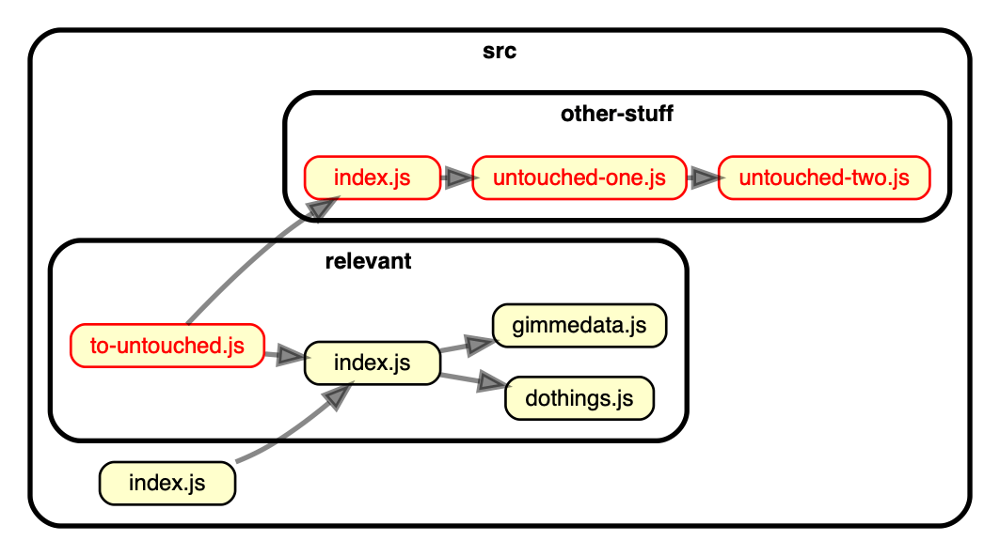

# Dependency cruiser rules - reference

## Introduction

- This is a small reference guide to the elements you can use to write rules
  for dependency-cruiser. If you want a step-by-step introduction check the
  [rules _tutorial_](./rules-tutorial.md).
- There is a [json schema](../src/schema/configuration.schema.json)
  that describes the output format. Dependency-cruiser
  checks rule sets against it.
- Some examples:
  - dependency-cruiser's [own configuration](../.dependency-cruiser.json)
  - the configuration [State Machine cat](https://state-machine-cat.js.org) uses
    [for validation](https://github.com/sverweij/state-machine-cat/blob/develop/config/dependency-cruiser.js)
    and the one it uses [for generating a visual graph](https://github.com/sverweij/state-machine-cat/blob/develop/config/dependency-cruiser-graph.js).
  - [mscgen.js](https://mscgen.js.org)'s [.dependency-cruiser.js](https://github.com/mscgenjs/mscgenjs-core/blob/develop/.dependency-cruiser.js)
- Tip: run `depcruise --init` to create a .dependency-cruiser.js with
  some rules that make sense in most projects.

## Contents

1. [The structure of a dependency-cruiser configuration](#the-structure-of-a-dependency-cruiser-configuration)
   - [`forbidden`](#forbidden)
   - [`allowed`](#allowed)
   - [`allowedSeverity`](#allowedSeverity)
   - [`required`](#required)
   - [`extends`](#extends)
   - [`options`](#options)
2. [The structure of an individual rule](#the-structure-of-an-individual-rule)
3. [Conditions](#conditions)
   - [`path`](#path)
   - [`pathNot`](#pathnot)
   - [path specials](#path-specials)
   - [`orphan`](#orphans)
   - [`reachable`](#reachable---detecting-dead-wood-and-transient-dependencies)
   - [`couldNotResolve`](#couldnotresolve)
   - [rules on dependents - `numberOfDependentsLessThan`](#rules-on-dependents---numberOfDependentsLessThan)
   - [rules on dependents - `numberOfDependentsMoreThan`](#rules-on-dependents---numberOfDependentsMoreThan)
   - [`circular`](#circular)
   - [`license` and `licenseNot`](#license-and-licensenot)
   - [`dependencyTypes` and `dependencyTypesNot`](#dependencytypes-and-dependencytypesnot)
   - [`dynamic`](#dynamic)
   - [`moreThanOneDependencyType`](#more-than-one-dependencytype-per-dependency-morethanonedependencytype)
   - [`exoticRequire` and `exoticRequireNot`](#exoticallyrequired-exoticrequire-and-exoticrequirenot)
   - [`preCompilationOnly`](#precompilationonly)
   - [`moreUnstable`](#moreunstable)
4. [Configurations in JavaScript](#configurations-in-javascript)

## The structure of a dependency cruiser configuration

The typical dependency-cruiser config is either json file or a JavaScript file
that exports a simple JavaScript object (see [Configurations in JavaScript below](#configurations-in-javascript)).
The most important sections in the config are `forbidden`, `allowed`, `required`
and `options`, so a skeleton config could look something like this:

```json
{
  "forbidden": [],
  "allowed": [],
  "required": [],
  "options": {}
}
```

The following paragraphs explain these as well as other sections.

### `forbidden`

A list of rules that describe dependencies that are not allowed.
dependency-cruiser will emit a separate error (warning/ informational) message
for each violated rule.

### `allowed`

A list of rules that describe dependencies that are _allowed_. dependency-cruiser
will emit a 'not-in-allowed' message for each dependency that does not
satisfy at least one of them. The severity of the message is _warn_ by
default, but you can override it with `allowedSeverity`

### `allowedSeverity`

The severity to use in reports when a dependency is not in the `allowed`
list of rules. It takes the same values as other `severity` fields and
also defaults to `warn`.

### `required`

A list of rules that describe what dependencies modules _must_ have, like 'every
controller _must depend on_ the base controller'.

'Required' rules have slightly different semantics from the `forbidden` and
`allowed` types. There's a mandatory `module` attribute that specifies which
modules the rule applies to and the `to` describes what dependencies that module
should exactly have.

```javascript
{
  required: [
    {
      name: "controllers-inherit-from-base",
      comment:
        "Each controller should inherit from the framework's base controller",
      module: {
        // every module that matches the pattern specified in path & pathNot ...
        path: "-controller\\.js$",
        pathNot: "framework/base-controller\\.js$",
      },
      to: {
        // ... must depend at least once on the framework's base controller
        path: "^src/framework/base-controller\\.js$",
      },
    },
  ];
}
```

### `extends`

This takes one or more file path to other dependency-cruiser-configs. When
dependency-cruiser reads your config, it takes the contents of the
`extends` and merges them with the contents of your config.

#### File resolution

dependency-cruiser resolves the `extends` relative to the file name with the
same algorithm node uses, which means a.o.

- names starting with `./` are local
- you can use external node_modules to reference rule sets (e.g. `dependency-cruiser/configs/recommended`)
- there's no need to specify the extension for JavaScript files, but for json it's mandatory.

#### How rules are merged

- `allowed` rules  
  Dependency-cruiser concatenates `allowed` rules from the extends, and de-duplicates
  them.
- `forbidden` and `required` rules  
  For `forbidden` and `required` rules it uses the same approach, except when the
  rules have a name, in which case the rule with the same name in the current file
  gets merged into the one from extends, where attributes from the current file
  win.
  This allows you to override only one attribute, e.g. the severity
- `allowedSeverity`  
  If there's an `allowedSeverity` in the current file, it wins. If neither file
  has an `allowedSeverity` dependency-cruiser uses _warn_ as a default
- `options`  
  `options` get the Object.assign treatment - where the option in the current
  file wins.
- If there's more than one path in extends, they get merged into the current file
  one by one, running through the array left to right.

#### Examples

To use a local base config:

```json
{
  "extends": "./configs/dependency-cruiser-base.json"
}
```

To use a base config from an npm package:

```json
{
  "extends": "@ourcompany/dependency-cruiser-configs/frontend-rules-base.json"
}
```

```js
module.exports = {
  extends: "dependency-cruiser/configs/recommended",
  forbidden: [
    {
      // because we still use a deprecated core module, still let
      // the no-deprecated-core rule from recommended fire,
      // but at least temporarily don't let it break our build
      // by setting the severity to "warn" here
      name: "no-deprecated-core",
      severity: "warn",
      // no need to specify the from and to, because they're already
      // defined in 'recommended'
    },
  ],
};
```

### `options`

Options that influence what is cruised, and how it is cruised. See
the [options reference](./options-reference.md) for an exhaustive list.

## The structure of an individual rule

A rule consists at least of a `from` and a `to` attribute that contain one or
more conditions that trigger the rule, so a minimal rule will look like this:

```json
{
  "from": {},
  "to": {}
}
```

A rule within the 'allowed' section can also have a `comment` attribute
which you can use to describe the rule.

Rules within the 'forbidden' section can have a `name` and a `severity`.

```json
{
  "name": "kebab-cased-name",
  "comment": "(optional) description of the rule",
  "severity": "warn",
  "from": {},
  "to": {}
}
```

### `from` and `to`

Conditions an end of a dependency should match to be caught by this
rule. Leave it empty if you want any module to be matched.

The [conditions](#conditions) section below describes them all.

### `comment`

You can use this field to document why the rule is there. It's not
used in any rule logic.

### `name`

> (only available in the `forbidden` section )

A short name for the rule - will appear in reporters to enable
customers to quickly identify a violated rule. Try to keep them
short, eslint style. E.g. 'not-to-core' for a rule forbidding
dependencies on core modules, or 'not-to-unresolvable' for one
that prevents dependencies on modules that probably don't exist.

If you do not provide a name, dependency-cruiser will default it
to `unnamed`.

### `severity`

> (only available in the `forbidden` section )

How severe a violation of a rule is. The 'error' severity will make
some reporters (at least the `err` one) return a non-zero exit
code, so if you want e.g. a build to stop when there's a rule
violated: use that.

The other values you can use are `info`, `warn` and `ignore`. If you
leave it out dependency-cruiser will assume it to be `warn`.

With the severity set to `ignore` dependency-cruiser will not check
the rule at all. This can be useful if you want to temporarily
disable a rule or disable a rule you inherited from a rule set you
extended.

> If you want to set the severity for the 'allowed' rules you can
> use [`allowedSeverity`](#allowedSeverity)

### `scope` - enable rules to apply on folders instead of modules

What to apply the rule to - either `module` (the default) or `folder`. For many
rules this makes no difference. For these rules we advise to not include the
`scope` attribute at all. There are two notable exceptions where it _does_ make
a difference:

- rules regarding Instability metrics
  A folder can contain a highly instable module (e.g. an index.js barrel that
  depends on everything and their mother within the module), but be stable itself
  e.g. because there's nothing in the folder that depends on modules outside it.
- rules regarding circular dependencies
  For example, when `main/index.js` depends on `utl/helper.js` and `utl/helper.js`
  depends on `main/utl.js` there is no circular dependency on module level,
  but there _is_ one between the `main` and `utl` folders

> - :warning: the _scope_ attribute is _experimental_. The attribute was introduced
>   to enable folder scope validations. Whether this is the best approach to
>   distinguish folder and module scope validations has to be proven over time.
>   If there's a better way dependency-cruiser will switch over to that without
>   a major version bump.
> - :warning: at this time only the `moreUnstable`, `circular` and `path`/ `pathNot`
>   attributes (including 'group matching') work, so it is
>   possible to check the "stable dependencies principle" on folder level. Other
>   attributes (including, but not limited to _via_)
>   still have to be implemented (after release 11.7.0)

## Conditions

### `path`

A regular expression an end of a dependency should match to be caught by this
rule.

In `from`, this is the path from the current working directory (typically your
project root) to the file containing a dependency. In `to`, this is the path from
the current working directory to the file the dependency resolves to.

When path is in a `to` part of a rule it accepts the regular expression
'group matching' special variables `$0`, `$1`, `$2`, ... as well. See
'group matching' below for an explanation & example.

### `pathNot`

A regular expression an end of a dependency should NOT match to be caught by
this rule.

When pathNot is in a `to` part of a rule it accepts the regular expression
'group matching' special variables `$0`, `$1`, `$2`, ... just like the path
attribute. See 'group matching' below for an explanation & example.

### path specials

#### regular expressions - not globs

I chose _regular expressions_ for matching paths over the more traditional
_glob_ because they're more expressive - which makes it easier to specify
rules. Some common patterns

| glob           | regular expression | this expresses:                                                                                       |
| -------------- | ------------------ | ----------------------------------------------------------------------------------------------------- |
| `*.js`         | `[^/]+\.js$`       | files in the current folder with the extension _.js_                                                  |
| `src/**/*`     | `^src`             | all files in the _src_ folder                                                                         |
| _not possible_ | `^src/([^/]+)/.+`  | everything in the src tree - remember the matched folder name directly under src for later reference. |

#### forward slashes

To make sure rules you specify run on all platforms, dependency-cruiser
internally represents paths with forward slashes as path separators
(`src/alez/houpe`).

#### 'group matching'

Sometimes you'll want to use a part of the path the 'from' part of your rule
matched and use it in the 'to' part. E.g. when you want to prevent stuff in
the same folder to be matched.

To achieve this you'll need to do two things:

- In the `from` of your rule:  
  Make sure the part of the `path` you want to be matched is between brackets.
  Like so: `"^src/([^/]+)/.+"`
- In the `to` part of your rule:  
  You can reference the part matched between brackets by using `$1` in `path`
  and `pathNot` rules. Like so: `"pathNot": "^src/$1/.+".`
- It is possible to use more than one group per rule as well. E.g. this
  expression `"^src/([^/]+)/[^\.]\.(.+)$"` has two groups; one
  for the folder directly under src, and one for the extension. The first is
  available in the `to` part of your rule with `$1`, the second with `$2`.
- The special variable `$0` contains the _whole_ matched string. I haven't
  seen a practical use for it in the context of dependency-cruiser, but
  I'll be glad to be surprised.

#### 'group matching' - an example: matching peer folders

Say you have the following folder structure

```
src
└── business-components
    ├── search
    ├── upsell
    ├── check-out
    ├── view-trip
    └── check-in
```

Business components should be completely independent of each other. So typically
you'd specify a rule like this to prevent accidents in the "forbidden" section:

```json
{
  "name": "no-inter-ubc",
  "comment": "Don't allow relations between code in business components",
  "severity": "error",
  "from": { "path": "^src/business-components/([^/]+)/.+" },
  "to": {
    "path": "^src/business-components/([^/]+)/.+"
  }
}
```

This will correctly flag relations from one folder to another, but also
relations _within_ folders. It's possible to get around that by specifying it
for each folder explicitly, leaving the current 'from' folder from the to
list e.g.  
_from: search, to: upsell|check-out|view-trip|check-in,_  
_from: upsell, to: search|check-out|view-trip|check-in,_  
 _..._

That'll be heavy maintenance though; especially when your
business components breed like a litter of rabbits. In stead, you can use
group matching:

```json
{
  "name": "no-inter-ubc",
  "comment": "Don't allow relations between business components",
  "severity": "error",
  "from": { "path": "^src/business-components/([^/]+)/.+" },
  "to": {
    "path": "^src/business-components/([^/]+)/.+",
    "pathNot": "^src/business-components/$1/.+"
  }
}
```

... which makes sure dependency-cruiser does not match stuff in the from folder
currently being matched.

#### Using an array of regular expressions

When your regular expressions grow bigger, you might want to express them
as an array of regular expressions instead of just one regular expression to
improve legibility.

<details>
<summary>example ...</summary>

```javascript
{
  from: {
    path: "(^src/report/)"
  },
  to: {
    pathNot: "$1|^node_modules|^(path|package.json)$|^src/utl"
  }
}
```

```javascript
{
  from: {
    path: "(^src/report/)"
  },
  to: {
      pathNot: [
        "$1",
        "^node_modules",
        "^(path|package.json)$",
        "^src/utl"
      ]
  }
}
```


</details>

### orphans

A Boolean indicating whether or not to match modules that have no incoming
and no outgoing dependencies. Orphans might need special attention because
they're unused leftovers from a refactoring. Or the start of some feature
that never got finished but which was merged anyway. Leaving the `orphan`
attribute out means you don't care about orphans in your code.

Detecting orphans will have an impact on performance. You will probably
only notice it when you have a larger code base (thousands of modules
in your dependency graph), but it is something to
keep in mind.

To detect orphan guys you can add e.g. this snippet to your
.dependency-cruiser.js's `forbidden` section:

```json
{
  "name": "no-orphans",
  "severity": "warn",
  "from": { "orphan": true },
  "to": {}
}
```

#### Usage notes

- dependency-cruiser will typically not find orphans when you give it
  only one module to start with. Any module it finds, it finds by
  following its dependencies, so each module will have at least one
  dependency incoming or outgoing. Specify one or more folder, several
  files or a glob. E.g.
  ```
  depcruise -v -- src lib test
  ```
  will find orphans if they exist,
  whereas
  ```sh
  depcruise -v -- src/index.ts
  ```
  probably won't (unless index.ts is an orphan itself).
- by definition orphan modules have no dependencies. So when `orphan` is
  part of a rule, the `to` part won't make sense. This is why
  dependency-cruiser will ignore the `to` part of these rules.
- For similar reasons `orphan` is not allowed in the `to` part of rules.

### `reachable` - detecting dead wood and transient dependencies

`reachable` is a Boolean indicating whether or not modules matching the `to` part
of the rule are _reachable_ (either directly or via other modules) from modules
matching the `from` part of the rule. This can be useful for two use cases:

- [detect dead wood](#detect-dead-wood-with-reachable)
- [prevent modules from being reached via via](#prevent-modules-from-being-reached-via-via-with-reachable)

#### detect dead wood with `reachable`

For instance, in this dependency-graph several modules are not reachable from
the root `index.js`. If `index.js` is the only (legal) entry to this package,
those unreachable modules are likely candidates for removal:


Here's a rule snippet that will detect these for you:

```javascript
{
    "forbidden": [
        {
            "name": "no-unreachable-from-root",
            "severity": "error",
            "from": {
                "path": "src/index\\.js$"
            },
            "to": {
                "path": "src",

                /*
                  spec files shouldn't be reachable from regular code anyway, so you
                  might typically want to exclude these from reachability rules.
                  The same goes for typescript definition files:
                 */
                "pathNot": "\\.spec\\.(js|ts)$|\\.d\\.ts$"

                /*
                  for each file matching path and pathNot, check if it's reachable from the
                  modules matching the criteria mentioned in "from"
                 */
                "reachable": false
            }
        }
    ]
}

```

With this rule enabled, the unreachable rules jump out immediately. Both in the output of the `err` reporter

```sh
  error no-unreachable-from-root: src/other-stuff/index.js
  error no-unreachable-from-root: src/other-stuff/untouched-one.js
  error no-unreachable-from-root: src/other-stuff/untouched-two.js
  error no-unreachable-from-root: src/relevant/to-untouched.js

✖ 4 dependency violations (4 errors, 0 warnings). 8 modules cruised.
```

... and in the output of the `dot` one:



#### Prevent modules from being reached via via with `reachable`

You can use the same `reachable` attribute to find transient dependencies (fancy
way to say _via via_). Let's say you have a bunch of JavaScript files that define
static schemas. It's OK if they import stuff, but they should _never_ touch
database implementation code (which happens to live in `src/lib/database`).

With a rule like this in the `forbidden` section you can make sure that never
happens:

```json
{
  "name": "implementation-not-reachable-from-info-ts",
  "comment": "Don't allow importing database implementation files for schema declaration files",
  "severity": "error",
  "from": {
    "path": "\\.schema\\.ts$"
  },
  "to": {
    "path": "^src/libs/database/",
    "reachable": true
  }
}
```

#### Usage notes

- You can set up multiple rules with a `reachable` attribute in the `to` section. If you do so,
  make sure you give a `name` to each rule. It's not only the only way dependency-cruiser can keep
  reachable rules apart - it will be for you as well :-).
- Different from other rules, rules with a `reachable` attribute can only have
  - `path` and `pathNot` in the `from` part of the rule
  - `path` and `pathNot` alongside the `reachable` in the `to` part of the rule  
    (these limitations might get lifted somewhere in the future)

### rules on dependents - `numberOfDependentsLessThan`

Matches when the number of dependents of a module is less than the provided number.
Useful to detect whether modules are 'shared' enough to your liking, or whether
they're actually used in the first place.

E.g. to flag modules in the `shared` folder that are only used from the
`features` folder once (or not a all), you can use a rule like this in the
`forbidden` section

```javascript
{
  name: "no-unshared-in-shared",
  from: {
    path: "^features/"
  },
  module: {
    path: "^shared/",
    numberOfDependentsLessThan: 2
  }
}
```

#### Usage notes

- Currently rules on dependents only work within the `forbidden` context.
- In the `from` part `path` and `pathNot` attributes work, but none other.
- Similarly the `to` part of the rule can (next to the `numberOfDependentsLessThan`
  attribute) also only use `path` and `pathNot`.
- You can't use group matching with this rule.
  <details>
  <summary>why?</summary>

  Unlike regular dependency rules this rule will not match one module at a time,
  but a whole bunch of them. With one match (i.e.
  `src/coolstuff/ice.ts` and a a regular expression with a group (`/^src/(^[/]+)/`)
  the `$1` variable can only mean one thing (`coolstuff`). With more than one
  result (`src/coolstuff/ice.ts, src/hotstuff/pepper.ts`) there's also more than
  one thing `$1` means - making use in e.g. `to.path` ambiguous.

  </details>

### rules on dependents - `numberOfDependentsMoreThan`

Matches when the number of dependents of a module is more than the provided number.
Useful to

- detect whether modules are 'shared' enough to your liking, or whether
  they're actually used in the first place, but you want or need to enforce that
  in an allowed rule
- put a maximum number on the number of dependents a module can have (not sure
  it's like super useful or anything, it's just a side-effect of the previous
  use)

E.g. to flag modules in the `shared` folder that are only used from the
`features` folder once (or not a all), you can use a rule like this in the
`allowed` section

```javascript
{
  name: "no-unshared-in-shared",
  from: {
    path: "^features/"
  },
  module: {
    path: "^shared/",
    numberOfDependentsMoreThan: 1
  }
}
```

The same usage notes and caveats apply as do for the numberOfDependentsLessThan
attribute.

### `couldNotResolve`

Whether or not to match modules dependency-cruiser could not resolve (and
probably aren't on disk). For this one too: leave out if you don't care either
way.

To get an error for each unresolvable dependency, put this in your "forbidden"
section:

```json
{
  "name": "not-to-unresolvable",
  "severity": "error",
  "from": {},
  "to": { "couldNotResolve": true }
}
```

### `circular`

A Boolean indicating whether or not to match module dependencies that end up
where you started (a.k.a. circular dependencies). Leaving this out => you don't
care either way.

For example, adding this rule to the "forbidden" section in your
.dependency-cruiser.js will issue a warning for each dependency that ends
up at itself.

```json
{
  "name": "no-circular",
  "severity": "warn",
  "from": { "pathNot": "^(node_modules)" },
  "to": { "circular": true }
}
```

### `via` and `viaNot`, `viaOnly` and `viaSomeNot` - restricting what cycles to match

Some codebases include a lot of circular dependencies, sometimes with a few 'knots'
(typically barrel files) that partake in most of them. Fixing these cycles might
take a spell, so you might want to (temporarily :-) ) exclude them from breaking
the build. At the same time you might want to prevent any new violation going
unnoticed because of this.

One solution to this is to use dependency-cruiser's
[`ignore-known`](cli.md#--ignore-known-ignore-known-violations) mechanism, Another
solution is to put restrictions on through which modules the cycles pass; the
"via"'s, in a similar fashion as possible with `path` and `pathNot`. There are
_four_ via-like restrictions in dependency-cruiser, as - different from the
`path`/`pathNot` restrictions the `via` (and `viaNot`) ones always almost have
to check against multiple paths; all the "via"'s in the cycle. The variants
exist to enable matching against only _some_ of the modules in the cycle or
against _all_ of them.

All these restrictions take the whole cycle into account; _including_ the tested
'from'; if `a/aa.js` has a cycle via `a/ab.js` and `b/bb/js` back to `a/aa.js`
the via-like restrictions also take `a/aa.js` into account.

The examples below refer to this cycle: `a/aa.js`, `a/ab.js`, `b/bb.js`, `a/aa.js`

| restriction  | what it does                                                        | example input | match?  | because...                    |
| ------------ | ------------------------------------------------------------------- | ------------- | ------- | ----------------------------- |
| `via`        | **some** of the modules in the cycle **do** match the expression    | `^a/.+`       | `true`  | `a/aa.js` and `a/ab.js` match |
| `viaOnly`    | **all** of the modules in the cycle **do** match the expression     | `^a/.+`       | `false` | `b/bb.js` doesn't match       |
| `viaNot`     | **all** of the modules in the cycle **don't** match the expression  | `^a/.+`       | `false` | `a/aa.js` and `a/ab.js` match |
| `viaSomeNot` | **some** of the modules in the cycle **don't** match the expression | `^a/.+`       | `true`  | `b/bb.js` doesn't match       |

#### Usage example: prevent code from going through a 'knot'

In this example `app/javascript/tables/index.ts` and `app/javascript/tables/index.ts`
are the known 'knots':

```javascript
// log an error for all circular dependencies except when they are via one of the
// known 'knots'
{
  name: 'no-circular',
  severity: 'error',
  from: {
  },
  to: {
    circular: true,
    viaNot: [
      '^app/javascript/tables/index.ts',
      '^app/javascript/ui/index.tsx',
    ]
  }
},

// for circular dependencies that pass through one of the knots, still generate
// a warning
{
  name: 'no-circular (exception for known barrels)',
  severity: 'warn',
  from: {
  },
  to: {
    circular: true,
    via: [
      '^app/javascript/tables/index.ts',
      '^app/javascript/ui/index.tsx',
    ]
  }
}
```

#### Usage example: prevent cycles from going outside a folder

This example (adapted from a
[question on GitHub](https://github.com/sverweij/dependency-cruiser/issues/585)
by [@PetFeld-ed](https://github.com/PetFeld-ed))
not only makes use of the `viaSomeNot`, but also displays the use of
[group matching](#group-matching).

```javascript
// in the `forbidden` section of a dependency-cruiser config:
{
  name: 'no-circular-dependency-of-modules',
  comment:
    'If a module in business component A depends on one in component B, then ' +
    'the module in component B should not depend on that component in module A ' +
    'This is also forbidden if the dependency is transitive. ',
    "I.a.w.: if there's a cycle, it should stay within the same component " +
  severity: 'error',
  from: {
    path: '^src/business-components/([^/]+)/.+'
  },
  to: {
    circular: true,
    viaSomeNot: '^src/business-components/$1/.+',
  },
}
```

### `license` and `licenseNot`

You can flag dependent modules that have licenses that are e.g. not
compatible with your own license or with the policies within your company with
`license` and `licenseNot`. Both take a regular expression that matches
against the license string that goes with the dependency.

E.g. to forbid GPL and APL licenses (which require you to publish your source
code - which will not always be what you want):

```json
{
  "name": "no-gpl-apl-licenses",
  "severity": "error",
  "from": {},
  "to": { "license": "GPL|APL" }
}
```

This raise an error when you use a dependency that has a string with GPL or
APL in the "license" attribute of its package.json (e.g.
[SPDX](https://spdx.org) compatible expressions like `GPL-3.0`, `APL-1.0` and
`MIT OR GPL-3.0` but also on non SPDX compatible)

To only allow licenses from an approved list (e.g. a greenlist provided by your
legal department):

```json
{
  "name": "only-licenses-approved-by-legal",
  "severity": "warn",
  "from": {},
  "to": { "licenseNot": ["MIT", " ISC"] }
}
```

> Just with _path_ and _pathNot_ you can pass an array of regular expressions
> as well if you think that's more legible.

Note: dependency-cruiser can help out a bit here, but you remain responsible
for managing your own legal stuff. To re-iterate what is in the
[LICENSE](../LICENSE) to dependency-cruiser:

> THE SOFTWARE IS PROVIDED "AS IS", WITHOUT WARRANTY OF ANY KIND, EXPRESS OR
> IMPLIED, INCLUDING BUT NOT LIMITED TO THE WARRANTIES OF MERCHANTABILITY,
> FITNESS FOR A PARTICULAR PURPOSE AND NONINFRINGEMENT. IN NO EVENT SHALL THE
> AUTHORS OR COPYRIGHT HOLDERS BE LIABLE FOR ANY CLAIM, DAMAGES OR OTHER
> LIABILITY, WHETHER IN AN ACTION OF CONTRACT, TORT OR OTHERWISE, ARISING FROM,
> OUT OF OR IN CONNECTION WITH THE SOFTWARE OR THE USE OR OTHER DEALINGS IN THE
> SOFTWARE.

### `dependencyTypes` and `dependencyTypesNot`

You might have spent some time wondering why something works on your machine,
but not on other's. Only to discover you _did_ install a dependency, but
_did not_ save it to package.json. Or you already had it in your devDependencies
and started using it in a production source.

To save you from embarrassing moments like this, you can make rules with the
`dependencyTypes` restriction. E.g. to prevent you accidentally depend on a
`devDependency` from anything in `src` add this to your
.dependency-cruiser.js's "forbidden" section:

```json
{
  "name": "not-to-dev-dep",
  "severity": "error",
  "comment": "because an npm i --production will otherwise deliver an unreliably running package",
  "from": { "path": "^src" },
  "to": { "dependencyTypes": ["npm-dev"] }
}
```

Or to detect stuff you npm i'd without putting it in your package.json:

```json
{
  "name": "no-non-package-json",
  "severity": "error",
  "comment": "because an npm i --production will otherwise deliver an unreliably running package",
  "from": { "pathNot": "^(node_modules)" },
  "to": {
    "dependencyTypes": ["unknown", "undetermined", "npm-no-pkg", "npm-unknown"]
  }
}
```

Likewise you can use the inverse `dependencyTypesNot` restriction. E.g. to ensure
type-only imports (e.g. `import type { IYadda } from "./types"`) are used from
`.d.ts` modules and/ or modules called `types.ts`:

```json
{
  "name": "only-type-only",
  "comment": "use explicit 'type' imports to import from type declaration modules",
  "severity": "error",
  "from": {},
  "to": {
    "path": ["types\\.ts$", "\\.d\\.ts$"],
    "dependencyTypesNot": ["type-only"]
  }
}
```

If you don't specify dependencyTypes (or dependencyTypesNot) in a rule, dependency-cruiser
will ignore them in the evaluation of that rule.

#### OK - `unknown`, `npm-unknown`, `undetermined` - I'm officially weirded out - what's that about?

This is a list of dependency types dependency-cruiser currently detects.

| dependency type | meaning                                                                                                                                                                       | example                   |
| --------------- | ----------------------------------------------------------------------------------------------------------------------------------------------------------------------------- | ------------------------- |
| local           | a module in your own ('local') package                                                                                                                                        | "./klont"                 |
| localmodule     | a module in your own ('local') package, but which was in the `resolve.modules` attribute of the webpack config you passed                                                     | "shared/stuff.ts"         |
| npm             | it's a module in package.json's `dependencies`                                                                                                                                | "lodash"                  |
| npm-dev         | it's a module in package.json's `devDependencies`                                                                                                                             | "chai"                    |
| npm-optional    | it's a module in package.json's `optionalDependencies`                                                                                                                        | "livescript"              |
| npm-peer        | it's a module in package.json's `peerDependencies` - note: deprecated in npm 3                                                                                                | "thing-i-am-a-plugin-for" |
| npm-bundled     | it's a module that occurs in package.json's `bundle(d)Dependencies` array                                                                                                     | "iwillgetbundled"         |
| npm-no-pkg      | it's an npm module - but it's nowhere in your package.json                                                                                                                    | "forgetmenot"             |
| npm-unknown     | it's an npm module - but there is no (parseable/ valid) package.json in your package                                                                                          |                           |
| deprecated      | it's an npm module, but the version you're using or the module itself is officially deprecated                                                                                | "some-deprecated-package" |
| core            | it's a core module                                                                                                                                                            | "fs"                      |
| aliased         | it's a module that's linked through an aliased (webpack)                                                                                                                      | "~/hello.ts"              |
| unknown         | it's unknown what kind of dependency type this is - probably because the module could not be resolved in the first place                                                      | "loodash"                 |
| undetermined    | the dependency fell through all detection holes. This could happen with amd dependencies - which have a whole Jurassic park of ways to define where to resolve modules to     | "veloci!./raptor"         |
| type-only       | the module was imported as 'type only' (e.g. `import type { IThing } from "./things";`) - only available for TypeScript sources, and only when tsPreCompilationDeps !== false |                           |

### `dynamic`

A Boolean that tells you whether the dependency is a dynamic one (i.e.
it uses the async ES import statement a la `import('othermodule').then(pMod => pMod.doStuff())`).

You can use this e.g. to restrict the usage of dynamic dependencies:

```json
{
  "forbidden": [
    {
      "name": "no-non-dynamic-dependencies",
      "severity": "error",
      "from": {},
      "to": { "dynamic": true }
    }
  ]
}
```

... or to enforce the use of dynamic dependencies for certain dependencies

```json
{
  "forbidden": [
    {
      "name": "only-dyn-deps-to-otherside",
      "comment": "only dynamically depend on 'otherside' modules",
      "severity": "error",
      "from": {},
      "to": { "path": "@theotherside/", "dynamic": false }
    }
  ]
}
```

### More than one dependencyType per dependency? `moreThanOneDependencyType`

With the flexible character of package.json it's totally possible to specify
a package more than once - e.g. both in the `peerDependencies` and in the
`dependencies`. Sometimes this is intentional (e.g. to make sure a plugin
type package works with both npm 2 and 3), but it can be a typo as well.

Anyway, it's useful to be conscious about it. You can check
for it with a `moreThanOneDependencyType` attribute - which matches these
when set to true:

```json
{
  "name": "no-duplicate-dep-types",
  "severity": "warn",
  "from": {},
  "to": { "moreThanOneDependencyType": true }
}
```

When left out it doesn't matter how many dependency types a dependency has.

(If you're more of an 'allowed' user: it matches the 0 and 1 cases when set to
false).

### `exoticallyRequired`, `exoticRequire` and `exoticRequireNot`

For exotic requires/ require wrappers you might want to have different
rules a.c.t. normal requires. E.g.

- When you use a require wrapper to include a dependency that might not be there
  and handle it elegantly, it's not an error if the module-to-be-there doesn't
  actually exist - or is e.g. in your optionalDependencies.
- You might want to only allow the use of certain dependencies through an
  exotic require:

```json
{
  "name": "not-to-optional-deps",
  "severity": "error",
  "from": {},
  "to": {
    "dependencyTypes": ["npm-optional"],
    "exoticallyRequired": false
  }
}
```

- ... or ban exotic requires altogether:

```json
{
  "name": "ban-all-exotic-requires",
  "severity": "error",
  "from": {},
  "to": {
    "exoticallyRequired": true
  }
}
```

- Or allow only one specific:

```json
{
  "name": "only-window-require-exotic",
  "severity": "error",
  "comment": "The only 'exotic' require allowed is window.require",
  "from": {},
  "to": {
    "exoticRequireNot": "^window\\.require$",
    "exoticallyRequired": true
  }
}
```

### `preCompilationOnly`

If you want to set restrictions on dependencies that only exist before
compilation from TypeScript to JavaScript, you can use the (boolean)
`preCompilation` only attribute.

E.g. to make sure to only import stuff from the react-native stuff that doesn't
make it beyond the pre-compilation step:

```json
{
  "forbidden": [
    {
      "name": "only-types-from-react-native",
      "description": "make sure to only import stuff that's portable over platforms",
      "severity": "error",
      "from": {
        "path": "^src/platform-independent-stuff"
      },
      "to": {
        "path": "^src/lib/react-native-stuff",
        "preCompilationOnly": false
      }
    }
  ],
  "options": {
    "tsPreCompilationDeps": "specify"
  }
}
```

:warning: This attribute only works for TypeScript sources, and only when
[`tsPreCompilationDeps`](#tsprecompilationdeps) option is set to `"specify"`.

### `moreUnstable`

When set to true moreUnstable matches for any dependency that has a higher
Instability than the module that depends on it. When set to false it matches
when the opposite is true; the dependency has an equal or lower Instability.

This attribute is useful when you want to check against Robert C. Martin's
stable dependencies principle: "depend in the direction of stability". Martin
defines $Instability$ as a function of the number of dependents and dependencies
a component has:

<!-- note: \# is valid LaTex/ KaTex for a #
     MathJax on GitHub, however needs an _extra_ backslash
-->

$$Instability = {\\#dependencies \over \\#dependents + \\#dependencies}$$

E.g. a module with no dependencies and one or more dependents has a Instability
of 0%; as stable as it can get. Conversely a module with no dependents, but
with one or more dependencies is 100% Instable.

Instability has a bit of an unusual connotation here - it's not 'bad' to be
an 100% Instable module - it's just the nature of the module. A CLI or GUI
component typically only depends on other modules and is 100% Instable. This is
not a bad thing.

Another way to look at Instability is how hard it is to change a module without
consequences to other modules. Changing a 0% Instable module will typically have
consequences for all its dependents. Making changes to a 100% Instable module
will have consequences for itself only.

To enforce/ find all modules that violate the stable dependencies principle
(SDP) you can include a rule like this in the _forbidden_ section

```javascript
module.exports = {
  forbidden: [
    {
      name: "SDP",
      comment:
        "This module violates the 'stable dependencies' principle; it depends " +
        "on a module that is likely to be more prone to changes than it is " +
        "itself. Consider refactoring.",
      from: {},
      to: {
        moreUnstable: true,
      },
    },
  ],
};
```

A note on using metrics:

> ..., a metric is not a god; it is merely a measurement against an arbitrary
> standard. It is certainly possible that the standard chosen in this chapter
> is appropriate only for certain applications and not for others.
>
> Robert C. Martin - Agile Principles, Patterns and Practices in C# (2006)

## Configurations in JavaScript

From version 4.7.0 you can pass a JavaScript module to `--validate`.
It'll work as long as it exports a valid configuration object
and node can understand it.

This allows you to do all sorts of nifty stuff, like composing
rule sets or using function predicates in rules. For example:

```javascript
const subNotAllowed = require("rules/sub-not-allowed.json");
const noInterComponents = require("rules/sub-no-inter-components.json");

module.exports = {
  forbidden: [subNotAllowed, noInterComponents],
  options: {
    tsConfig: {
      fileName: "./tsconfig.json",
    },
  },
};
```

### dot

> If you're looking for configuring the `dot`, `archi` or `ddot` reporters, that
> section has moved to the [options reference](./options-reference.md#reporteroptions).
