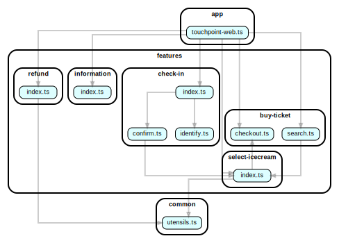

# Writing dependency-cruiser rules - a tutorial

If you're looking for examples - they're in the [recipes](#recipes) section on
the bottom of this tutorial.

## Introduction

This tutorial takes you step by step through writing a rule for
dependency-cruiser. If you're one of those 'quick-to-grasp' types, or you're
just looking for a reference there's a **[rules
reference](./rules-reference.md)** that might better suit your needs.

## Basics

### A simple rule - take 1

Let's say you want to prevent the use of the node core 'http' library for one
reason or other.

```json
{
  "forbidden": [
    {
      "from": {},
      "to": { "path": "http" }
    }
  ]
}
```

This rule says it is `forbidden` to have a relation `from` anything `to` things
with a `path` that contains the string `http`.

You run a depcruise with these rules and lo and behold it comes up with
something:

_warn_ unnamed: **src/secure/index.ts** → **node_modules/@supsec/http/index.js**  
_warn_ unnamed: **src/secure/knappekop.ts** → **node_modules/@supsec/http/index.js**  
_warn_ unnamed: **node_modules/yudelyo/index.js** → **http**  
_warn_ unnamed: **src/secure/index.ts** → **http**  
_warn_ unnamed: **src/secure/index.ts** → **https**

There's a few things you notice:

- dependency-cruiser generates _warnings_. This is the default, but maybe you
  want to stop the build. You'd need _errors_.
- The rule has no name. For this one rule - no problem. If there's more rules it
  might be handy for your future self (and your co-workers) to reference the
  rule.
- The rule matches a little too much for your taste.

Let's see how we can fix that - name and severity first.

### A simple rule - take 2 - adding name and severity

```json
{
  "forbidden": [
    {
      "name": "not-to-core-http",
      "comment": "Don't rely on node's http module because of internal guideline BOYLE-839 - use https and the internal @supsec variant in stead",
      "severity": "error",
      "from": {},
      "to": { "path": "http" }
    }
  ]
}
```

_error_ not-to-core-http: **src/secure/index.ts** → **node_modules/@supsec/http/index.js**  
_error_ not-to-core-http: **src/secure/knappekop.ts** → **node_modules/@supsec/http/index.js**  
_error_ not-to-core-http: **node_modules/yudelyo/index.js** → **http**  
_error_ not-to-core-http: **src/secure/index.ts** → **http**  
_error_ not-to-core-http: **src/secure/index.ts** → **https**

That's a lot easier to understand - _and_ it will stop the build from happening.

### A simple rule - take 3 - tightening the rule down

The rule as it is matches not only the core module, but also `@supsec/http`
_which is module you should actually use_ according to BOYLE-839.
So we should make sure we only match the core module. We can do that by
specifying we want to also match the _dependencyType_ `core`:

```json
{
  "forbidden": [
    {
      "name": "not-to-core-http",
      "comment": "Don't rely on node's http module because of internal guideline BOYLE-839 - use https and the internal @supsec variant in stead",
      "severity": "error",
      "from": {},
      "to": { "dependencyTypes": ["core"], "path": "http" }
    }
  ]
}
```

The result:

_error_ not-to-core-http: **node_modules/yudelyo/index.js** → **http**  
_error_ not-to-core-http: **src/secure/index.ts** → **http**

Now you can go about fixing so `src/secure/index.ts` relies on the internal
`@supsec/http` module, so you're all BOYLE-839 compliant.

### But that pesky node_module relies on a forbidden dependency as well? Watnu?

Yep. Don't you just _love_ those 1500 npm packages you drag in and rely on for
your website to run :grimace: .

Luckily you know `kpttraag`, the author of `yudelyo` - you submit a PR and wait.
In the meantime you don't want to have the build break until `kpttraag` has
found the time to merge your PR.

You realise there might be more npm packages using http too, so ...

- You change the `not-to-core-http` to only generate errors for paths _outside_
  node_modules.
- You add a new rule for node_modules, that just generate a warning. You'll
  still see it in the build logs, but you can go on developing for the time
  being.

```json
{
  "forbidden": [
    {
      "name": "not-to-core-http",
      "comment": "Don't rely on node's http module because of internal guideline BOYLE-839 - use https and the internal @supsec variant in stead",
      "severity": "error",
      "from": { "pathNot": "^node_modules" },
      "to": { "dependencyTypes": ["core"], "path": "^http$" }
    },
    {
      "name": "node_mods-not-to-http",
      "comment": "Some node_modules use http - warn about these so we can replace them/ make PR's so we're BOYLE compliant",
      "severity": "warn",
      "from": { "path": "^node_modules" },
      "to": { "dependencyTypes": ["core"], "path": "^http$" }
    }
  ]
}
```

_warn_ node*mods-not-to-http: **node_modules/yudelyo/index.js** → **http**  
\_error* not-to-core-http: **src/secure/index.ts** → **http**

## {} over { "path": ".+" }

Functionally, `"from": {}` and `"from": { "path": ".+" }` are the same. The way
dependency-cruiser is wired today, however, makes the former faster than the
latter. So - unless you have CPU cycles to spare - use the former one
(`"from": {}`).

## Recipes

### isolating peer folders from each other

Let's say you have a bunch of features you want to keep independent of each
other:



As you see the `search` and `confirm` check-in module directly use the
`select-icecream` module, which in its turn uses the `checkout` module.

To smoke these out you create a rule with ...

- the sub-folders of `features` in the from part
- the features folder _except_ the current folder in the to part:

```javascript
forbidden: [
  {
    name: "features-not-to-features",
    comment:
      "One feature should not depend on another feature (in a separate folder)",
    severity: "error",
    from: { path: "(^features/)([^/]+)/" },
    to: { path: "^$1", pathNot: "$1$2" },
  },
];
```

As you see this rule uses the $1 and $2 variables. These match the parts in the
from.path between brackets. In the regular expression world this is called
'group matching'. Read more about this in the [rules reference](./rules-reference.md#group-matching)

Et voilá:


### Must use

Let's say you have an app that has a bunch of controllers. For some reason you
want these to always use the base controller. So in the dependency-graph below
the cloud, rain and sun controllers are ok, as are `a-controller-this-is-not.ts`
and the `index.ts` as they're not controllers. The `wind-controller` is a bit
naughty though, as it doesn't use the base controller.


The easiest way to put this into a rule is to express it as a [`required`](./rules-reference.md#required)
rule. Different from 'forbidden' and 'allowed' rules, 'required' rules have a
`module` attribute to specify to which modules you want the rule to apply.

```javascript
  required: [
    {
      name: "must-inherit-from-base-controller",
      severity: "error",
      module: {

        // only flag modules that end in '-controller.ts`
        path: "-controller\\.ts$",

        // prevents the base-controller from being flagged
        pathNot: "base-controller\\.ts$",
      },
      to: {
        path: "base-controller\\.ts$",
      },
    },
  ],
```

Applying this rule to the dependency-graph above would yield the graph below. As
you can see it flags the `wind-controller.ts` in red. In the svg and html versions
you'll see the name of the rule when you hover over it:


### Is a utility module shared?

Over time central utility modules will rise and fall in use. Some shops want to
ensure there's a minimum number of modules that use those utility modules. With
dependency-cruiser you can keep track of usage of utility modules and define
rules on them.

When you inspect these modules closely, you see the `icecream.ts` module
is only used by `information.ts`, and `guitar.ts` isn't used at all.


We can set up a rule that flags any module that is used from the `features` folder
less than twice:

```javascript
forbidden: [
  {
    name: "no-unshared-utl",
    from: {
      path: "^features/",
    },
    module: {
      path: "^common/",
      numberOfDependentsLessThan: 2,
    },
  },
];
```

In graphical form the result would look like this:


### Is a module actually used?

If you're using dependency-cruiser to validate dependencies, you might be familiar
with the concept of [orphans](rules-reference.md#orphans) - modules that have
no dependencies and no dependents.


However, sometimes a module only has dependencies to an external module, e.g.
node's native `path` module or to `lodash`. That module is not strictly an orphan,
but for all intents and purposes has the same characteristics as orphans. To flag
them we can add a rule that forbids the dependents of a module to drop below one -
for example:

```javascript
forbidden: [
  {
    name: "no-internal-orphans",
    from: {
      path: "^do-things/",
    },
    module: {
      path: "^do-things/",
      numberOfDependentsLessThan: 1,
    },
  },
];
```

And when we apply that rule to the example, we see them light up as errors:


### No new dependents on deprecated modules

When you deprecate modules you take for granted that it'll be used by existing
dependents for some time. You typically want to prevent new dependents to arrive
on it.

#### Recipe 1: Use a list of exceptions

One way to prevent this is to create a list of exceptions and use that in two rules;
one to throw errors on everything not in the exceptions, one to show warnings
for those that are:

```javascript
const KNOWN_DEPRECATED_THINGY_DEPENDENTS = [
  "^src/features/search/caramba\\.ts$"
  "^src/features/checkout/migusta\\.ts$"
  "^src/features/landing/sacrebleu\\.ts$"
  "^src/features/refund/donderju\\.ts$"
];

{
  forbidden: [
    // For anything pointing to deprecated-thingy that is not in the exceptions
    // throw an error
    {
      name: "not-to-deprecated-thingy",
      severity: "error"
      from: {
        pathNot: [
          "^src/common"
        ].concat(KNOWN_DEPRECATED_THINGY_DEPENDENTS)
      },
      to: {
        path: "^src/common/deprecated-thingy",
      }
    },
    // ... but emit a warning for known exceptions
    {
      name: "not-to-deprecated-thingy-known-exceptions",
      severity: "warn"
      from: {
        path: KNOWN_DEPRECATED_THINGY_DEPENDENTS,
        pathNot: [
          "^src/common"
        ]
      },
      to: {
        path: "^src/common/deprecated-thingy",
      }
    }
  ]
}


```

#### Recipe 2: Use the numberOfDependentsMoreThan attribute

Another way to do this, is to have the rule above, but without a list of exceptions,
and to have another rule that ensures the number of dependents of the module
doesn't raise above the current tally:

```javascript
forbidden: [
    // For anything pointing to deprecated-thingy (both known and new)
    // emit a warning
    {
    name: "not-to-deprecated-thingy",
    severity: "warn"
    from: {
      pathNot: "^src/common"
    },
    to: {
      path: "^src/common/deprecated-thingy",
    }
  },
  // when the number of dependents for deprecated-thingy raises above 4
  // flag an error
  {
    name: "no-more-dependents-on-deprecated",
    severity: "error"
    from: {
      pathNot: "^src/common"
    },
    module: {
      path: "^src/common/deprecated-thingy",
      numberOfDependentsMoreThan: 4
    }
  },
]
//...
```

The benefit over the previous recipe is that it doesn't require administrating
a list of exceptions. Drawback is that it isn't immediately clear which dependents
are the new ones.
