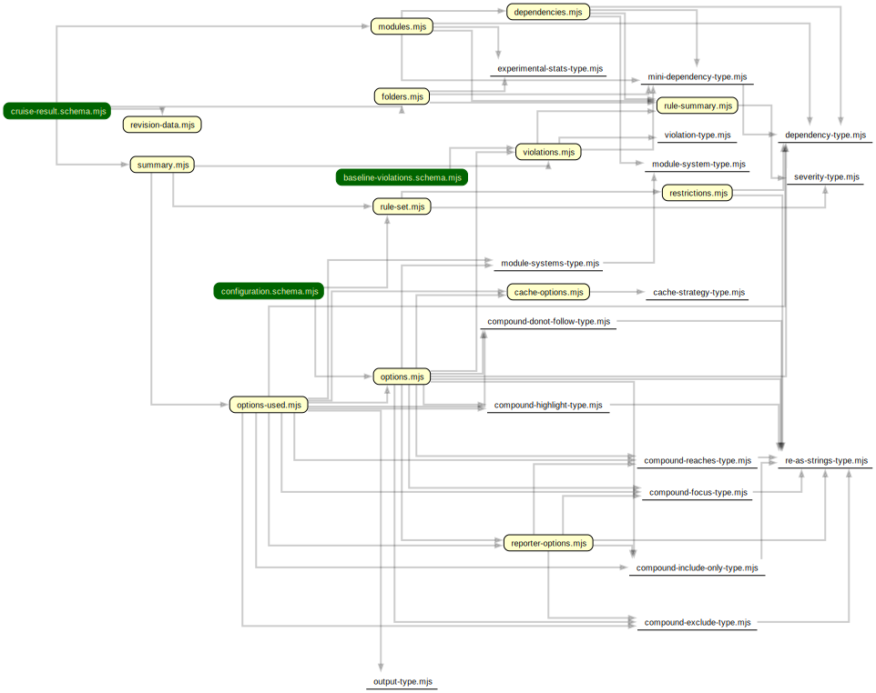

# Utensils

Some utensils that help a bit with the development of dependency-cruiser.

## schema and generate-schemas.utl.mjs

The [schema](schema) folder contains the sources for both json schemas
([configuration](../src/schema/configuration.schema.json) and
[cruise-result](../src/schema/cruise-result.schema.json). They're split up
for ease of maintenance).

To generate the schemas from their sources run:

```sh
node tools/generate-schemas.utl.mjs
```

> The build and version lifecycle scripts take care of this automatically, so
> there's no need to run this manually each PR or push _unless_ you're modifying
> the json schema

[](https://sverweij.github.io/dependency-cruiser/schema-overview.html)

## fixture regeneration scripts

Maintaining fixtures/ mocks is fairly labor intensive. If you're doing a change
in one of dependency cruiser's schemas (e.g. make something mandatory, add an
attribute), you can run the scripts below to do the necessary updates. Please
be sure to inspect the results with a `git status` and a `git diff` to see whether
your changes had the desired outcome.

```sh
# Regenerate fixtures/ mocks associated with the main dependency-cruiser api
node tools/regenerate-main-fixtures.utl.mjs

# Regenerate fixtures/ mocks associated with the reporters
node tools/regenrate-report-fixtures.utl.mjs
```
