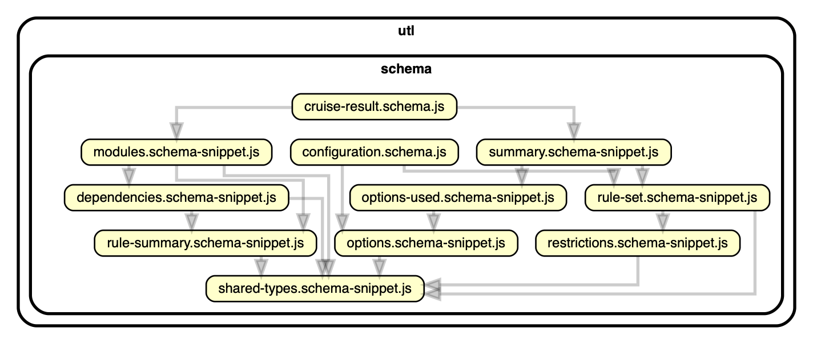

The [schema](schema) folder contains the sources for both json schemas. They're split up 
for ease of maintenance. To generate the schemas after updating any of the stuff in there
run:

```sh
node utl/generate-schemas.utl.js
```

This is done on each build as well



