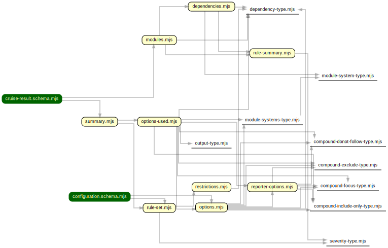

# Utensils
Some utensils that help a bit with the development of dependency-cruiser.

## schema and generate-schemas.utl.js

The [schema](schema) folder contains the sources for both json schemas
([configuration](../src/schema/configuration.schema.json) and
[cruise-result](../src/schema/cruise-result.schema.json). They're split up
for ease of maintenance).

To generate the schemas from their sources run:

```sh
node utl/generate-schemas.utl.js
```

> The build and version lifecycle scripts take care of this automatically, so 
> there's no need to run this manually each PR or push _unless_ you're modifying
> the json schema

[](https://sverweij.github.io/dependency-cruiser/schema-overview.html)

## embed svg in html

Does just that by slapping a header and a footer around the svg it reads from
stdin and putting some graphviz dot specific css in the html's header.

Sample usage:

```sh
dot -T svg < some-graph.dot | node utl/embed-svg-in-html.utl.js > docs/wrapped-svg.html
```
